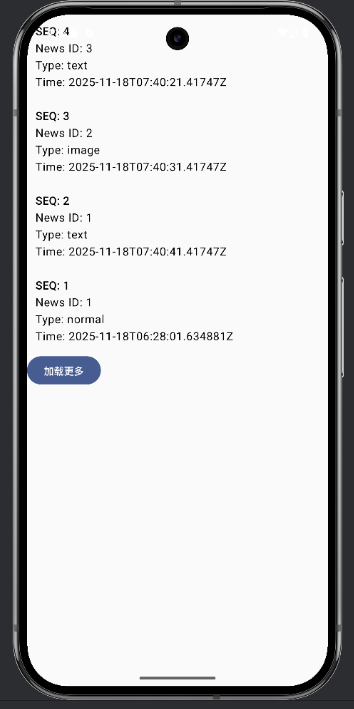

# Toutiao News Feed Demo

A minimal end-to-end demo replicating the **Today’s Headlines (今日头条)** style news feed.

This project includes:

- 📱 **Android Client** (Jetpack Compose + MVVM)
- 🌐 **Go Backend API** (DDD structure + PostgreSQL)
- 🐳 **Docker Compose Environment** (Backend + PostgreSQL)
- 📄 **Documentation & Development Log**

This repository demonstrates a clean & scalable architecture suitable for mobile + backend training workflows.

---

## ✨ Features

### ✔ End-to-end working demo
- Android client successfully fetches paginated news feed
- Go backend serves data using clean architecture
- PostgreSQL stores seed sample news

### ✔ Android App (Jetpack Compose)
- MVVM + Repository Pattern
- Retrofit + Coroutines
- LazyColumn news feed
- Load More button
- Network security config enabling cleartext (dev mode)
- Compose UI components (FeedCard, FeedScreen, ViewModel)

### ✔ Go Backend
- Lightweight DDD layered structure:
  - `api/` – handlers & routing
  - `application/` – business logic (UseCase)
  - `domain/` – entity model + interfaces
  - `infrastructure/` – PostgreSQL repository implementation
  - `middleware/` – logger & panic recovery
  - `seed/` – seed demo news records
- Cursor-based pagination
- Clean code structure with repository abstraction

### ✔ Dockerized Deployment
- PostgreSQL 14 container
- Backend container (Go 1.22)
- Auto-run DB schema & seed data

---

## 📱 Android Screenshots



## 📦 Folder Structure

```
toutiao-news-feed-demo/
│
├── backend/                 # Go backend (DDD architecture)
│   ├── api/
│   ├── application/
│   ├── domain/
│   ├── infrastructure/
│   ├── middleware/
│   ├── seed/
│   ├── main.go
│   ├── go.mod / go.sum
│   └── Dockerfile
│
├── docker/                  # Database schema / data
│   ├── db/
│   │   └── init/01-schema.sql
│   └── ... (no persistent data tracked)
│
├── ToutiaoAndroid/          # Android client
│   ├── app/
│   │   └── src/main/java/com/xuziyi/toutiaoandroid/
│   ├── gradle/
│   ├── build.gradle.kts
│   └── settings.gradle.kts
│
├── docker-compose.dev.yml
├── docker-compose.prod.yml
├── docs/
└── README.md
```

------

## 🚀 How to Run the Project

### 1️⃣ Start backend + database

Make sure Docker Desktop is running, then:

```
docker-compose -f docker-compose.dev.yml up --build
```

This will start:

- PostgreSQL
- Go backend server (default port: **8080**)

Verify backend is running:

```
http://localhost:8080/api/v1/feed
```

------

### 2️⃣ Run Android Client

1. Open **ToutiaoAndroid/** in Android Studio
2. Run on **Emulator** or **Physical Device**
3. Ensure backend API address uses:

```
http://10.0.2.2:8080
```

Android emulator maps host machine → `10.0.2.2`.

## 🧪 API Example

### **GET /api/v1/feed?cursor=0&limit=10**

Sample response:

```
{
  "items": [
    {
      "id": 1,
      "type": "text",
      "title": "Sample News",
      "publish_time": "2025-11-18T07:40:31Z"
    }
  ],
  "next_cursor": 2
}
```

## 🧩 Tech Stack

### **Android**

- Kotlin
- Jetpack Compose
- MVVM
- Retrofit + Coroutines
- Material 3

### **Backend**

- Go 1.22
- Gin-style handlers (custom minimal HTTP)
- DDD-style folder structure
- PostgreSQL
- Docker

### **Ops**

- Docker Compose
- Makefile (optional)
- Local dev environment

------

## 📚 Development Roadmap (Next Steps)

### 🟦 For Android

- Pull-to-refresh
- Shimmer loading effect
- Error & retry UI
- Offline caching (Room)

### 🟩 For Backend

- Full news detail API
- Author profile API
- Redis caching
- JWT authentication (optional)

### 🟧 For Deployment

- CI/CD with GitHub Actions
- Automatic Docker image build
- Deploy to Render / Fly.io / Railway

------

## ✍️ Author

**Xu Ziyi (胥子逸)**  
2025 Training Camp – News Feed Demo

---

## © Copyright

**All Rights Reserved.**  
This project is for training and demonstration purposes only.  
Unauthorized commercial use, redistribution, or modification is strictly prohibited.
