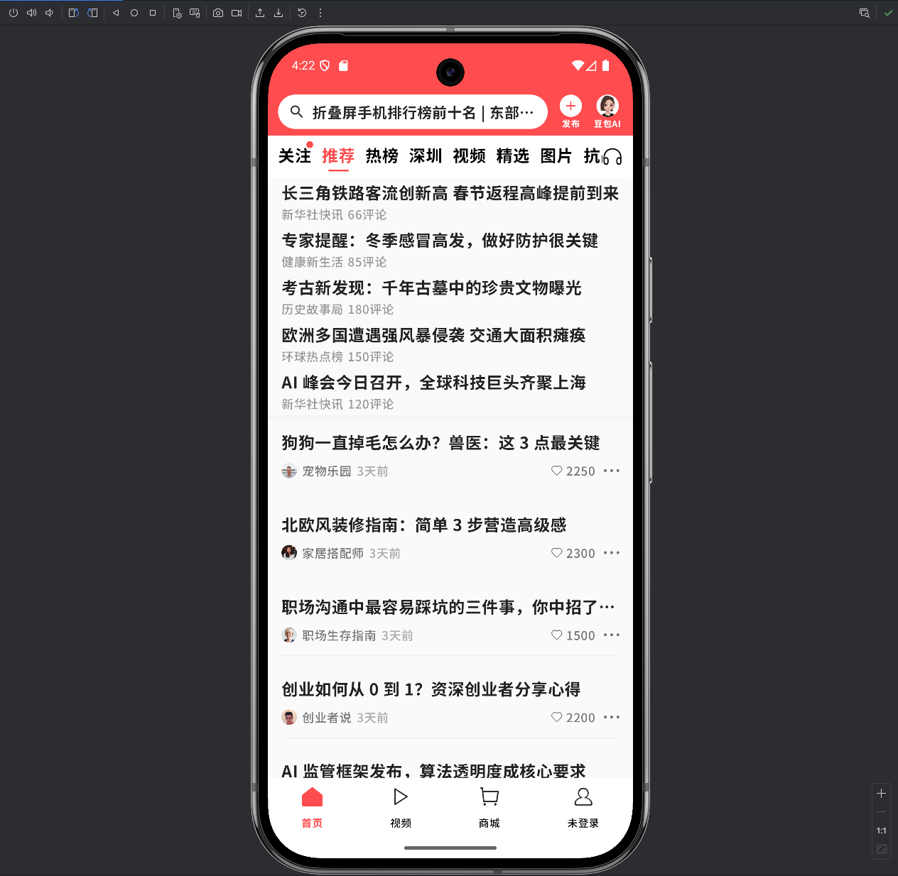
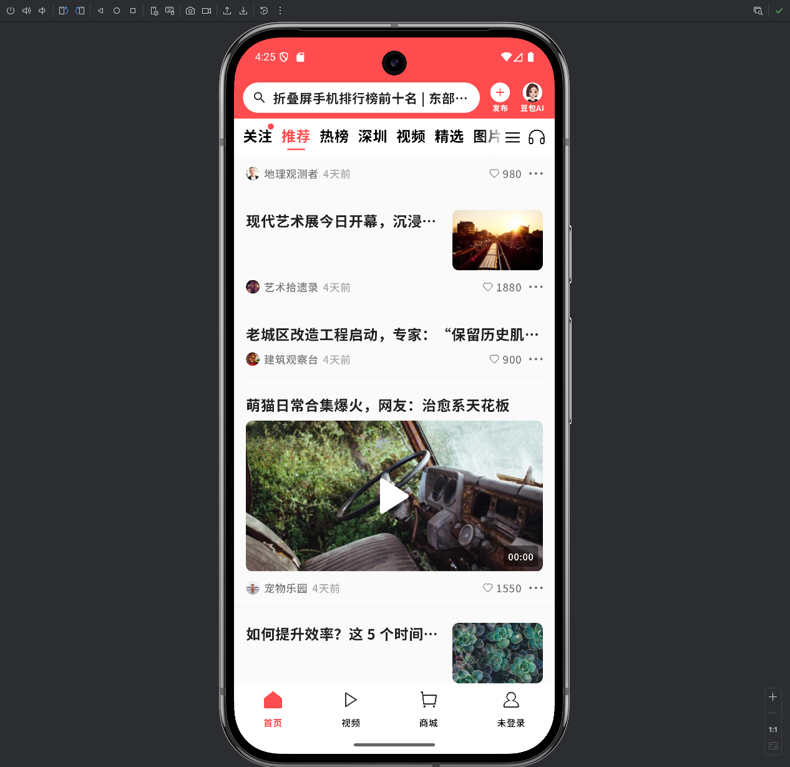

# 📰 Toutiao News Feed Demo（今日头条推荐流 Demo）

一个完整复现 **今日头条首页推荐流** 的端到端 Demo。

项目包含：

- 📱 **Android 客户端（Jetpack Compose + MVVM + UDF）**
- 🌐 **Go 后端（DDD 分层 + PostgreSQL）**
- 🐳 **Docker Compose 一键环境**
- 📄 **完整开发文档与架构说明**

本项目重点展示真实业务场景下的 **推荐流架构设计、Compose 性能优化、前后端协同开发**。

------

## ✨ 核心技术亮点（Android）

### 🔥 1. 多段式 FeedList 渲染架构（今日头条同款）

- 官方 Top5 + 混排流 + Footer 多段列表
- Stable Key 防止 Compose Key 冲突
- Near-viewport 渲染优化减少卡顿
- 卡片类型自动识别（文本/图片/视频/官方）

### 🔥 2. 自定义下拉刷新（绳性阻尼 + Lottie 动画）

- 完整模拟今日头条刷新方式：
  - Header 跟随列表一起下移
  - NestedScroll 阻尼算法
  - 刷新吸顶（35dp）
  - Lottie 联动 + 回弹

### 🔥 3. 今日头条 TabBar（独立滚动 + 点击自动居中）

- 使用独立 LazyListState，不与 FeedList 共享滚动
- 点击自动滚动并精确居中选项
- 支持红点提示、频道管理、听新闻入口

### 🔥 4. MVVM + 单向数据流 (UDF) 推荐流架构

- FeedScreen（UI 层）
- FeedUiState（单一数据源）
- FeedViewModel（首次加载 / 刷新 / 分页 / 卡片渲染）
- ViewModelFactory（确保生命周期稳定，避免 Tab 切换导致重建）

------

## ✨ 核心技术亮点（后端）

### 🔥 1. 轻量 DDD 分层架构

- `domain/`：实体 & 接口
- `application/`：UseCase
- `infrastructure/`：PostgreSQL Repository
- `api/`：路由与 Handler

### 🔥 2. 今日头条式推荐流逻辑

- 官方 Top5 固定区域
- Normal15 混排
- Cursor-based Pagination（游标分页，适合大规模流式推荐系统）

### 🔥 3. Docker Compose 开箱即用

- PostgreSQL 自动建表 + 自动导入 Seed 数据
- 后端自动编译并运行

------

## 📱 Android UI 截图





------

## 📦 项目结构

```
toutiao-news-feed-demo/
│
├── backend/                 # Go 后端（DDD + 游标分页）
│   ├── api/
│   ├── application/
│   ├── domain/
│   ├── infrastructure/
│   ├── seed/
│   └── main.go
│
├── docker/                  # 数据库初始化脚本
│
├── ToutiaoAndroid/          # Android 客户端（Compose + MVVM）
│   ├── app/
│   └── build.gradle.kts
│
├── docker-compose.dev.yml
└── README.md
```

------

## 🚀 如何运行本项目

### 1️⃣ 启动后端 + 数据库

```
docker-compose -f docker-compose.dev.yml up --build
```

启动后访问：

```
http://localhost:8080/api/v1/feed
```

------

### 2️⃣ 运行 Android 客户端

在 Android Studio 中打开 `ToutiaoAndroid/`

确保 API 地址配置为：

```
http://10.0.2.2:8080
```

------

## 🧪 API 示例

```
GET /api/v1/feed?cursor=0&limit=10
```

响应示例：

```
{
  "items": [
    {
      "id": 1,
      "type": "text",
      "title": "Sample News",
      "publish_time": "2025-11-18T07:40:31Z"
    }
  ],
  "next_cursor": 2
}
```

------

## 🧩 技术栈

### Android

Kotlin · Jetpack Compose · MVVM · Coroutines
 Retrofit · Material3 · Lottie

### Backend

Go 1.22 · PostgreSQL · DDD · Cursor Pagination
 Docker Compose

------

## 📚 后续计划（Roadmap）

- Shimmer 骨架屏
- 视频卡片 + 自动播放
- 离线缓存（Room）
- 详情页 API
- 推荐模型接入（可选）
- CI/CD（GitHub Actions）

------

## ✍️ 作者

**Xu Ziyi（胥子逸）**
 2025 今日头条推荐流 Demo

------

## © 版权声明

本项目用于学习与演示，不允许未经授权的商业用途。

