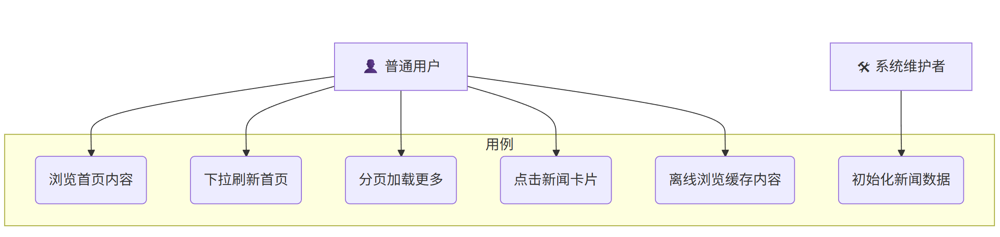

# **03. 用例分析**

## 1. 参与者

系统包含两个主要参与者：

### 1.1 普通用户

使用客户端浏览新闻内容，执行滑动、刷新、点击等交互行为。

### 1.2 系统维护者

负责后端服务的启动运行、管理新闻数据，并通过脚本初始化新闻内容。

------

## 2. 用例图

------

## 3. 用例列表

系统的主要用例如下：

| 用例编号 | 用例名称         | 说明                                   |
| -------- | ---------------- | -------------------------------------- |
| UC01     | 浏览首页内容     | 展示新闻推荐流，是最核心的用户行为。   |
| UC02     | 下拉刷新首页内容 | 用户主动获取最新数据。                 |
| UC03     | 分页加载更多     | 用户滑动到底部时继续加载更多新闻。     |
| UC04     | 点击新闻卡片     | 用户点击某条新闻触发跳转逻辑（预留）。 |
| UC05     | 离线浏览缓存内容 | 无网络时读取本地缓存数据以保证可用性。 |
| UC06     | 初始化新闻数据   | 系统维护者批量生成并写入新闻数据。     |

------

## 4. 用例描述

以下为每个用例的结构化说明。

------

### UC01 浏览首页内容

| 项目     | 内容                                                         |
| -------- | ------------------------------------------------------------ |
| 用例编号 | UC01                                                         |
| 参与者   | 普通用户                                                     |
| 触发条件 | 用户打开应用进入首页                                         |
| 前置条件 | 若无网络，则读取本地缓存内容                                 |
| 基本流程 | 1. 客户端加载本地缓存 2. 请求后端第一页数据 3. 按权重排序并展示 |
| 后置条件 | 本地缓存更新为最新内容                                       |
| 异常流程 | 网络异常 → 展示缓存 → 提示离线浏览                           |

------

### UC02 下拉刷新首页内容

| 项目     | 内容                                                         |
| -------- | ------------------------------------------------------------ |
| 用例编号 | UC02                                                         |
| 参与者   | 普通用户                                                     |
| 触发条件 | 用户在首页执行下拉操作                                       |
| 基本流程 | 1. 触发刷新动画 2. 请求最新内容 3. 替换现有内容 4. 写入本地缓存 |
| 后置条件 | 内容刷新为最新版本                                           |
| 异常流程 | 网络异常 → 刷新失败 → 保留当前内容                           |

------

### UC03 分页加载更多

| 项目     | 内容                                                    |
| -------- | ------------------------------------------------------- |
| 用例编号 | UC03                                                    |
| 参与者   | 普通用户                                                |
| 触发条件 | 用户滑动到列表底部                                      |
| 基本流程 | 1. 检查是否正在加载 2. 请求下一页数据 3. 向列表追加内容 |
| 后置条件 | 新内容追加至列表并存入缓存                              |
| 异常流程 | 网络异常 → 显示加载失败提示                             |

------

### UC04 点击新闻卡片

| 项目     | 内容                                     |
| -------- | ---------------------------------------- |
| 用例编号 | UC04                                     |
| 参与者   | 普通用户                                 |
| 基本流程 | 1. 用户点击卡片 2. 触发 onCardClick 回调 |
| 后置条件 | 无（本项目不实现详情页）                 |
| 备注     | 为未来扩展详情页保留接口                 |

------

### UC05 离线浏览缓存内容

| 项目     | 内容                                          |
| -------- | --------------------------------------------- |
| 用例编号 | UC05                                          |
| 参与者   | 普通用户                                      |
| 前置条件 | 网络不可用                                    |
| 基本流程 | 1. 检测网络不可用 2. 加载本地缓存 3. 展示内容 |
| 后置条件 | 用户可正常浏览缓存数据                        |

------

### UC06 初始化新闻数据（后端）

| 项目     | 内容                               |
| -------- | ---------------------------------- |
| 用例编号 | UC06                               |
| 参与者   | 系统维护者                         |
| 触发条件 | 维护者执行 seed 脚本               |
| 基本流程 | 1. 读取种子数据 2. 写入数据库      |
| 后置条件 | 数据库包含可用于展示的初始新闻内容 |