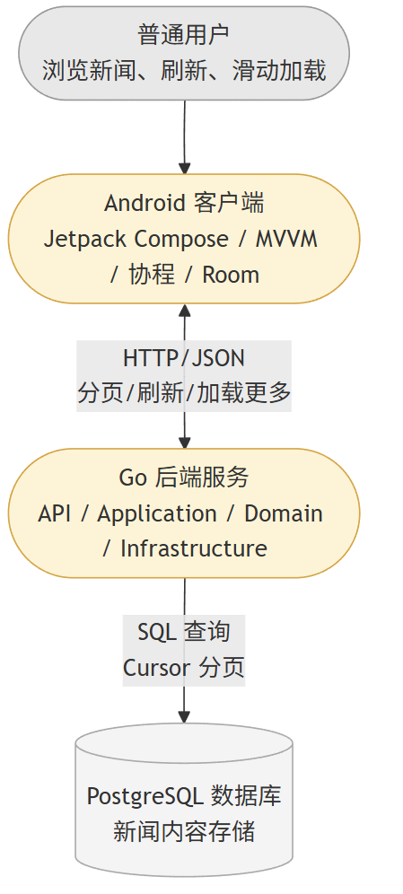
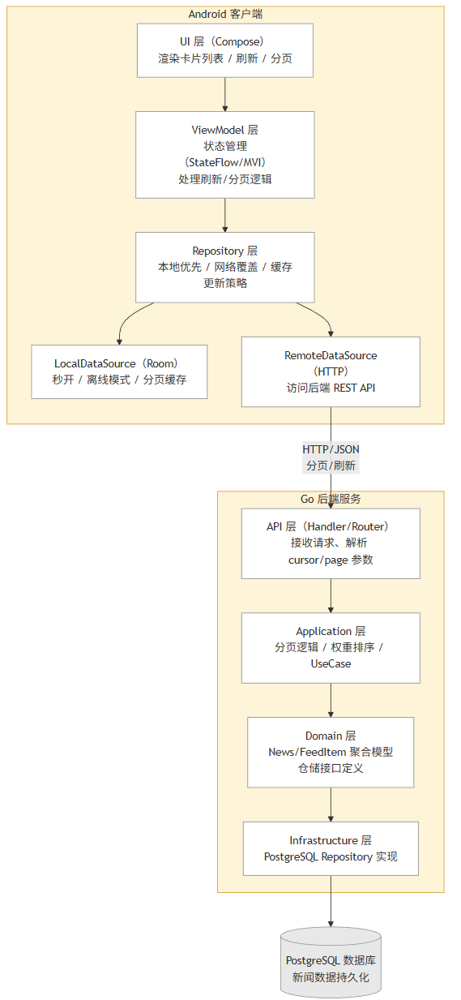
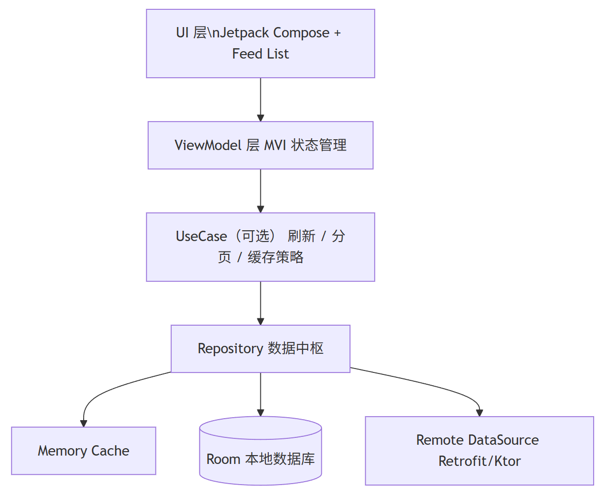
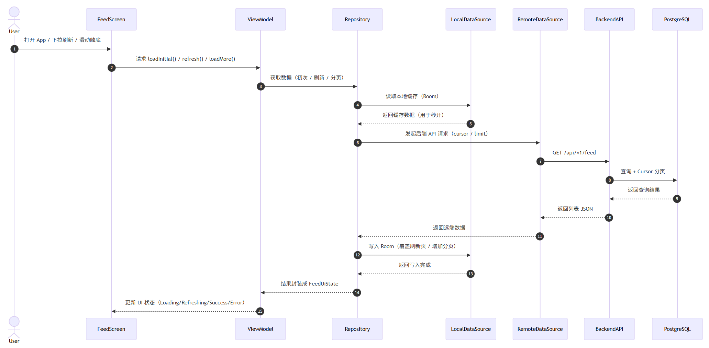

# 04. 系统架构设计

## 4.1 架构设计目标

本系统的架构设计围绕以下三个核心能力：

1. **推荐流列表（Feed List）作为多卡片渲染引擎**
   - 支持文字卡片、图文卡片，并预留视频、广告等扩展能力；
   - 通过 sealed class + 卡片工厂模式实现“数据驱动的 UI 渲染”。
2. **数据加载作为核心技术亮点**
   - 数据层拆分为 Remote / Local DataSource + Repository + MVI 状态流；
   - 支持弱网降级、本地兜底、自动重试、结构化并发。
3. **刷新、分页、本地缓存一体化的推荐流体验**
   - 区分初次加载、下拉刷新、分页加载三种状态；
   - 首屏“秒开”+ 后台刷新 + 分页缓存 + 离线模式。

同时，后端采用 DDD 风格分层，配合 CI/CD、自动化测试和基础监控。

------

## 4.2 整体系统架构概览

系统采用前后端分离架构，由以下部分构成：

- Android 客户端：Kotlin + Jetpack Compose + MVVM/MVI + 协程 + Room
- Go 后端：基于 DDD 思想的 API / Application / Domain / Infrastructure 分层
- 数据库：PostgreSQL，用于持久化新闻数据
- 工程配套：GitHub Actions CI/CD、基础日志与监控

### 4.2.1 C4 level 1：系统上下文图 System Context Diagram




### 4.2.2 C4 level 2：容器图 Container Diagram




## 4.3 客户端架构设计（推荐流引擎 + 数据管线）


### 4.3.1 分层结构 MVVM + Repository + DataSources

客户端采用 MVVM + Repository + 状态流（StateFlow / MVI）：



### 4.3.2 推荐流列表（Feed List）架构

1. **数据模型（领域模型）**

   - 使用 `sealed class FeedItem` 表达不同卡片类型（TextItem, ImageItem 等）；
   - 每个卡片包含 `id`, `publishTime`, `weight`, `type` 等字段，支持推荐排序和扩展。1、推荐流列表

2. **渲染体系**

   - 提供统一的 `FeedCard(item: FeedItem)` 渲染入口；
   - 通过 `when(item)` 分发到不同的卡片组件（TextCard, ImageCard）；
   - 支持淡入动画、内容高度自适应、图片占位符 / 骨架屏。

3. **状态管理**
    ViewModel 维护统一的 `FeedUiState`，包括：

   - `isLoading`：首屏加载
   - `isRefreshing`：下拉刷新状态4、分页加载
   - `isLoadingMore`：分页加载中
   - `feed: List<FeedItem>`：当前列表
   - `error`：错误信息

   UI 通过 `collectAsState()` 绑定状态，实现数据驱动渲染。

### 4.3.3 数据加载与协程管线

根据“数据加载”文档，数据加载被拆成三层：DataSource → Repository → ViewModel。

1. **DataSource 层**
   - `RemoteDataSource`：调用 Go 后端 API 获取 feed
   - `LocalDataSource (RoomDAO)`：读写本地缓存
   
2. **Repository 层**
   - 统一负责“本地兜底 + 远端覆盖”的加载策略；
   - 输出 `Flow<DataResult<List<FeedItem>>>`，封装 Loading/Success/Error 状态；
   - 支持自动重试（指数退避）、弱网回退本地缓存。
   
3. **ViewModel 层**
   - 对外暴露 `StateFlow<FeedUiState>`；
   
   - 提供 `loadInitial()`, `refresh()`, `loadMore()` 等方法；
   
   - 根据 Repository 结果更新 `FeedUiState`，驱动 UI。
   
     



------

## 4.4 刷新、分页与本地缓存的一体化设计

### 4.4.1 下拉刷新（Pull-to-Refresh）

根据刷新分析文档，下拉刷新不是简单请求，而是一个小型状态机：

- 区分“首屏 loading”与“下拉刷新”；
- 刷新时设置 `isRefreshing = true`，调用 `Repository.refresh()`；
- 刷新成功：在保持滚动位置稳定的前提下，用新数据替换顶部内容；
- 刷新失败：提示错误，但不清空列表（推荐流首页不能刷成空白）。

UI 使用 Material3 `pullRefresh` + `PullRefreshIndicator`，刷新结束增加 200–300ms 缓冲，避免指示器瞬间消失导致体验生硬。

### 4.4.2 分页加载（Load More）

分页目标是实现一个“抗重复触发、与刷新互斥、支持 cursor 的分页系统”。

- `FeedUiState` 内包含
  - `isLoadingMore`：是否正在加载下一页
  - `endReached`：是否已无更多数据
  - `nextCursor`：下一页游标
- UI 使用 `LazyListState + snapshotFlow` 检测“滚动至底部”触发 `loadMore()`，而不是按钮；
- ViewModel 在 `loadMore()` 内：
  - 防止并发触发和刷新冲突：
     `if (isLoadingMore || endReached || isRefreshing) return`；
  - 调用 Repository 通过 `nextCursor` 请求下一页，并将新数据 append 到现有列表；
  - 将 `nextCursor` 更新为后端返回值，实现标准 cursor 分页。

分页错误时，只提示底部重试，不清空已加载内容，避免影响用户正在浏览的部分。

### 4.4.3 本地缓存（Room）与“秒开体验”

本地缓存的目标不是“存数据”，而是支撑：
 1）首页秒开
 2）离线/弱网降级
 3）分页缓存
 4）无闪烁更新。

Room 表结构中包含：

- `id`，`type`，`title`，`summary`
- `imageUrl`，`source`
- `publishTime`，`weight`（用于排序）
- `page`（属于哪一页）
- `cacheTime`（缓存时间戳）

策略：

- 冷启动：优先从 Room 读取最近缓存 → 立即展示 → 启动后台网络刷新；
- 刷新成功：用网络数据覆盖缓存，并以“Network → Room → UI”的顺序更新，保证 UI 的单一数据源（SSOT）始终是 Room；
- 分页：下一页成功后追加到 Room，对应 `page` 字段递增；
- 刷新时：重置第一页缓存，并清理后续 pages，确保新列表从最新数据开始。

------

## 4.5 后端架构设计（Go + DDD 风格）

### 4.5.1 分层结构

后端采用轻量级 DDD 分层：

```
backend/
 ├─ api/            // HTTP Handler / 路由（API 层）
 ├─ application/    // 应用服务（UseCase：查询推荐流）
 ├─ domain/         // 领域模型（News, FeedItem）+ 仓储接口
 ├─ infrastructure/ // Repository 实现，PostgreSQL 访问，配置
 ├─ middleware/     // 日志、恢复、简单监控
 ├─ seed/           // 种子数据脚本
 └─ main.go
```

- **API 层（api）**
  - 定义 `/api/v1/feed` 等接口；
  - 解析查询参数（如 `cursor`, `limit`）；
  - 调用 Application 层并返回统一的 JSON 响应。
- **Application 层（application）**
  - 封装“获取推荐流列表”用例；
  - 负责分页逻辑、简单的业务规则（例如按 `weight` 与时间排序）；
  - 对接 Domain 层定义的仓储接口。
- **Domain 层（domain）**
  - 定义 `News` / `FeedItem` 等领域实体和值对象；
  - 定义 `FeedRepository` 接口，屏蔽数据库细节。
- **Infrastructure 层（infrastructure）**
  - 基于 PostgreSQL 的 `FeedRepository` 实现；
  - 使用 cursor 分页查询（如基于 `publishTime` + `id` 组合）；
  - 负责 DB 连接管理、迁移脚本等。

### 4.5.2 分页与排序策略

- 使用 `cursor + limit` 模式分页，而非简单 page/pageSize，避免翻页错乱问题；
- cursor 设计为：`publishTime` 或 `(publishTime, id)` 的编码结果；
- 排序：按 `weight`（推荐权重） + `publishTime` 组合排序，先展示更“重要”的内容。

------

## 4.6 数据库与信息持久化设计（后端视角）

- 使用 PostgreSQL 存储新闻数据；
- 主表字段对齐前端 Room Entity，保证字段语义一致：
  - `id`, `title`, `summary`, `image_url`, `type`, `source`, `publish_time`, `weight`, `tags` …
- 通过索引优化按时间和权重排序分页查询性能。

------

## 4.7 CI/CD 与部署架构

### 4.7.1 仓库结构与分支策略

- 单一 Git 仓库（monorepo），包含 `android/` 与 `backend/` 两个子目录；
- 标准分支模型：`main`（稳定） + `dev`（开发） + feature 分支；
- 所有变更通过 PR 合并，触发 GitHub Actions 流水线。

### 4.7.2 后端 CI/CD

GitHub Actions 流水线示例：

1. 触发条件
   - push / PR 到 `backend/` 目录或 main 分支
2. 流水线步骤
   - Checkout 代码
   - 安装 Go 环境
   - 执行 `go test ./...`（单元测试）
   - 执行 `go build ./...`（编译校验）
   - 构建 Docker 镜像（可选）
   - 推送镜像到仓库，部署到 Render/Railway 或本地环境（根据课程实际安排）

### 4.7.3 Android CI（可选）

- 编译检查：`./gradlew assembleDebug`
- 基础单元测试：`./gradlew test`
- Lint 检查：`./gradlew lint`

CI 结果在 PR 中展示，保证基本质量。

------

## 4.8 测试与质量保障

### 4.8.1 客户端测试

- **单元测试**
  - ViewModel 的状态机（加载 / 刷新 / 分页互斥）；
  - Repository 的数据策略（缓存优先 / 网络覆盖 / 弱网回退）。
- **UI 测试（可选）**
  - 验证下拉刷新、分页加载时 UI 呈现是否正确；
  - 骨架屏与错误提示的展示。

### 4.8.2 后端测试

- **单元测试**
  - Application 层：分页逻辑、权重排序逻辑。
- **集成测试**
  - 针对 `/api/v1/feed` 的接口测试，验证 cursor / limit 行为正确。

------

## 4.9 日志与监控（基础版）

- 后端中间件提供：
  - 请求日志（方法、路径、耗时、状态码）；
  - Panic 恢复，避免进程崩溃；
  - 简单请求计数和错误计数，可为后续接 Prometheus 做准备。
- 客户端记录：
  - 请求失败原因（网络异常、解析失败等）；
  - 可用于调试和用户问题分析。

------

## 4.10 小结：架构如何支撑三个核心目标

1. **推荐流列表（Feed List）**
   - sealed class + CardFactory + LazyColumn + 动效，使首页真正成为“多卡片渲染引擎”，支持未来拓展更多类型内容。
2. **数据加载作为核心亮点**
   - 通过 DataSource / Repository / ViewModel 三层结构 + 协程 + Flow，实现缓存优先、弱网兜底、自动重试的工程级数据管线。
3. **刷新 + 分页 + 本地缓存的一体化体验**
   - 刷新、分页、本地缓存各自有清晰状态机，又在 UI 层协同工作；
   - 首屏秒开、下拉刷新自然、分页平滑、无网仍可浏览，从体验上对齐真实内容平台首页。