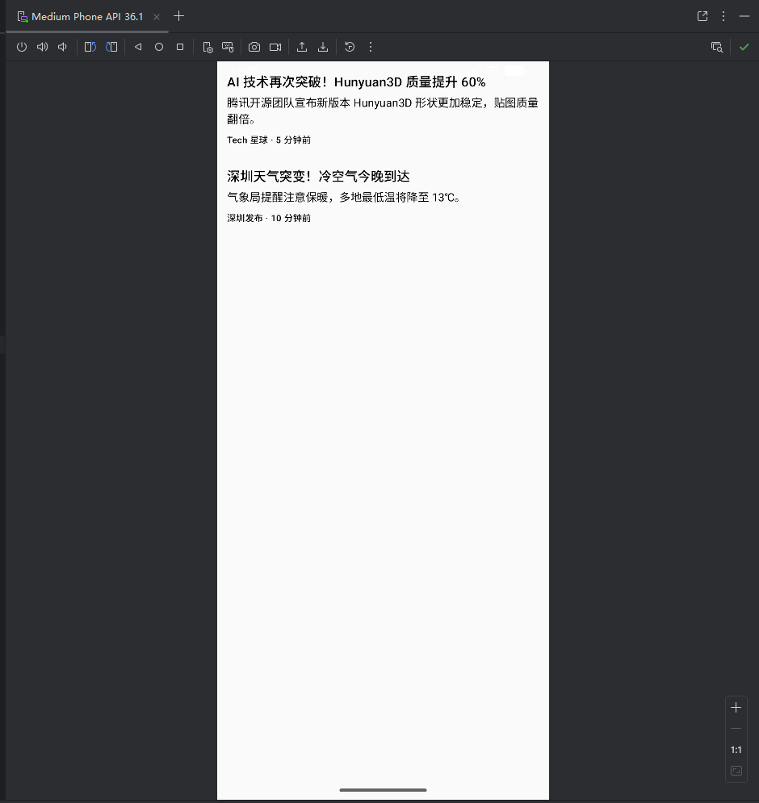
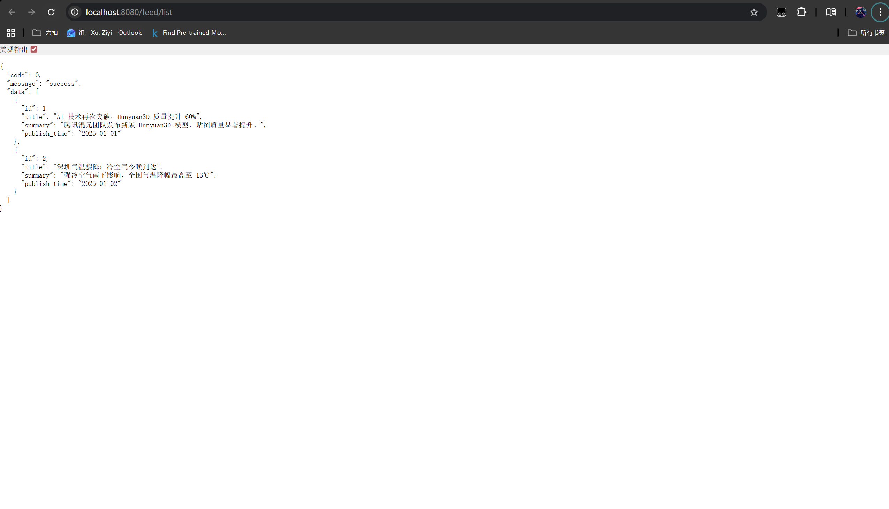
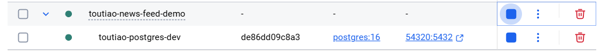
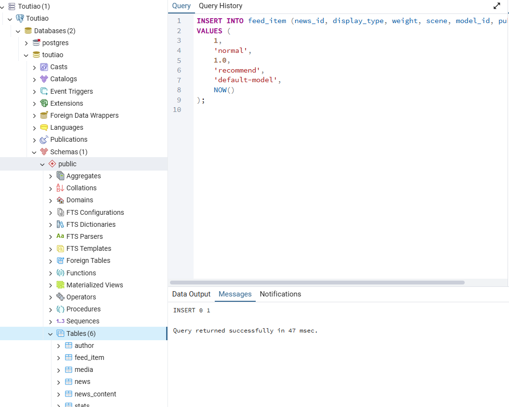
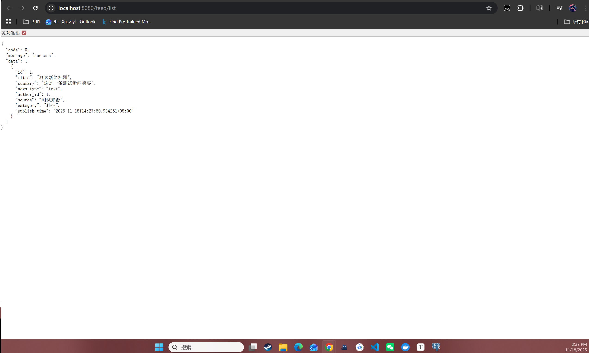
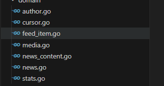
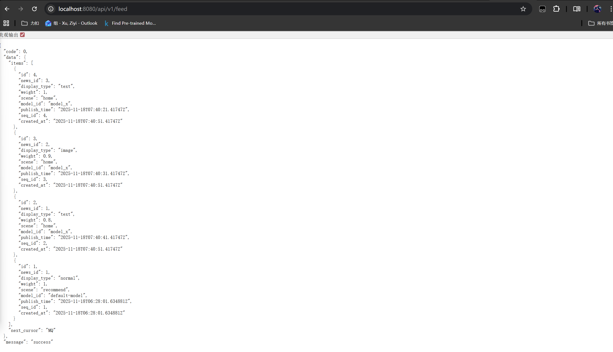

## 11/16-11/17

1、完成了01-10的开发文档的初步定稿，初步确定开发内容以及计划，后续再开发过程当中更新相关内容

2、配置git仓库初始化文件目录开始项目管理

```
news-feed-demo/
│
├── docs/           # 软件工程文档（需求、用例、架构、设计…）
│
├── backend/        # Go 后端（我们的 API 服务）
│
├── android/        # Android Studio 工程（Compose App）
│
└── README.md       # 项目总说明

```

仓库初始化

```
git init
git add .
git commit -m "Init project structure"

```

创建远程仓库

关联远程仓库

```
git branch -M main
git remote add origin https://github.com/SUPERpowerGT/toutiao-news-feed-demo.git
git push -u origin main
```

https://github.com/SUPERpowerGT/toutiao-news-feed-demo

3、启动jira来管理项目sprint以及每日功能开发需求更新

https://toutiao-develop.atlassian.net/jira/software/projects/SCRUM/boards/1

4、环境配置

后端环境配置

vscode

- go
- docker

go

```
go version go1.24.0 windows/amd64
```

postgresql

- docker拉去镜像配置用pgadmin来可视化

postman

docker desktop


客户端开发环境（windows）安卓

android studio

 https://developer.android.com/studio

配置时候注意改在d盘同一目录下包括后续sdk安装等


新建项目这里注意要修改名称和路径以及vpn不建议挂

更新gitignore再根目录（全局管理项目删掉子目录自动生成的gitignore）


**6、客户端开发（mvp）**

```
com.xuziyi.toutiaoandroid
│
├── common/            // 通用工具（扩展、转换器等）
│
├── data/repo/         // 数据层 = Repository：数据来源（本地/网络/假数据）
│       └── FeedRepository.kt
│
├── domain/model/      // 领域层（前端自己的业务模型）
│       └── FeedItem.kt
│
└── ui/
    ├── components/    // 小 UI 组件：卡片、标题、按钮等
    │       └── FeedCard.kt
    │
    ├── feed/          // 页面级 UI：FeedScreen + FeedViewModel
    │       ├── FeedScreen.kt
    │       └── FeedViewModel.kt
    │
    └── theme/         // 主题、颜色、样式

```


domain/model

标准化数据结构，保证客户端和后端的数据格式一致性

```
package com.xuziyi.toutiaoandroid.domain.model

data class FeedItem(
    val id: String,
    val title: String,
    val summary: String,
    val source: String,
    val time: String,
)
```


data/repo

调取数据给UI


ui/feed mvvm的viewmodel+screen

viewmodel

链接repo，状态管理等，负责管理状态


feedscreen

compose页面类比react


ui/components

重用组件卡片时间等


common

通用工具时间格式，mapper，日志等

```
 MainActivity
    ↓
 FeedScreen (UI 层)
    ↓ 订阅 ViewModel.state
 FeedViewModel (ViewModel 层)
    ↓ 调用 Repository.getFeed()
 FeedRepository (数据层)
    ↓
 返回 FeedItem 列表（假数据 / 本地缓存 / 网络）

```

这里简单来学习一下mvvm的标准

model+ view +viewmodel

view:

视图层，展示ui，ux，接受用户的交互，但是所有逻辑都交给vm做

不做网络请求，不访问数据库，不拼装业务逻辑


vm：

写逻辑，拿数据从repo，启动协程，管理ui，返回干净数据给ui

不做数据库代码，不屑网络框架调用，不依赖android view


model

网络请求retrofit

数据库存储room

本地缓存

业务实体dataclass

```
UI（Compose）
   │
   ▼
ViewModel（处理逻辑/状态）
   │
   ▼
Repository（数据读写）
   │
   ▼
API / Room（真正的来源）

```

这里类比到我们的项目中

```
com.xuziyi.toutiaoandroid
 ├── domain/          ← 真正的 Model（业务模型）
 ├── data/            ← 数据来源层（API/DB/Mock）
 │     └── repo/FeedRepository
 └── ui/
       ├── components/    ← 复用 UI
       └── feed/          ← Feed Feature 的全部 UI 逻辑
             ├── FeedScreen
             ├── FeedViewModel
             └── FeedUiState（可加）

```

合理的看起来




**6、后端开发（mvp）**

打开我们的backend然后先go初始化并安装gin包

```
go mod init toutiao-backend

```

这里我还在国内用镜像更新路径

```
go env -w GO111MODULE=on
go env -w GOPROXY=https://goproxy.cn,direct
go env -w GOSUMDB=sum.golang.org
```

重新安装gin包

```
go get github.com/gin-gonic/gin
```

可以简单写一个main来测试

http://localhost:8080/feed/list


**7、后端和数据库链接（mvp）**

安装pgx v5 驱动postgresql


```
go get github.com/jackc/pgx/v5
go get github.com/jackc/pgx/v5/stdlib

```

这里注意国内vpn的问题

$Env:http_proxy="http://127.0.0.1:7890";$Env:https_proxy="http://127.0.0.1:7890"

再当前terminal配置才可以正常访问docker 镜像

```
docker compose up --build
```

http://localhost:8080/feed/list



成功！


## 11/18

**1、后端数据库链接开发板**

我们重新审视设计了一下数据库表来保证我们的设计是合理的且能满足前端的需求以及更高的拓展性

```
-- ================================
-- ENUM 类型定义
-- ================================
DO $$ BEGIN
    CREATE TYPE news_type_enum AS ENUM ('text', 'image', 'video', 'multi_image', 'multi_video');
EXCEPTION
    WHEN duplicate_object THEN null;
END $$;

DO $$ BEGIN
    CREATE TYPE media_type_enum AS ENUM ('image', 'video');
EXCEPTION
    WHEN duplicate_object THEN null;
END $$;

-- ================================
-- 作者表
-- ================================
CREATE TABLE IF NOT EXISTS author (
    id            BIGSERIAL PRIMARY KEY,
    name          VARCHAR(50) NOT NULL,
    avatar_url    VARCHAR(255),
    description   VARCHAR(255),
    certification VARCHAR(50),
    created_at    TIMESTAMP DEFAULT NOW()
);

-- ================================
-- 新闻主表
-- ================================
CREATE TABLE IF NOT EXISTS news (
    id           BIGSERIAL PRIMARY KEY,
    title        VARCHAR(255) NOT NULL,
    summary      VARCHAR(255),
    news_type    news_type_enum NOT NULL,
    author_id    BIGINT REFERENCES author(id),
    source       VARCHAR(100),
    category     VARCHAR(50),
    publish_time TIMESTAMP,
    status       SMALLINT DEFAULT 1,
    created_at   TIMESTAMP DEFAULT NOW(),
    updated_at   TIMESTAMP DEFAULT NOW()
);

-- ================================
-- 新闻内容（正文字段）
-- ================================
CREATE TABLE IF NOT EXISTS news_content (
    news_id      BIGINT PRIMARY KEY REFERENCES news(id) ON DELETE CASCADE,
    content_html TEXT,
    content_json JSONB,
    word_count   INT
);

-- ================================
-- 多媒体表（新增）
-- ================================
CREATE TABLE IF NOT EXISTS media (
    id          BIGSERIAL PRIMARY KEY,
    news_id     BIGINT REFERENCES news(id) ON DELETE CASCADE,
    group_id    BIGINT,
    media_type  media_type_enum NOT NULL,
    url         VARCHAR(255),
    cover_url   VARCHAR(255),
    duration    INT,
    width       INT,
    height      INT,
    order_index INT,
    created_at  TIMESTAMP DEFAULT NOW()
);

-- ================================
-- 互动统计表
-- ================================
CREATE TABLE IF NOT EXISTS stats (
    news_id        BIGINT PRIMARY KEY REFERENCES news(id) ON DELETE CASCADE,
    like_count     INT DEFAULT 0,
    comment_count  INT DEFAULT 0,
    favorite_count INT DEFAULT 0,
    share_count    INT DEFAULT 0,
    play_count     INT DEFAULT 0,
    version        INT DEFAULT 0,
    updated_at     TIMESTAMP DEFAULT NOW()
);

-- ================================
-- 推荐流 feed_item
-- ================================
CREATE TABLE IF NOT EXISTS feed_item (
    id           BIGSERIAL PRIMARY KEY,
    news_id      BIGINT REFERENCES news(id) ON DELETE CASCADE,
    display_type news_type_enum NOT NULL,
    weight       FLOAT,
    scene        VARCHAR(30),
    model_id     VARCHAR(50),
    publish_time TIMESTAMP,
    seq_id       BIGSERIAL,
    created_at   TIMESTAMP DEFAULT NOW()
);

```

这里由于我们之前是初步测试，直接删除镜像重新拉取建表就好

需要注意要端口正确（之前有部署其他docker监听）

```
docker compose down
Remove-Item -Recurse -Force .\docker\db\data
docker compose up -d

```

这里重新确认一下相关配置

后端和数据库使用pgxv5来连接，整体式gin+pgxv5+postgresql

 

考虑到后续发布问题，这里重新更新一下docker，发布两个版本

```
docker compose -f docker-compose.dev.yml up -d
docker compose -f docker-compose.prod.yml up --build
```

并配置两个版本的env，.env.dev和.env.prod


安装env识别包，方便后端链接数据库

```
PS D:\Project\toutiao-news-feed-demo\backend> go get github.com/joho/godotenv
>>  
go: downloading github.com/joho/godotenv v1.5.1
go: added github.com/joho/godotenv v1.5.1
PS D:\Project\toutiao-news-feed-demo\backend> 
```


重新走docker

```
docker compose down
Remove-Item -Recurse -Force .\docker\db\data
docker compose -f docker-compose.dev.yml up -d
```

这边可以观察到挂起只挂起postgresql



然后配置pgadmin



插入测试数据，启动go后端

```
go run main.go
```

访问

```
http://localhost:8080/health

http://localhost:8080/feed/list
```



测试成功！


**2、现在我们优化后端架构以及和数据库的表的映射以及ddd体系**

这里先简单学习一下请求链路

```
Android 客户端 → Go API → Application → Domain → Infrastructure(DB) → PostgreSQL
```

API 层：接请求（Controller） → 
Application 层：处理业务用例 → 
Domain 层：实体模型 + 业务规则 → 
Infrastructure 层：数据库、缓存等实现 → 
PostgreSQL：真实存储

这里api类比controller

负责：

- 接收 HTTP 请求
- 解析 query/body
- 调用 Application Service
- 输出 JSON

```
func (h *FeedHandler) handleGetFeed(w http.ResponseWriter, r *http.Request) {
    cursor := r.URL.Query().Get("cursor")
    limit, _ := strconv.Atoi(r.URL.Query().Get("limit"))

    result, err := h.service.GetFeed(r.Context(), cursor, limit)

    json.NewEncoder(w).Encode(result)
}
```


application类比service

负责：

- 封装“业务用例”
- 不处理 SQL
- 不处理 JSON
- 不实现数据库操作
- 只做“调用仓储 + 封装返回值”

```
items, nextCursor, err := s.repo.ListLatest(ctx, cur, limit)

return &FeedResult{
    Items: items,
    NextCursor: encodeCursor(nextCursor),
}, nil

```


domain纯净的业务模型，不依赖数据库，不依赖 HTTP，不依赖 JSON


infrastructure

写：

- PostgreSQL 访问
- Redis 访问
- Repository 的具体实现
- 配置加载
- 第三方服务 SDK

```
func (r *PGNewsRepository) ListLatest(ctx context.Context, cursor *domain.NewsCursor, limit int) {
    rows, _ := r.db.QueryContext(ctx, `
        SELECT id, title, summary, publish_time
        FROM news
        ORDER BY publish_time DESC, id DESC
        LIMIT $1
    `, limit)
}

```

创建所有domain和数据库表映射




go开发和java开发哲学不一样，java是直接所有表映射因为有spring jpa的缘故，但是go是根据业务需求开发链路的

我们现在升级成ddd架构不用gin来打通最小链路

这里不用gin是因为这里涉及到推荐等操作，手动写感觉控性高一点！

我们实现一个简单的查询流程来看看怎么个事

这里创建如下文件

```
feed_handler.go
feed_service.go
feed_item.go
feed_item_repository.go
feed_item_repository_pg.go
logging.go
recover.go
seed.go
```

并更新执行main，然后调用seed插入数据并检查数据是否插入成功

```
http://localhost:8080/seed
http://localhost:8080/api/v1/feed

```



成功捏


**3、客户端和后端链路（mvp）**

```
UI 层 FeedScreen.kt
        ↓ 触发事件（加载/刷新）
ViewModel FeedViewModel.kt
        ↓ suspend fun 调用仓库
Repository FeedRepository.kt
        ↓ 调用 Retrofit FeedApi
Network Retrofit
        ↓ HTTP 请求
Go 后端 /api/v1/feed
        ↓ 查询 PostgreSQL cursor 分页
DB PostgreSQL
        ↓ 返回 Json
Repository
        ↓ 保存/合并本地数据（未来 Room）
ViewModel 更新 StateFlow
        ↓
UI 层自动重组 (Composable Recompose)
```


```
data.repo/FeedRepository.kt       → Repository 层
domain.model/FeedItem.kt          → Domain/UI 模型层
ui/feed/FeedViewModel.kt          → ViewModel 层
ui/feed/FeedScreen.kt             → UI 层
ui/components/FeedCard.kt         → UI 组件层
```


这里补充一下再gradle下面syncs

```
// Retrofit + Gson
implementation("com.squareup.retrofit2:retrofit:2.11.0")
implementation("com.squareup.retrofit2:converter-gson:2.11.0")

// OkHttp（可选但建议）
implementation("com.squareup.okhttp3:okhttp:4.12.0")
implementation("com.squareup.okhttp3:logging-interceptor:4.12.0")

```

配置网络文件

貌似出现一点问题，需要能访问本地主机

⭐ **第一步：允许明文 HTTP（Network Security Config）**

### 🔧 1. 新建文件

路径必须按照 Android 要求：

```
app/src/main/res/xml/network_security_config.xml
```

内容：

```
<?xml version="1.0" encoding="utf-8"?>
<network-security-config>
    <domain-config cleartextTrafficPermitted="true">
        <domain includeSubdomains="true">10.0.2.2</domain>
    </domain-config>
</network-security-config>
```

⭐ **第二步：修改 AndroidManifest.xml**

在 `<application>` 中加入：

```
<application
    android:usesCleartextTraffic="true"
    android:networkSecurityConfig="@xml/network_security_config"
    ...>
```

完整示例：

```
<application
    android:name=".MyApp"
    android:allowBackup="true"
    android:usesCleartextTraffic="true"
    android:networkSecurityConfig="@xml/network_security_config"
    android:theme="@style/Theme.ToutiaoAndroid">
```

⭐ **第三步（确认）：BASE_URL 必须继续用**

```
http://10.0.2.2:8080
```

⚠ 不能用 `localhost` 或 `127.0.0.1`
 ⚠ 不能用你的电脑 IP

貌似还是没有改变

尝试更新新的设备来测试


## 11/19

1、修复网络连接问题模拟器

修改配置文件允许网络访问即可

2、git上传更新

确保远程仓库内容正确

本地清除缓存

```
git rm -r --cached .

```

重新追踪

```
git add .

```

检查状态https://pzjolf2f07.feishu.cn/wiki/TOQJwyoY5iq51BkMNLOcgiZRnzf?from=from_copylink

```
git stauts

```

没问题就提交push

```
git commit -m "feat: add Android client + Go backend + docs + docker compose"
git push

```

3、复习链路框架以及代码部分

客户端

4、开发功能

我们先开发客户端吧！！！！

创建新的分支

```
git checkout -b feature/android-mvp
```

我们先重新优化构建客户端的开发架构并规定好脚手架

1. **MainActivity** → setContent → `AppNavigator`
2. `AppNavigator` → 进入 `FeedScreen`
3. `FeedScreen` → 使用 `FeedViewModel`
4. `FeedViewModel` → 调用 `LoadInitialFeedUseCase`
5. `LoadInitialFeedUseCase` → 调用 `FeedRepositoryContract`
6. 实现类 `FeedRepository`（data 层）：
   - 使用 `RemoteDataSource` 调用 `RetrofitClient.feedApi` → 后端
   - 使用 `LocalDataSource` + `AppDatabase` + `FeedDao` 做缓存
7. `FeedRepository` 把 `FeedItemDto` → `FeedItem`（domain model）
8. `FeedViewModel` 收到 `List<FeedItem>` 更新 `StateFlow`
9. `FeedScreen` 收到新状态 → `FeedList` → `FeedCardFactory` → `TextCard / ImageCard / VideoCard`
10. 公共组件（`LoadingScreen` / `ErrorScreen`）参与不同状态展示
11. `DateFormatter` 格式化时间、`ApiResult` 包装网络结果


今日头条首页卡片数据类型分析

##### 视频卡片

大标题

视频封面图

视频播放按钮

视频时长

作者头像

作者名称

发布时间

点赞数量

更多按钮


##### 纯文本卡片

大标题

作者名称

评论数量


##### 单图卡片

大标题

图片

作者头像

作者名称

发布时间

点赞数量


### 场景 A：推荐列表页（首页 Feed）

这里有 **三种卡片展示形态**（暂时可以不管进详情之后的差异）：

1. **纯文字卡片**
   - 大标题
   - 来源（如“新华社”，有红 V）
   - 评论数（列表可以只显示个数字）
   - 下方：作者头像、作者名、发布时间、点赞数、更多（更多行为先不做）
2. **单图卡片**
   - 左：标题
   - 右：封面图（media 表里的一条 image）
   - 下方：作者头像、作者名、发布时间、点赞数、更多
3. **视频卡片**
   - 上：标题
   - 中：大图封面 + 播放按钮 + 时长
   - 下方：作者头像、作者名、发布时间、点赞数、更多

👉 **这里的共同点就是：**

> 每条 feed item 都要有：标题 + 类型 + 作者信息 + 发布时间 + 互动数量 + 媒体信息（图片/视频）。


### 场景 B：图文详情页（文字/单图/多图）

从列表点进去到**文章详情**的情况（你第 1、3 张图）：

- 顶部：大标题
- 正文：长文本（支持段落、加粗等，最好用 `content_html` 或 `content_json`）
- 文章下方：
  - 评论区（评论列表、回复、地区等）——你说可以先 mock / 不做
  - 分享 / 评论 / 点赞 / 收藏 的按钮和数量（显示数字就好）

📌 文字卡片 与 图文卡片 的区别现在主要是：

- 列表展示形式不同
- 进入详情后其实结构可以统一：**都是“文章 + 评论 + 操作条”**

你提到的

> “图片类型进入后底下是推荐流”
>  这个属于 **后续扩展的“相关文章推荐”功能**，可以后面加一个 `/news/{id}/related` 这样的接口，现在先不影响主体设计。


### 场景 C：视频详情页（全屏滑动）

类似抖音：

- 视频自动播放（全屏播放器）
- 右侧一列：头像、点赞、评论、收藏、分享
- 下方：标题 + 简介
- 往下滑是下一个视频

这个**从数据上看**，其实就是：

- 一条 `news`，`news_type = "video"`
- 关联一条或多条 `media`，`media_type = "video"`，要拿：视频地址、封面图、时长
- 一样有 author + stats

现在可以只做“点进去播一个视频，不支持上下滑”，但数据设计最好一次性支持完整信息。


### ✅ 首页每一条 FeedItem 需要的字段（列表用）

**基础信息**

- `id`：新闻 ID（跳详情用）
- `title`：大标题
- `summary`：摘要（有些纯文字/图文可以用）
- `news_type`：内容类型
  - `text` / `image` / `multi_image` / `video`

**作者信息（来自 author）**

- `author_name`（author.name）
- `author_avatar`（author.avatar_url）
- `author_certification`（author.certification，用于红 V、黄 V 等）

**媒体信息（来自 media）**

- `media`：一个列表，每个元素包含：
  - `media_type`：image / video
  - `url`：图片地址或视频地址
  - `cover_url`：视频封面图（图文的话可以为空或等于 url）
  - `duration`：时长（视频用）
  - `width`、`height`：需要的话可以携带，做布局优化

> 列表卡片中：
>
> - 文本卡片：media 为空
> - 单图卡片：media 中 1 条 image
> - 三图卡片：media 中 >=3 条 image
> - 视频卡片：media 中 1 条 video

**时间 & 来源**

- `publish_time`：发布时间（时间戳或已格式化字符串都行，如果你想客户端做“几小时前”就传时间戳）
- `source`：来源，如“新华社”、“头条号昵称”。如果你觉得重复，可以直接用 author_name。

**互动统计（来自 stats）**

- `like_count`
- `comment_count`
- `favorite_count`
- `share_count`
- `play_count`（视频用）


### ✅ 详情页需要的额外字段

在列表字段基础上，再加：

**正文内容（来自 news_content）**

- `content_html`：完整 HTML
- 或 `content_json`：结构化内容（比如富文本 JSON）

> MVP：可以只用 `content_html` 或只用 `content_json` 中的其中一种。

**推荐 &扩展**

- `related_items`（可选，将来扩展时再加）


这里先额外补充思考一下我们客户端数据来源的架构理念

这样的架构设计很好帮助我们区分数据来源以及分层，有点ooo的味道了

| 层级       | 职责                             | 示例             |
| ---------- | -------------------------------- | ---------------- |
| remote     | 请求服务器 → 返回 DTO            | Retrofit GET     |
| local      | SQLite / Room 本地缓存           | Room Dao         |
| datasource | remote/local 的“包装工”          | RemoteDataSource |
| repository | 业务逻辑大脑 → 提供 Domain Model | FeedRepository   |
| domain     | UI 数据结构                      | FeedItem         |
| ui         | Compose                          | FeedScreen       |

后端 application 层负责组合多个 repository 的 domain 数据，
 然后转为一个“前端专用的 DTO”，由 API 返回给前端。


所以实际上我们第一步骤就是分析usecase

然后设计前端界面

然后根据前端界面设计dto api规范

然后客户端和后端在分开开发自己的部分


## 11/20

1、完成dto设计

2、开发客户端

创建dto

创建retrofitclient（mock版本）

创建api fake版本

创建datasource

更新lcoal和remote的datasource

创建repository

