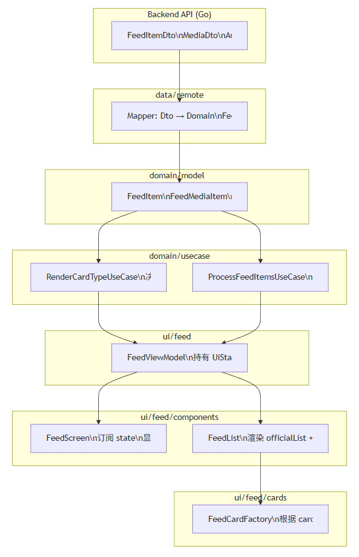

优化dto

| 内容类型               | isOfficial | isTopOfficial | 结果              |
| ---------------------- | ---------- | ------------- | ----------------- |
| 新华社普通新闻         | true       | false         | 不会进入官方 Top5 |
| 新华社权威发布         | true       | true          | 进入 Top5         |
| 人民日报评论           | true       | false         | 不进入 Top5       |
| 中央电视台重大报道     | true       | true          | 进入 Top5         |
| 封面新闻（非官方媒体） | false      | false         | 不进入 Top5       |

style type不应该是后端决定的，应该是客户端决定的

DTO → Domain → (RenderCardTypeUseCase) → renderedList → (ProcessFeedItemsUseCase) → UI 分段

