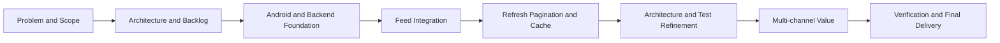

# Management Assessment Evidence Pack

## Source and Honesty Statement

This pack supports `TeamXX- Management Assessment.mp4` and the aligned management sections of the final report. The source rubric is page 33 of `Project Requirements SE33 v2.pdf`, which sets a maximum duration of five minutes.

The report's March-to-August Sprint schedule, `sprint-backlog.csv`, and `burndown.csv` are reconstructed planning and traceability artifacts. They are not presented as contemporaneous Jira exports. The Git-backed execution record in this pack uses repository dates and commit SHAs. Effort is an approximate retrospective self-declaration by the sole developer, not a contemporaneous timesheet. Formal sponsor feedback is unavailable and is not invented.

## Rubric Coverage

| PDF Requirement | Evidence to Show | Status |
|---|---|---|
| Project justification | Final report Sections 1.1, 1.2, and 1.4 | Ready |
| Project journey map | Final report Section 1.9 | Ready |
| Scope: features or use cases | Final report Sections 1.3 and 3.2 | Ready |
| Product backlog: all stories/use cases | `management-product-backlog.csv` | Ready |
| Agile/Scrum conduct | Reconstructed iteration goals, reviews, and actions below | Ready with reconstruction disclosure |
| Tracking tool | Git/GitHub history and commit SHAs | Ready; Jira was not used |
| Sprint backlogs, goals, completion, and burndown | `git-backed-iteration-log.csv`, `sprint-backlog.csv`, `burndown.csv`, and E02 | Ready with reconstruction disclosure |
| Overall effort for each member | `effort-tracking.csv`: sole developer, approximately 100 man-days | Ready as a retrospective estimate |
| Planned versus actual hours | `effort-tracking.csv`: approximately 800 planned and 800 actual hours | Ready as a retrospective estimate |
| Client/sponsor management | Scope/acceptance handling and transparent status below | Ready; no formal acceptance evidence |
| Team management | One-person delivery model and Git identities below | Ready |

## Project Justification

The project addresses the gap between a static mobile list and a resilient news-feed experience. Its goals are to deliver a working Android, Go, and PostgreSQL path; support refresh and cursor pagination; render multiple content types and channels; preserve cached content during backend failure; and make ranking behavior explainable. The expected benefit is faster content discovery, clearer recommendation reasons, and a maintainable end-to-end implementation that can be verified through tests and runtime evidence.

## Scope Baseline

| In Scope and Delivered | Deferred or Outside Final Scope |
|---|---|
| Android Compose feed and explicit UI states | User authentication and account synchronization |
| Go REST API and PostgreSQL persistence | Search and social interaction workflows |
| Refresh, cursor pagination, and duplicate prevention | Production-scale personalised machine learning |
| Room cache-first feed and offline fallback | Advanced cache expiry and eviction policy |
| Multi-channel and multi-card rendering | Advanced streaming, preloading, and adaptive bitrate |
| News detail and basic lifecycle-aware video playback | Production deployment and formal go-live |
| Automated tests, Docker, load test, and CI definitions | Formal sponsor acceptance where evidence is unavailable |

## Project Journey

## Product and Iteration Control

The complete delivery backlog is stored in `management-product-backlog.csv`. P0 identifies required delivery and verification work, and P1 identifies experience and explainability enhancements. PB-01 through PB-12 are the 12 stories committed to the current release and are complete. PB-13 is labelled as a future epic outside the release; it was not accepted into a Sprint and is not counted as an incomplete committed story.

The verified execution sequence is stored in `git-backed-iteration-log.csv`. It contains five completed Git-backed iterations and a completed Git-backed finalisation stage. Each row gives a goal, selected work, commit SHAs, review outcome, and a retrospective action. Earlier review wording is explicitly labelled as reconstructed from Git rather than original meeting minutes.

### Sprint Completion Summary

| Sprint | Period | Backlog Items | Completed | Sprint Goal |
|---|---|---:|---:|---|
| Sprint 0 | 03/23-04/05 | 4 | 4 | Achieved |
| Sprint 1 | 04/06-04/27 | 4 | 4 | Achieved |
| Sprint 2 | 04/28-05/25 | 4 | 4 | Achieved |
| Sprint 3 | 05/26-06/29 | 4 | 4 | Achieved |
| Sprint 4 | 06/30-07/27 | 4 | 4 | Achieved |
| Sprint 5 | 07/28-08/14 | 4 | 4 | Achieved |

All 24 Sprint Backlog items are complete. The Sprint schedule is a reconstructed management view for the confirmed March 23 to August 14 assessment period; the separate Git-backed iteration log preserves the repository's actual commit dates.

The existing burndown chart E02 is a final traceability reconstruction from backlog completion, not a historical Jira export. It ends at zero after all committed Sprint work was completed, but it must not be described as live daily tracking.

## Review and Retrospective Record

| Evidence Review | Observed Outcome | Improvement Action | Closure Evidence | Classification |
|---|---|---|---|---|
| Feed integration review | Multi-card feed rendered, but refresh and pagination were incomplete | Split refresh and load more into separate testable flows | Commits `8c7a6d8`, `35d724a`, and `9447406` | Reconstructed from Git |
| Reliability review | Network failure could leave the feed unavailable | Add Room data, skeleton, and explicit error states | Commits `58457b0`, `f290eca`, and `26556e6` | Reconstructed from Git |
| Architecture review | Feed UI and data responsibilities required clearer boundaries | Refine repository/use-case/ViewModel boundaries and add tests | Commits `06d8dc4`, `1db5c6c`, and `7cd77ef` | Reconstructed from Git |
| Final performance review | Nested database reads exhausted the connection pool under load | Close outer rows before related-media queries and repeat the stress test | `verification-2026-08-08.md`: 500 requests, zero failures | Final verification record |
| Security gate review | Trivy blocked real HIGH/CRITICAL dependency findings | Upgrade Go dependencies and the container base, then rescan | Commits `bb0467d`, `d16f5f8`, and final green run evidence | Final CI remediation record |

## Management Risks and Outcomes

| Risk or Issue | Owner Role | Mitigation | Current Outcome |
|---|---|---|---|
| Refresh and pagination races | Android owner | Operation guards, request versions, and ID-based merge | Covered by ViewModel tests |
| Weak-network blank feed | Android/data owner | Scene-filtered Room cache-first flow | Demonstrable in App Demo |
| Database pool exhaustion | Backend owner | Close outer query rows before nested media loading | 500 requests at concurrency 25 with zero failures |
| Scope expansion during finalisation | Project owner | P0/P1 release backlog and explicit future-scope boundary | Advanced ML, auth, and streaming remain outside the release |
| CI evidence not tied to final code | Sole developer | Commit and push final code, then retain artifacts and SHA | Closed with final GitHub Actions runs and artifacts |
| Formal sponsor acceptance unavailable | Project owner | State the limitation and use technical acceptance evidence | No sponsor acceptance claim is made |

## Client/Sponsor and Team Management

Client/sponsor management was handled through a visible scope baseline, acceptance criteria, progress evidence, and explicit disclosure that formal sponsor acceptance is unavailable. This prevents technical verification from being misrepresented as sponsor sign-off.

For a one-person project, team management focused on role switching and independent quality controls. Sprint goals and P0/P1/future-scope priorities limited concurrent work across Android, backend, database, testing, DevSecOps, and documentation. Automated tests, CodeQL, Trivy, ZAP, repeatable scripts, and Git history reduced the risk created by having no second developer reviewer. The three Git identities are therefore consolidated under one member and one effort record.

## Effort and Team Evidence

This was a one-person project completed by Xu Ziyi as the sole developer. The delivery period was 2026-03-23 to 2026-08-14. Using the developer-confirmed working intensity of approximately 20 workdays per month for about five months, planned effort is reported as approximately 100 man-days or 800 hours. Actual effort is retrospectively reported at approximately the same level: 100 man-days or 800 hours. This is an honest retrospective estimate, not a daily timesheet, and should be described that way in the recording.

Git contains 65 commits at final technical evidence commit `900f4e5` under the author identities `SUPERpowerGT`, `Zee`, and `xu ziyi`. The developer confirmed that this is a solo project, so these identities must not be presented as three team members. Git activity provides an audit trail, while `effort-tracking.csv` provides the separate retrospective effort declaration.

## Sponsor and Acceptance Status

Formal sponsor or mentor acceptance was not available at the time of evidence preparation. No acceptance or go-live claim is made. Technical acceptance evidence consists of the running Android application, backend health/API evidence, PostgreSQL/Docker evidence, automated tests, and repeatable stress-test results.

## Recording Evidence Order

1. PDF page 33 and final report project justification.
2. Final report scope and Project Journey Map.
3. `management-product-backlog.csv`, showing 12 completed release stories and PB-13 outside scope.
4. `sprint-backlog.csv` and the Sprint Completion Summary, showing 24 of 24 completed and all goals achieved.
5. `git-backed-iteration-log.csv`, a filtered `git log` view, and E02 with the reconstruction disclosure.
6. `effort-tracking.csv`, showing the sole member and planned versus actual effort.
7. Client/sponsor management, sole-developer team management, remediation evidence, final CI status, and sponsor status.

## Remaining External Evidence

- Original Jira/board screenshots, only if a tracking tool other than GitHub was used.
- Formal sponsor or mentor feedback, only if it exists.
