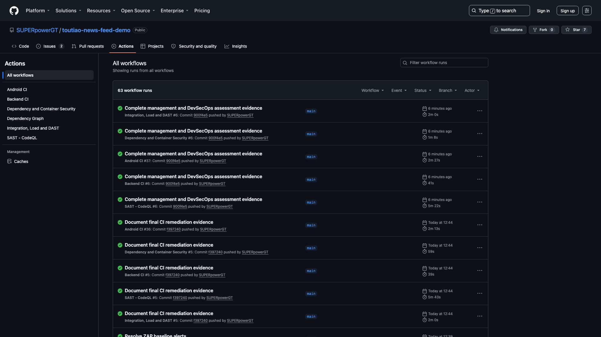
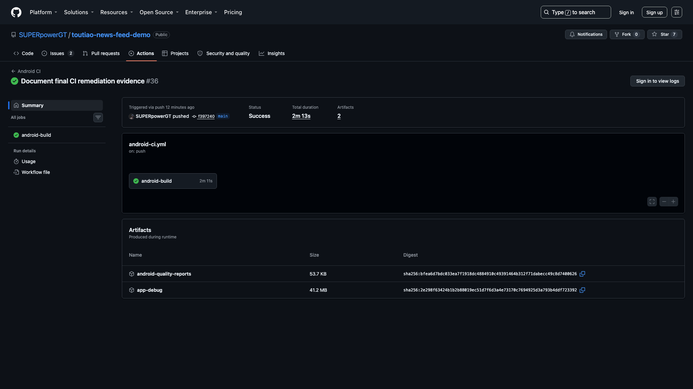
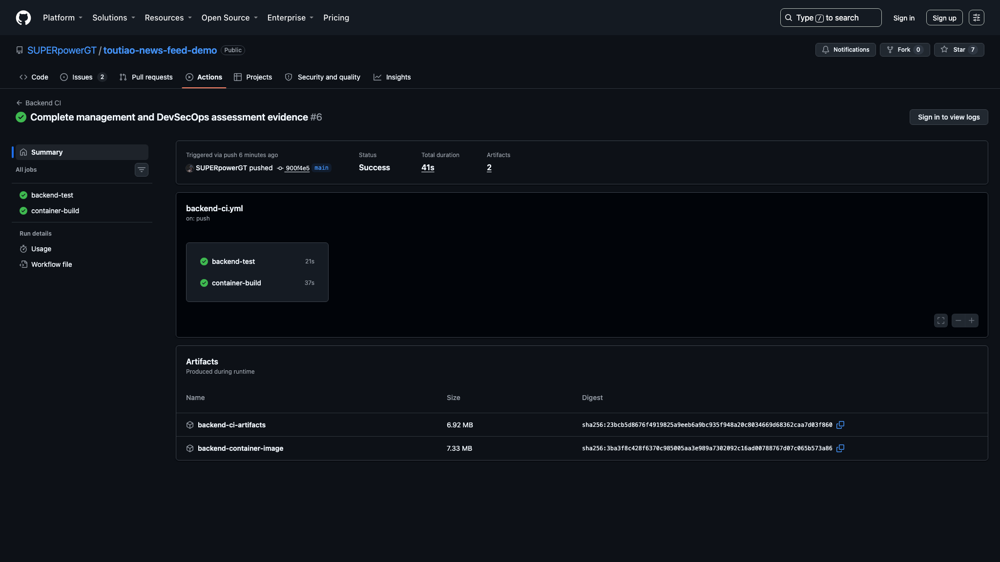
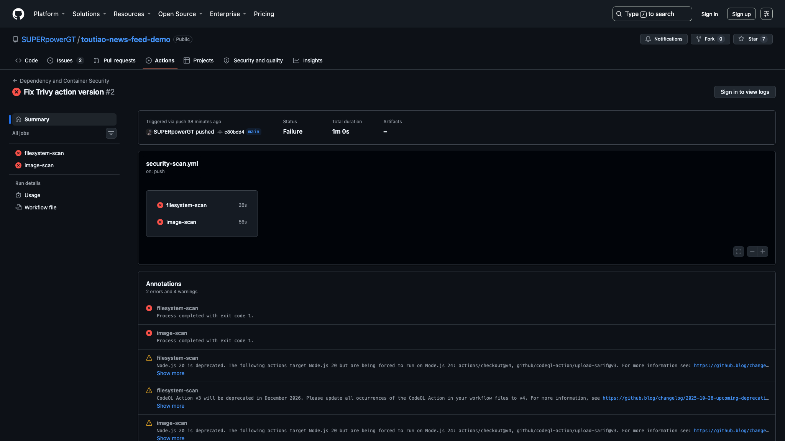
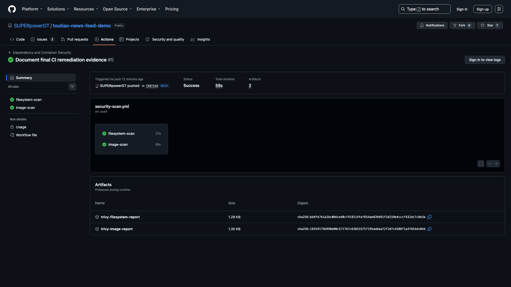
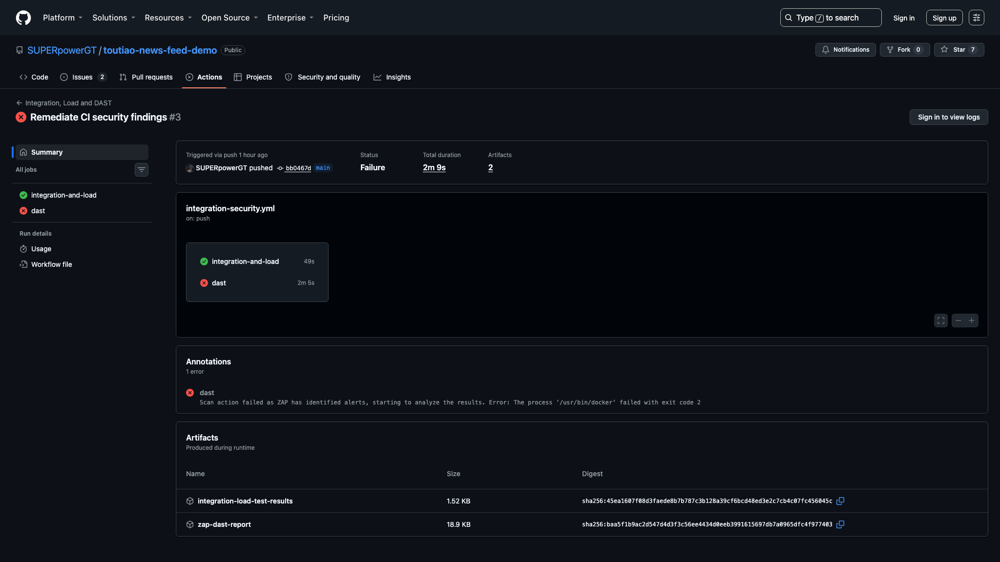
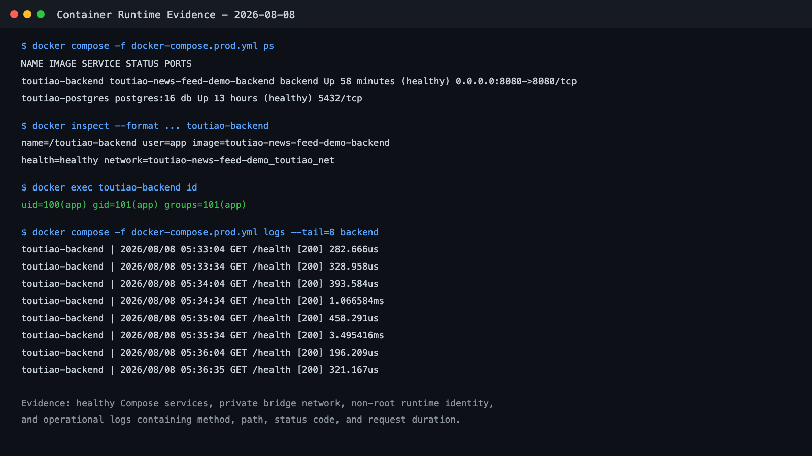
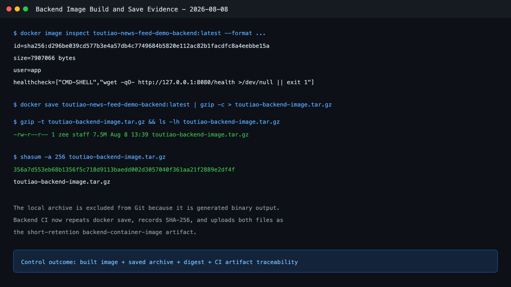

# Video 4 - Technical Assessment - DevSecOps

## Delivery Information

- Required filename: `TeamXX- Technical Assessment - DevSecOps.mp4`
- Target duration: 10 minutes
- Primary purpose: prove a working build, test, security, container, deployment, audit, remediation, and evidence pipeline.

## Required Content

- DevSecOps pipeline architecture and quality gates.
- Android CI: unit tests, lint, APK build, and uploaded reports/artifact.
- Backend CI: formatting, vet, race tests, coverage, binary, and container build.
- Unit test evidence with case counts and coverage.
- API integration test evidence.
- Load/stress test configuration and metrics.
- CodeQL SAST result.
- Trivy dependency, secret, misconfiguration, and image scan results.
- OWASP ZAP DAST result.
- Vulnerability finding, remediation decision, and rescan outcome.
- Multi-stage non-root backend container and health check.
- Docker Compose as Infrastructure as Code.
- Runtime logs, health status, and fault diagnosis example.
- Git history and traceability from change to pipeline run.
- GDPR applicability assessment and machine-validated compliance-as-code mapping.

## Evidence Required Before Recording

- [x] Successful Android CI run with quality and APK artifacts in E19.
- [x] Successful Backend CI run with coverage/binary and saved-image artifacts in E30.
- [x] Successful Integration and Load workflow artifact in E22.
- [x] CodeQL result for Go and Java/Kotlin in E23.
- [x] Trivy filesystem and container-image reports in E21.
- [x] OWASP ZAP report in E22.
- [x] Trivy initial finding and rescan in E24/E21; ZAP initial finding and rescan in E28/E22.
- [x] Docker image build, save, digest, health check, and non-root evidence in E27.
- [x] Container health, inspect, runtime identity, network, and log evidence in E26.
- [x] Git commit SHA associated with all shown GitHub results.
- [x] GDPR applicability and machine-validated control mapping.
- [ ] A CodeQL SAST finding-to-resolution example is unavailable because retained CodeQL runs show successful analysis but no actionable finding. State this limitation; do not substitute Trivy dependency remediation as CodeQL remediation.

## Suggested Timeline

| Time | Narration | Screen Evidence |
|---|---|---|
| 0:00-0:50 | Pipeline and quality-gate overview | E12 architecture diagram |
| 0:50-2:00 | Android CI | Test, lint, APK, artifact pages |
| 2:00-3:10 | Backend CI | Format, vet, race, coverage, image build |
| 3:10-4:15 | Automated testing | Unit and integration reports |
| 4:15-5:10 | Load/stress testing | 500/25 metrics and before/after result |
| 5:10-6:15 | CodeQL SAST | Analysis result and code location |
| 6:15-7:25 | Trivy security | Dependency, secret, config, image reports |
| 7:25-8:10 | OWASP ZAP DAST | Target, rules, findings, report |
| 8:10-9:05 | Remediation and rescan | Finding, fix commit, clean/accepted rescan |
| 9:05-9:40 | Container and operations | Non-root image, health, logs, Compose |
| 9:40-10:00 | Compliance and conclusion | GDPR mapping, audit trail, and honest limitations |

## Evidence Screenshots

| Pipeline overview | Android CI | Backend CI |
| --- | --- | --- |
|  |  |  |

| Trivy before remediation | Trivy after remediation |
| --- | --- |
|  |  |

| ZAP before remediation | ZAP after remediation |
| --- | --- |
|  |  |

| Container runtime and logs | Saved image and digest |
| --- | --- |
|  |  |

## Exact Recording Runbook and Oral Script

### Prepare These Screens

Open E12 and E19-E30, `evidence/verification-2026-08-08.md`, `.github/workflows/`, `backend/Dockerfile`, `docker-compose.prod.yml`, `compliance/gdpr-controls.json`, and the report's GDPR table. In the authenticated GitHub browser, prepare runs `31242565863` through `31242565879` and expand the artifact lists. Download or open at least one small report artifact before recording; do not download the full saved image during the take.

### Exact Ten-Minute English Script

| Time | Screen Evidence | Exact English Narration |
| --- | --- | --- |
| 0:00-0:40 | E12 pipeline architecture, then E29 overview | "This DevSecOps assessment follows the rubric areas for CI and CD, automated testing, static and dynamic security, container management, vulnerability remediation, infrastructure as code, version-control audit, and a specific regulatory framework. A push to GitHub triggers independent Android, backend, CodeQL, Trivy, and integration, load, and ZAP workflows. Each workflow acts as a quality gate and retains evidence. The final overview shows all five project workflows green against the same evidence commit." |
| 0:40-1:30 | E19 Android CI and its artifact list | "Android CI uses JDK seventeen and Gradle dependency caching. It runs the Debug JVM unit-test suite, Android lint, and the Debug APK build. The test suite covers FeedViewModel state transitions, refresh-state logic, update-banner logic, repository cache-first behaviour, detail loading, and related business paths. The workflow does not treat a successful compile as sufficient evidence. It uploads the HTML and XML unit-test and lint reports as android-quality-reports, and uploads the installable Debug APK separately as app-debug. This provides traceability from a commit to tests, static validation, and a deliverable mobile artifact." |
| 1:30-2:20 | E30 Backend CI, workflow YAML, then E27 | "Backend CI first validates the version-controlled GDPR control mapping. It then verifies Go formatting, runs go vet, executes tests with the race detector and atomic coverage, and builds the backend binary. Reproduced coverage is fifty-four point nine percent for the API package, sixty-four point four percent for the application package, and twenty-three point two percent overall. I do not claim high repository-wide coverage because infrastructure and executable wiring remain lightly tested. A separate job builds the multi-stage backend container, exports it through docker save, compresses it, calculates SHA two hundred and fifty-six, and uploads the archive and digest as the short-retention backend-container-image artifact." |
| 2:20-3:20 | Verification evidence, integration script, then E22 artifacts | "Testing is separated by purpose. Unit tests isolate Android state and repository behaviour and Go handler and service rules. Integration testing starts PostgreSQL and the backend with Docker Compose, waits for the health endpoint, resets deterministic data, and exercises the real HTTP boundary. It verifies the initial recommendation feed, ranking reasons, append-and-refresh behaviour, video-scene separation, invalid cursor, invalid scene, invalid limit, conflicting request modes, and unsupported methods. The workflow stores the complete integration log. This is distinct from Postman evidence because the checks are repeatable and automated. After the integration stage, the same deployed stack is reused for the load test, and both logs are uploaded as integration-load-test-results." |
| 3:20-4:10 | Load-test before/after table in verification evidence | "The load stage sends five hundred requests at concurrency twenty-five with ApacheBench. The first implementation exhausted a ten-connection PostgreSQL pool because outer query rows remained open while nested media queries requested more connections. Only one request completed before timeout. The repository was changed to read and close the outer rows before loading related media. After remediation, all five hundred requests completed with zero failures. Throughput reached one thousand two hundred and sixty-seven point seven six requests per second, mean latency was nineteen point seven two milliseconds, P ninety-five was thirty-five milliseconds, P ninety-nine was forty milliseconds, and maximum latency was forty-five milliseconds. A second run again had zero failures, demonstrating repeatability." |
| 4:10-5:00 | E23 CodeQL run and `codeql.yml` language matrix | "CodeQL is the source-code SAST control. The workflow initialises GitHub CodeQL for both Go and Java or Kotlin. Go uses the CodeQL autobuild path, while the Android matrix configures JDK seventeen and compiles the Kotlin source before analysis. The successful run proves that both language analyses completed against the identified commit. The retained evidence does not show an actionable CodeQL alert, so I do not invent a SAST remediation claim. The accurate statement is that CodeQL execution is retained and repeatable, while the genuine finding-to-fix evidence in this project comes from Trivy dependency scanning and OWASP ZAP dynamic scanning." |
| 5:00-6:00 | E24 failure, Trivy workflow, then E21 success and artifacts | "Trivy performs two complementary controls. The filesystem job scans dependencies, secrets, and configuration, uploads SARIF to code scanning, retains a report artifact, and enforces a HIGH and CRITICAL gate with exit code one. The image job builds the actual backend image, scans its operating-system and application packages, uploads SARIF, and enforces the same gate. The first real scan blocked twelve Go dependency findings: ten HIGH and two CRITICAL. We upgraded pgx, x sync, and x text, moved the backend to Go one point twenty-five, and moved the runtime to Alpine three point twenty-three. The successful rescan shows both jobs green and retains both Trivy reports. One low-severity Dependabot notice is disclosed separately; this is not presented as a universal zero-alert claim." |
| 6:00-7:00 | E28 ZAP failure, `.zap/rules.tsv`, security header code, then E22 | "OWASP ZAP provides the DAST control against the running recommendation API, not against source code or a Postman response. At commit bb zero four six seven d, integration and load passed, but the DAST job failed after ZAP identified alerts and still retained the report. Review found three categories: a missing or invalid Cross-Origin-Resource-Policy value, intentionally non-storable API content, and intentional Unix timestamp fields. The API added a restrictive same-origin resource policy. Rules one zero zero four nine and one zero zero nine six were documented as justified API behaviour rather than silently hidden. The final local report recorded sixty-five PASS, zero FAIL, zero WARN, and two documented IGNORE results, and the GitHub rerun passed with its ZAP artifact retained." |
| 7:00-7:50 | Git log with `c80bdd4`, `bb0467d`, `d16f5f8`, then before/after pairs | "The audit trail makes remediation decisions reviewable. Commit c eighty b d d four corrected the Trivy action version so the real scanner could execute. That scan then failed on genuine dependencies rather than a workflow syntax problem. Commit bb zero four six seven d upgraded the dependencies and base image, after which Trivy passed but ZAP exposed the dynamic alerts. Commit d sixteen f five f eight added the resource-policy correction and documented ZAP rules. The final evidence commit reran all controls successfully. Showing failures is important: a quality gate is credible because it blocked delivery, produced evidence, led to a code or policy decision, and was rerun rather than disabled." |
| 7:50-8:40 | E26, Dockerfile, and `docker-compose.prod.yml` | "Container management is demonstrated beyond building an image. Docker Compose runs PostgreSQL and the Go backend on a private bridge network, waits for database health, and publishes only backend port eight thousand and eighty. Runtime inspection shows both services healthy and confirms that the backend runs as uid one hundred, user app, rather than root. The Dockerfile uses a multi-stage static Go build, a minimal Alpine runtime, ownership-aware copy, and an image health check. The inspect evidence links the running container to that image and network. Container logs show method, route, HTTP status, and duration. Application feed logs omit the client IP and do not record request bodies, tokens, or credentials." |
| 8:40-9:15 | Compose files, workflow files, compliance JSON, validation script | "Infrastructure and compliance controls are versioned as code. Docker Compose defines services, health checks, dependencies, storage, ports, and the private network. GitHub workflow files define builds, tests, scans, gates, and retained artifacts. The GDPR mapping is stored as machine-readable JSON, and a shell validation step uses jq to verify the framework, unique control identifiers, legal references, evidence, and status fields. These files are reviewed through the same Git history as application code, providing an auditable link between infrastructure intent, compliance decisions, execution, and final evidence." |
| 9:15-9:50 | GDPR control table in final report | "The selected framework is the European Union General Data Protection Regulation. This is an applicability mapping, not a certification claim. Under Article five, the release minimises data: it has no login, user profile, behavioural tracking, or advertising identifier, and application logs omit client IP addresses. Article twenty-five is addressed by keeping account, social, and behaviour-based personalisation outside scope until consent and privacy controls exist. Article thirty-two maps to validation, parameterised SQL, tests, scans, non-root execution, and health checks. Before public deployment, storage limitation, access-log retention, deletion, data-subject requests, consent, and breach-response procedures still require implementation." |
| 9:50-10:00 | E29 final overview | "In summary, the project provides tested artifacts, enforced security gates, genuine remediation and rescans, managed containers, compliance-as-code, and Git traceability without overstating certification or unresolved evidence. Thank you." |

### Recording Controls

- Rehearse at approximately 120 words per minute; the narration is designed for ten minutes including short screen transitions.
- Keep the commit SHA and artifact names visible on GitHub screens.
- Introduce E24 and E28 as historical failures, and finish on a green final run.
- Say that CodeQL completed; do not claim a remediated CodeQL alert without retained alert evidence.
- Describe the GDPR section as an applicability mapping, not certification or legal advice.
- Show the image artifact name but avoid downloading the large archive during the recording.
- Page 36 asks for SAST resolution and rescan results. Explain that CodeQL was rerun successfully but produced no actionable finding requiring resolution; the project cannot truthfully demonstrate a CodeQL before/after fix.

## Recording Notes

- Use the final successful GitHub runs after the saved-image workflow change is pushed.
- A workflow YAML file is design evidence, not execution evidence.
- Postman is integration evidence, not DAST evidence.
- Show tool version, commit SHA, scan target, severity, result, and artifact where possible.
- Do not hide failed scans; explain remediation or documented risk acceptance.

## Definition of Done

- [x] Unit, integration, load/stress, SAST, and DAST rubric categories are addressed.
- [x] SAST, DAST, dependency, secret, configuration, and image scans show real results.
- [x] Trivy and ZAP remediation/rescan loops are demonstrated.
- [x] Container build/save, inspect, health, logs, IaC, compliance-as-code, and Git audit are visible.
- [x] Every screenshot belongs to the final or a clearly identified historical remediation commit.
- [ ] CodeQL SAST resolution evidence is not available; successful clean analysis is disclosed instead.
- [ ] Final video is ten minutes or shorter, 1920x1080, with the speaker's face clearly visible.
