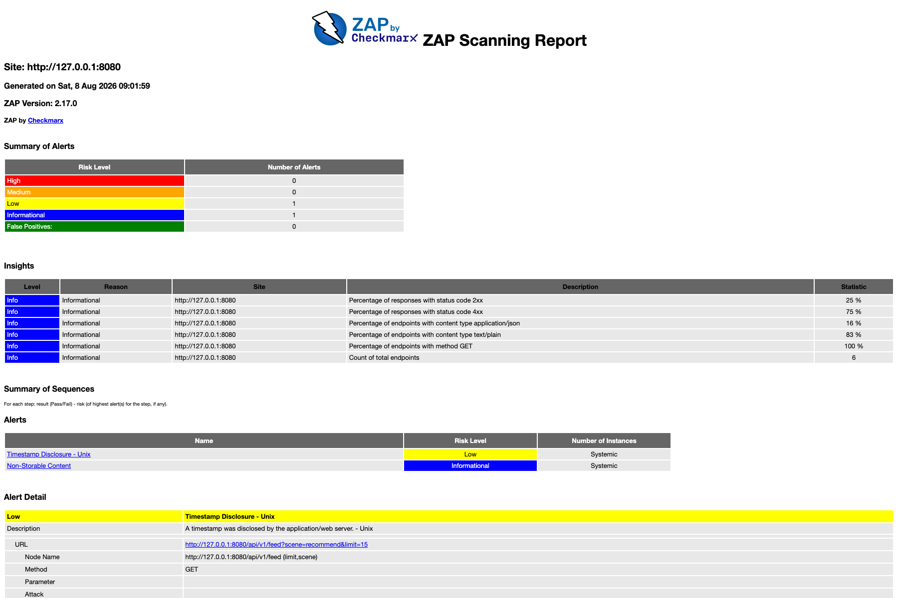
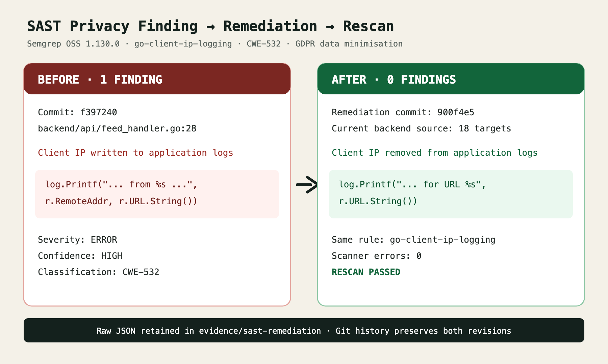
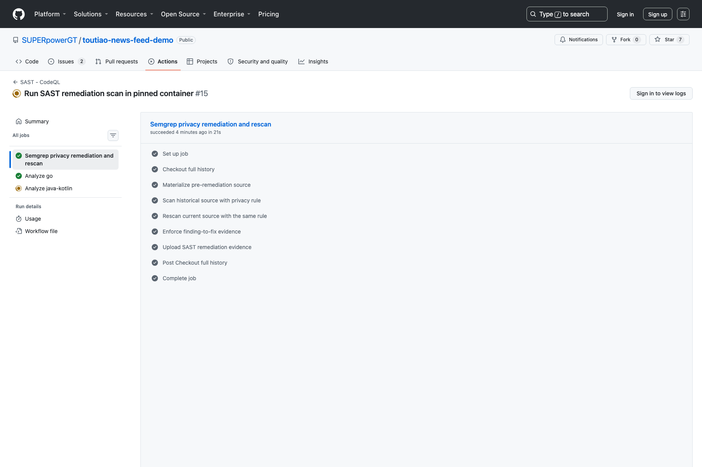

# Video 4 - Technical Assessment - DevSecOps

## Delivery Information

- Required filename: `TeamXX- Technical Assessment - DevSecOps.mp4`
- Maximum duration: 10 minutes
- Primary purpose: prove a working build, test, security, container, deployment, audit, remediation, and evidence pipeline.

## Required Content

- DevSecOps pipeline architecture and quality gates.
- Android CI: unit tests, lint, APK build, and uploaded reports/artifact.
- Backend CI: formatting, vet, race tests, coverage, binary, and container build.
- Unit test evidence with case counts and coverage.
- API integration test evidence.
- Load/stress test configuration and metrics.
- CodeQL SAST result.
- Trivy dependency, secret, misconfiguration, and image scan results.
- OWASP ZAP DAST result.
- Vulnerability finding, remediation decision, and rescan outcome.
- Multi-stage non-root backend container and health check.
- Docker Compose as Infrastructure as Code.
- Runtime logs, health status, and fault diagnosis example.
- Git history and traceability from change to pipeline run.
- GDPR applicability assessment and machine-validated compliance-as-code mapping.

## Evidence Required Before Recording

- [x] Successful Android CI run with quality and APK artifacts in E19.
- [x] Successful Backend CI run with coverage/binary and saved-image artifacts in E30.
- [x] Successful Integration and Load workflow artifact in E22.
- [x] CodeQL result for Go and Java/Kotlin in E23.
- [x] Trivy filesystem and container-image reports in E21.
- [x] OWASP ZAP report in E22.
- [x] Trivy initial finding and rescan in E24/E21; ZAP initial finding and rescan in E28/E22.
- [x] Docker image build, save, digest, health check, and non-root evidence in E27.
- [x] Container health, inspect, runtime identity, network, and log evidence in E26.
- [x] Git commit SHA associated with all shown GitHub results.
- [x] GDPR applicability and machine-validated control mapping.
- [x] Reproducible SAST finding-to-resolution evidence in E33: the same versioned Semgrep privacy rule detects one client-IP logging finding in historical commit `f397240` and zero findings in the current backend. CodeQL remains the two-language broad SAST control.
- [x] Open and capture the Android unit-test execution and APK build logs. The supplied authenticated GitHub screenshots show Android CI run `#47`, the exact command `./gradlew testDebugUnitTest --stacktrace`, a successful `Run Unit Tests` step, `BUILD SUCCESSFUL in 17s`, 38 actionable build tasks, and the successful APK upload step.
- [x] Open and capture the backend Go test result and coverage summary. The supplied screenshot expands `Test with race detector and coverage`, shows the exact `go test -race` command, successful package results, and package coverage from 17.4% to 64.4%.
- [x] Open and capture the ZAP HTML report contents. The supplied screenshots show ZAP 2.17.0, target `http://127.0.0.1:8080`, 0 High, 0 Medium, 2 Low, and 1 Informational alert, with complete alert details.
- [x] Rerun ZAP after the private-IP remediation and capture the replacement report in E43. Integration, Load and DAST run `31249623511` passed against commit `cabb8c0`; the downloaded report contains no `Private IP Disclosure` alert.
- [ ] Decide and evidence the CD position. Current workflows build delivery artifacts and deploy an ephemeral Compose stack for verification, but do not automatically deploy to a persistent environment. Either show a sanitized staging/internal deployment execution or describe this accurately as continuous delivery readiness rather than production CD.

## Suggested Timeline

| Time | Narration | Screen Evidence |
|---|---|---|
| 0:00-0:50 | Pipeline and quality-gate overview | E12 architecture diagram |
| 0:50-2:00 | Android CI | Test, lint, APK, artifact pages |
| 2:00-3:10 | Backend CI | Format, vet, race, coverage, image build |
| 3:10-4:15 | Automated testing | Unit and integration reports |
| 4:15-5:10 | Load/stress testing | 500/25 metrics and before/after result |
| 5:10-6:15 | CodeQL SAST | Analysis result and code location |
| 6:15-7:25 | Trivy security | Dependency, secret, config, image reports |
| 7:25-8:10 | OWASP ZAP DAST | Target, rules, findings, report |
| 8:10-9:05 | Remediation and rescan | Finding, fix commit, clean/accepted rescan |
| 9:05-9:40 | Container and operations | Non-root image, health, logs, Compose |
| 9:40-10:00 | Compliance and conclusion | GDPR mapping, audit trail, and honest limitations |

## Evidence Screenshots

| Pipeline overview | Android CI | Backend CI |
| --- | --- | --- |
|  |  |  |

### Supplied Android CI Detail Evidence

Use the two authenticated GitHub screenshots supplied for Android CI run `#47` immediately after E19:

1. **Unit-test detail:** `android-build` is green and the expanded `Run Unit Tests` step shows `./gradlew testDebugUnitTest --stacktrace`. This is direct execution evidence, but it does not expose the final test count.
2. **APK-build detail:** the expanded `Build Debug APK` step shows `BUILD SUCCESSFUL in 17s`, `38 actionable tasks: 18 executed, 20 up-to-date`, followed by a successful `Upload APK` step.

The earlier backend `Set up Go` and `Post Checkout` screenshots are not test evidence. The subsequently supplied screenshot satisfies the requirement by expanding the workflow's exact `Test with race detector and coverage` step. It shows `go test -race -coverprofile=coverage.out -covermode=atomic ./...`, successful package results, API coverage at 54.9%, application at 64.4%, media at 62.5%, middleware at 39.1%, and seed at 17.4%. It also honestly exposes untested executable and infrastructure packages rather than implying universal coverage.

### Supplied ZAP HTML Evidence and Remediation

The supplied ZAP 2.17.0 HTML report is readable and suitable as **before-remediation evidence**:

- Target: `http://127.0.0.1:8080`
- High: 0
- Medium: 0
- Low: 2
- Informational: 1
- Low alerts: `Private IP Disclosure` and `Timestamp Disclosure - Unix`
- Informational alert: `Non-Storable Content`

`Private IP Disclosure` was a real project-controlled finding: seeded video media exposed the emulator-only address `10.0.2.2:8080` in the API response. Commit `cabb8c0` changes the API value to `/media/demo-video.mp4` and lets Android resolve that relative path against its configured backend base URL. Integration, Load and DAST run `31249623511` passed, and direct inspection of its downloaded JSON, Markdown, and HTML reports confirms that `Private IP Disclosure` is absent. E43 shows the replacement report with 0 High, 0 Medium, 1 Low Unix timestamp alert, and 1 Informational non-storable-content alert. The remaining alerts are documented risk acceptances under `.zap/rules.tsv`; do not describe E43 as zero-alert.

| Trivy before remediation | Trivy after remediation |
| --- | --- |
|  |  |

| ZAP before remediation | ZAP after remediation |
| --- | --- |
|  |  |

| SAST before remediation | SAST after remediation |
| --- | --- |
|  | The right-hand panel in E33 shows the retained clean backend rescan; the latest CI artifact repeats the scan after subsequent backend additions. |

| Container runtime and logs | Saved image and digest |
| --- | --- |
|  |  |

## Exact Recording Runbook and Oral Script

### Prepare These Screens

Open E12, E19-E34, E43, the two supplied Android CI run `#47` detail screenshots, `evidence/verification-2026-08-08.md`, `.github/workflows/`, `backend/Dockerfile`, `docker-compose.prod.yml`, `compliance/gdpr-controls.json`, and the report's GDPR table. In GitHub, prepare SAST run `#15`, Integration, Load and DAST run `31249623511`, and the retained earlier final workflow runs for the other controls. Download or open at least one small report artifact before recording; do not download the full saved image during the take.

The opened backend test/coverage screenshot and final ZAP report E43 are now ready. For CD, do not call the Compose integration environment a production deployment. Use the wording "delivery-ready artifact plus automated deployment verification" unless sanitized persistent-environment evidence is available.

### Exact Ten-Minute English Script

| Time | Screen Evidence | Exact English Narration |
| --- | --- | --- |
| 0:00-0:40 | E12 pipeline architecture, then E29 overview | "This DevSecOps assessment follows the rubric areas for CI and CD, automated testing, static and dynamic security, container management, vulnerability remediation, infrastructure as code, version-control audit, and a specific regulatory framework. A push to GitHub triggers independent Android, backend, CodeQL, Trivy, and integration, load, and ZAP workflows. Each workflow acts as a quality gate and retains evidence. The final overview shows all five project workflows green against the same evidence commit." |
| 0:40-1:30 | E19, then the supplied run `#47` Unit Tests and Build Debug APK screenshots | "Android CI uses JDK seventeen and Gradle dependency caching. In this authenticated run, the android-build job completed successfully. The expanded unit-test step shows the exact command, dot slash gradlew test Debug Unit Test with stack trace, and the step completed in fifty-one seconds. The pipeline then built the Debug APK. The expanded build log records BUILD SUCCESSFUL in seventeen seconds, with thirty-eight actionable tasks: eighteen executed and twenty up to date. The following Upload APK step is also green. The workflow additionally runs Android lint and retains the quality reports and installable APK as artifacts. These screens provide direct traceability from the commit to test execution and a deliverable mobile build. I do not claim a test count from this screen because the summary line is not visible." |
| 1:30-2:20 | Supplied expanded backend test screenshot, then E30 and E27 | "Backend CI first validates the version-controlled GDPR control mapping, verifies formatting, and runs go vet. The expanded test step shows the exact command: go test with the race detector and atomic coverage across all packages. The successful output reports fifty-four point nine percent coverage for API, sixty-four point four percent for application, sixty-two point five percent for media, thirty-nine point one percent for middleware, and seventeen point four percent for seed. Executable wiring and infrastructure remain at zero, so I do not claim universal or high repository-wide coverage. The job then builds the backend and uploads the binary and coverage profile. A separate job builds the multi-stage container, saves it, calculates its SHA two hundred and fifty-six digest, and uploads the image archive." |
| 2:20-3:20 | Verification evidence, integration script, then E22 artifacts | "Testing is separated by purpose. Unit tests isolate Android state and repository behaviour and Go handler and service rules. Integration testing starts PostgreSQL and the backend with Docker Compose, waits for the health endpoint, resets deterministic data, and exercises the real HTTP boundary. It verifies the initial recommendation feed, ranking reasons, append-and-refresh behaviour, video-scene separation, invalid cursor, invalid scene, invalid limit, conflicting request modes, and unsupported methods. The workflow stores the complete integration log. This is distinct from Postman evidence because the checks are repeatable and automated. After the integration stage, the same deployed stack is reused for the load test, and both logs are uploaded as integration-load-test-results." |
| 3:20-4:10 | Load-test before/after table in verification evidence | "The load stage sends five hundred requests at concurrency twenty-five with ApacheBench. The first implementation exhausted a ten-connection PostgreSQL pool because outer query rows remained open while nested media queries requested more connections. Only one request completed before timeout. The repository was changed to read and close the outer rows before loading related media. After remediation, all five hundred requests completed with zero failures. Throughput reached one thousand two hundred and sixty-seven point seven six requests per second, mean latency was nineteen point seven two milliseconds, P ninety-five was thirty-five milliseconds, P ninety-nine was forty milliseconds, and maximum latency was forty-five milliseconds. A second run again had zero failures, demonstrating repeatability." |
| 4:10-5:00 | E23 CodeQL run, E33 Semgrep before/after, and `codeql.yml` | "CodeQL is the broad source-code SAST control and analyses both Go and Java or Kotlin. To provide a reproducible source-code remediation loop, the pipeline also runs a version-controlled Semgrep privacy rule. Applying that same rule to historical commit f three nine seven two four zero identifies one CWE five hundred and thirty-two finding where the feed handler logged the remote client address. The remediation removes the client IP while retaining method, route, status, and duration for operations. Applying the identical rule to all current backend Go targets returns zero findings. The workflow asserts one finding before and zero after, then uploads both JSON reports and the summary. This is a reproducible historical comparison, not a claim that CodeQL originally raised the alert." |
| 5:00-6:00 | E24 failure, Trivy workflow, then E21 success and artifacts | "Trivy performs two complementary controls. The filesystem job scans dependencies, secrets, and configuration, uploads SARIF to code scanning, retains a report artifact, and enforces a HIGH and CRITICAL gate with exit code one. The image job builds the actual backend image, scans its operating-system and application packages, uploads SARIF, and enforces the same gate. The first real scan blocked twelve Go dependency findings: ten HIGH and two CRITICAL. We upgraded pgx, x sync, and x text, moved the backend to Go one point twenty-five, and moved the runtime to Alpine three point twenty-three. The successful rescan shows both jobs green and retains both Trivy reports. One low-severity Dependabot notice is disclosed separately; this is not presented as a universal zero-alert claim." |
| 6:00-7:00 | E28, supplied ZAP summary and alert-detail screenshots, relative media-path fix, then replacement ZAP report | "OWASP ZAP provides dynamic application security testing against the running API, not against source code or a Postman response. The opened ZAP two point seventeen report identifies zero High, zero Medium, two Low, and one Informational alert. Timestamp Disclosure reflects the API's documented Unix publish-time and cursor fields, while Non-Storable Content reflects the deliberate no-store policy for API responses; both are recorded as reviewed rule exceptions. The remaining Low alert, Private IP Disclosure, was project-controlled and therefore remediated rather than ignored. Seeded video data exposed the emulator-only address ten dot zero dot two dot two in an API media URL. The backend now returns a relative media path, and Android resolves it using its own configured backend address. The replacement report shown after the fix no longer contains Private IP Disclosure. This demonstrates a finding, root-cause decision, code correction, and same-tool rescan." |
| 7:00-7:50 | Git log with `c80bdd4`, `bb0467d`, `d16f5f8`, then before/after pairs | "The audit trail makes remediation decisions reviewable. Commit c eighty b d d four corrected the Trivy action version so the real scanner could execute. That scan then failed on genuine dependencies rather than a workflow syntax problem. Commit bb zero four six seven d upgraded the dependencies and base image, after which Trivy passed but ZAP exposed the dynamic alerts. Commit d sixteen f five f eight added the resource-policy correction and documented ZAP rules. The final evidence commit reran all controls successfully. Showing failures is important: a quality gate is credible because it blocked delivery, produced evidence, led to a code or policy decision, and was rerun rather than disabled." |
| 7:50-8:40 | E26, Dockerfile, and `docker-compose.prod.yml` | "Container management is demonstrated beyond building an image. Docker Compose runs PostgreSQL and the Go backend on a private bridge network, waits for database health, and publishes only backend port eight thousand and eighty. Runtime inspection shows both services healthy and confirms that the backend runs as uid one hundred, user app, rather than root. The Dockerfile uses a multi-stage static Go build, a minimal Alpine runtime, ownership-aware copy, and an image health check. The inspect evidence links the running container to that image and network. Container logs show method, route, HTTP status, and duration. Application feed logs omit the client IP and do not record request bodies, tokens, or credentials." |
| 8:40-9:15 | Compose files, workflow files, compliance JSON, validation script | "Infrastructure and compliance controls are versioned as code. Docker Compose defines services, health checks, dependencies, storage, ports, and the private network. GitHub workflow files define builds, tests, scans, gates, and retained artifacts. The GDPR mapping is stored as machine-readable JSON, and a shell validation step uses jq to verify the framework, unique control identifiers, legal references, evidence, and status fields. These files are reviewed through the same Git history as application code, providing an auditable link between infrastructure intent, compliance decisions, execution, and final evidence." |
| 9:15-9:50 | GDPR control table in final report | "The selected framework is the European Union General Data Protection Regulation. This is an applicability mapping, not a certification claim. Under Article five, the release minimises data: it has no login, user profile, behavioural tracking, or advertising identifier, and application logs omit client IP addresses. Article twenty-five is addressed by keeping account, social, and behaviour-based personalisation outside scope until consent and privacy controls exist. Article thirty-two maps to validation, parameterised SQL, tests, scans, non-root execution, and health checks. Before public deployment, storage limitation, access-log retention, deletion, data-subject requests, consent, and breach-response procedures still require implementation." |
| 9:50-10:00 | E29 final overview | "In summary, the project provides tested artifacts, enforced security gates, genuine remediation and rescans, managed containers, compliance-as-code, and Git traceability without overstating certification or unresolved evidence. Thank you." |

### Recording Controls

- Rehearse at approximately 120 words per minute; the narration is designed for ten minutes including short screen transitions.
- Keep the commit SHA and artifact names visible on GitHub screens.
- Introduce E24 and E28 as historical failures, and finish on a green final run.
- Distinguish the controls accurately: CodeQL completed for two languages; the finding-to-fix example is produced by the versioned Semgrep privacy rule.
- Describe the GDPR section as an applicability mapping, not certification or legal advice.
- Show the image artifact name but avoid downloading the large archive during the recording.
- Page 36 asks for SAST resolution and rescan results. Show E33 and the uploaded raw JSON: one historical source finding, the exact code change, and zero current findings under the same rule.

## Recording Notes

- Use the final successful GitHub runs after the saved-image workflow change is pushed.
- A workflow YAML file is design evidence, not execution evidence.
- Postman is integration evidence, not DAST evidence.
- Show tool version, commit SHA, scan target, severity, result, and artifact where possible.
- Do not hide failed scans; explain remediation or documented risk acceptance.

## Definition of Done

- [x] Unit, integration, load/stress, SAST, and DAST rubric categories are addressed.
- [x] SAST, DAST, dependency, secret, configuration, and image scans show real results.
- [x] Trivy and ZAP remediation/rescan loops are demonstrated.
- [x] Container build/save, inspect, health, logs, IaC, compliance-as-code, and Git audit are visible.
- [x] Every screenshot belongs to the final or a clearly identified historical remediation commit.
- [x] SAST resolution and same-rule rescan evidence is available in E33 and `evidence/sast-remediation/`; it is correctly attributed to Semgrep rather than CodeQL.
- [x] Android unit-test execution and APK build/upload details are visible in the supplied run `#47` screenshots.
- [x] Backend `go test` output and package coverage are visible in the supplied expanded workflow screenshot.
- [x] ZAP HTML summary and alert details are visible in the supplied report screenshots.
- [x] E43 and the downloaded reports from run `31249623511` confirm that `Private IP Disclosure` is absent after the relative media-path remediation.
- [ ] CI/CD wording and evidence accurately distinguish artifact delivery, ephemeral deployment verification, and any real persistent deployment.
- [ ] Final video is ten minutes or shorter, 1920x1080, with the speaker's face clearly visible.
