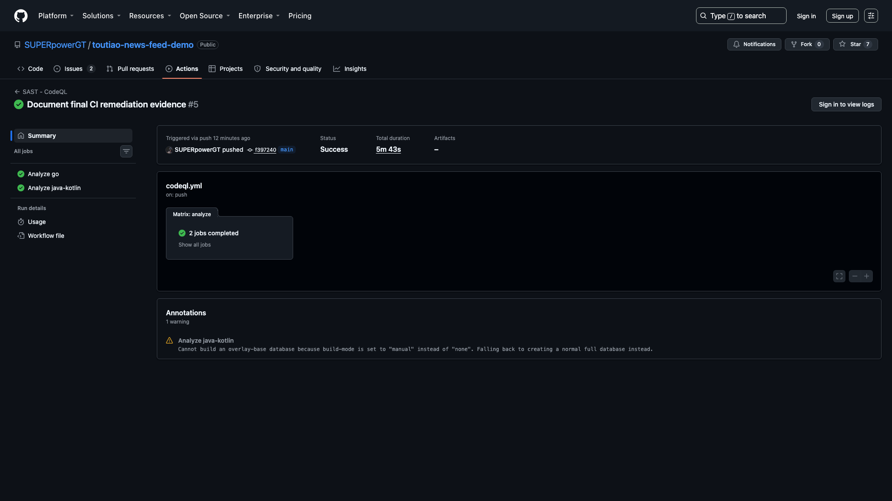
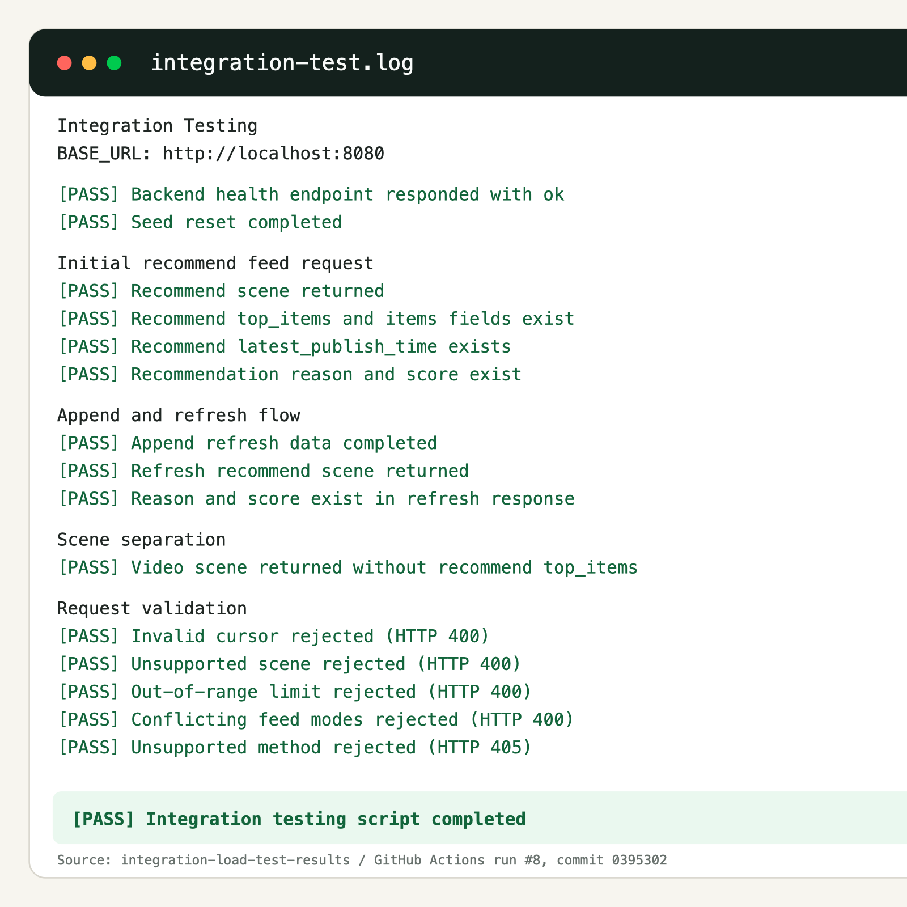
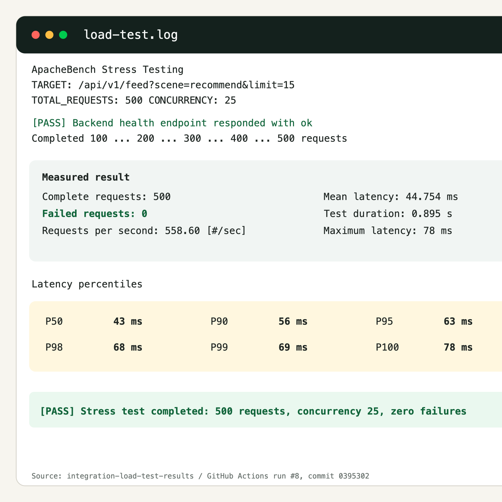

# Video 7 - Presentation Assessment CI/CD Demo

## Delivery Information

- Required filename: `TeamXX- Presentation Assessment CICD Demo.mp4`
- Maximum duration: 5 minutes
- Primary purpose: demonstrate a real automated change-to-artifact pipeline rather than only showing a pipeline diagram.

## Required Demo Flow

- Identify the commit SHA used for the demonstration.
- Show the commit or pull request triggering GitHub Actions.
- Show Android CI stages and generated artifacts.
- Show Backend CI stages and coverage artifact.
- Show Integration, Load, and DAST workflow results.
- Show CodeQL and Trivy security results.
- Show a quality gate preventing success when a check fails, if a controlled example is available.
- Show the corrected commit or successful rerun.
- Download or open at least one generated artifact.
- Connect the successful build to the Docker/demo release process.

## Evidence Required Before Recording

- [x] Final technical evidence commit `900f4e5` is committed and pushed.
- [x] Android CI run `31242565865` is green.
- [x] Backend CI run `31242565864` is green.
- [x] Integration, Load and DAST run `31242565879` is green.
- [x] OWASP ZAP published the downloadable `zap-dast-report` artifact.
- [x] CodeQL run `31242565863` completed Go and Java/Kotlin analysis.
- [x] Trivy run `31242565874` completed filesystem and image scans.
- [x] APK, backend binary/coverage, test logs, saved image, and security reports are downloadable.
- [x] Genuine failure and remediation evidence is prepared in E24/E21 and E28/E22.
- [x] `integration-load-test-results` was downloaded from successful run `#8` on commit `0395302`, extracted, and retained in the repository.

## Evidence Screens

| Final workflow overview | Android CI | Backend CI and image artifacts |
|---|---|---|
|  |  |  |

| Trivy failure before remediation | Trivy success after remediation | CodeQL success |
|---|---|---|
|  |  |  |

| ZAP failure before remediation | Integration, load and ZAP success |
|---|---|
|  |  |

| Opened integration artifact | Opened load-test artifact |
|---|---|
|  |  |

## Suggested Timeline

| Time | Action | Narration |
|---|---|---|
| 0:00-0:25 | Show commit/PR | Explain trigger and commit SHA |
| 0:25-1:15 | Open workflow overview | Explain automated quality gates |
| 1:15-2:00 | Android and Backend CI | Tests, lint/vet, coverage, build artifacts |
| 2:00-2:45 | Integration and load | API checks and 500/25 test artifact |
| 2:45-3:35 | Security jobs | CodeQL, Trivy, and ZAP results |
| 3:35-4:15 | Failure/remediation | Failed gate, fix commit, successful rerun |
| 4:15-4:45 | Artifacts and release | Open APK/report and relate to Docker build |
| 4:45-5:00 | Close | Summarize traceability and release readiness |

## Exact Recording Runbook and Oral Script

### Prepare These Tabs

Open the following pages before recording. Keep the run title, commit SHA, job status, and artifact names visible.

1. Repository commit `900f4e5` and E29 final workflow overview.
2. Android CI run `31242565865`.
3. Backend CI run `31242565864` with `backend-ci-artifacts` and `backend-container-image` visible.
4. Integration, Load and DAST run `31242565879`.
5. CodeQL run `31242565863`.
6. Trivy failure E24 followed by successful run `31242565874`.
7. ZAP failure E28 followed by successful run `31242565879`.

The `integration-load-test-results` artifact has already been downloaded from the later successful run `#8` on commit `0395302`. The original files are retained in `integration-load-test-results/`, and E31/E32 provide readable recording views. Keep both files open before the take. This artifact proves executable results; do not download the 7.33 MB saved image during the recording.

### Exact Five-Minute English Script

| Time | Operator Action | Exact English Narration |
|---|---|---|
| 0:00-0:25 | Show commit `900f4e5`, then E29. | "This demonstration traces one known source revision through automated build, test, security, and artifact stages. The technical evidence commit is nine zero zero f four e five on the main branch. Its push triggered five independent GitHub Actions workflows, and this overview shows their final status as successful." |
| 0:25-1:05 | Open E29 and briefly show workflow names. | "The pipeline separates concerns instead of treating one successful build as complete delivery evidence. Android CI validates the mobile client. Backend CI validates and packages the Go service. CodeQL performs source analysis. Trivy scans dependencies and the built container image. The integration workflow starts the real PostgreSQL and backend stack, then runs API integration tests, load testing, and OWASP ZAP dynamic scanning. A failed enforced job prevents its workflow from becoming green." |
| 1:05-1:45 | Open Android run, then Backend run E30. | "Android CI uses JDK seventeen and Gradle caching, runs JVM unit tests and Android lint, builds the Debug APK, and publishes android-quality-reports and app-debug. Backend CI validates the GDPR control map, checks formatting, runs go vet and race-enabled tests with coverage, and builds the backend binary. It publishes backend-ci-artifacts. A second backend job builds the multi-stage container, exports it with docker save, records its SHA two hundred and fifty-six digest, and publishes backend-container-image with short retention." |
| 1:45-2:25 | Open E22 and expand its two jobs and artifacts. | "The integration workflow proves behaviour against deployed services rather than mocks. It verifies health, recommendation scenes, cursor and validation rules, and refresh behaviour. ApacheBench then sends five hundred requests at concurrency twenty-five; the final result has zero failures. The DAST job runs OWASP ZAP against that deployed API. The final report records sixty-five pass, zero fail, zero warn, and two documented ignores. The workflow retains integration-load-test-results and zap-dast-report." |
| 2:25-3:05 | Show E23, then E21. | "CodeQL analyses both Go and Java or Kotlin source. This successful run proves repeatable SAST execution, but I do not claim a CodeQL remediation because no retained actionable alert is shown. Trivy provides the demonstrated dependency and image-security gate. Its filesystem and image jobs create SARIF and report artifacts, then fail on HIGH or CRITICAL findings. The successful run publishes trivy-filesystem-report and trivy-image-report. One separate low-severity Dependabot notice remains disclosed." |
| 3:05-3:50 | Show E24 then E21; show E28 then E22. | "These historical failures demonstrate that the gates are enforced rather than decorative. The first real Trivy scan failed on twelve dependency findings, including two critical findings. Dependencies and the Alpine runtime were upgraded, and both scans passed on rerun. Later, integration and load passed while ZAP failed on dynamic alerts. The API added a restrictive same-origin resource-policy header, and two intentional API behaviours were documented in the ZAP rules file. The next run passed. The failed runs remain visible as audit evidence and were not deleted or bypassed." |
| 3:50-4:30 | Show the run `#8` artifact entry, then E31 and E32 or the original logs. | "I will now open a generated artifact rather than relying only on green icons. The downloaded package contains successful integration checks for health, recommendation, refresh, scene separation, and request validation. Its load result records five hundred completed requests at concurrency twenty-five with zero failures, five hundred and fifty-eight point six requests per second, P ninety-five of sixty-three milliseconds, and P ninety-nine of sixty-nine milliseconds. Other deliverables include the APK, quality reports, backend binary and coverage, saved image, Trivy reports, and ZAP report." |
| 4:30-5:00 | Show E30, then Docker Compose file or E26, and finish on E29. | "The accepted backend image is the same build path used by Docker Compose for the application demonstration. Compose starts PostgreSQL and the non-root backend with health checks on a private network. Therefore the pipeline connects source control to tested binaries, a saved and scanned image, deployable services, and retained audit evidence. The release gates are green for the stated commit without claiming that every advisory of every severity is zero. This concludes the CI and CD demonstration." |

### Recording Controls

- Do not run a new five-workflow pipeline during the take; show the completed runs.
- Show the `integration-load-test-results` entry and then E31/E32 or the original retained logs so the artifact requirement is visibly satisfied.
- Introduce E24 and E28 as historical failures, then immediately show their successful reruns.
- Keep `900f4e5`, run IDs, job status, and artifact names readable.
- Do not call CodeQL successful execution a remediation when no actionable CodeQL alert is retained.
- Finish on E29 so the final state is unambiguously green.

## Recording Notes

- Pre-run workflows before recording; do not wait for a full pipeline on camera.
- Use a prepared browser tab for each result and switch quickly.
- Keep commit SHA visible so evidence belongs to one known version.
- Do not describe Postman as DAST or a successful YAML parse as a security scan.
- If no controlled failure is available, explain the configured `exit-code: 1` gate and show a genuine historical failure only if it exists.
- The evidence commit is `900f4e5`; later documentation-only commits do not replace this technical evidence anchor.

## Definition of Done

- [ ] Video is five minutes or shorter.
- [x] A real GitHub Actions run is prepared.
- [x] Build, test, scan, and artifact stages are prepared.
- [x] At least one artifact is downloaded, opened, and retained as E31/E32.
- [x] Quality-gate and remediation evidence and wording are prepared truthfully.
- [x] Commit-to-artifact traceability is documented.
