# Modern Recommendation Feed Demo Architecture

# 1. Internship Full-Stack Project Overview

## 1.1 Project Background

This project is positioned as an **internship-oriented full-stack recommendation-feed demo**. It simulates the homepage information-flow experience of mainstream news clients and focuses on building a believable engineering closed loop rather than a purely static UI showcase.

The implementation adopts an end-to-end stack of **Android client + Go backend + PostgreSQL**, covering data preparation, API access, business processing, local caching, and UI rendering. The goal is to demonstrate the kind of cross-layer ownership and delivery ability expected from a solid software engineering intern.

This demo is intentionally designed as a **runnable full-stack project**: the homepage feed supports first-screen loading, pull-to-refresh, cursor pagination, cache-first reading, skeleton states, and multi-card rendering, so the overall result feels closer to a realistic internship project than to a toy example.

By completing the client, backend, database, API debugging, and technical documentation in one project, the developer can show a complete delivery process from requirement understanding and architecture design to implementation, verification, and presentation.

From a broader technology background, this project also reflects two visible industry trends: modern Android development is moving from traditional XML-based UI construction toward declarative UI frameworks such as **Jetpack Compose**, while content platforms are increasingly exploring cross-platform evolution through technologies such as **Kotlin Multiplatform (KMP)**. Even though the current delivery focuses on the Android + Go + PostgreSQL path, the architecture is intentionally described in a way that leaves room for future cross-platform extension.

## 1.2 Requirements Description

This internship project focuses on building a homepage recommendation feed demo and using it to demonstrate the following **full-stack engineering capabilities**:

#### (1) Tool Proficiency

- Android Studio project building and debugging
- Git/GitHub workflow
- Docker/database usage

#### (2) Development Skills

- Kotlin fundamentals + coroutine asynchronous processing
- Jetpack Compose UI construction
- Layered architecture (MVVM + Repository)
- Room local caching
- Client network request and data parsing

#### (3) Engineering and R\&D Literacy

- Project structure organization
- Architecture design capabilities (modularization, layering, scalability)
- Code standardization and maintainability
- Technical documentation writing

#### (4) Business Understanding

- Understand the homepage business logic of news clients
- Recommendation feed loading methods (first screen, refresh, pagination)
- Basic concepts such as content sorting and weight control
- Multi-type content card rendering methods

## 1.3 Project Scope

To keep the internship project realistic, focused, and deliverable within a limited timeline, the development scope of this full-stack demo is defined as follows:

#### In-Scope Development

**Functional Categories**

- Homepage recommendation feed list
- Multi-type content card display (text, image-text, official top cards)
- Pull-down refresh logic
- Pagination loading (Cursor Pagination)
- Loading state and skeleton screen (Skeleton UI)
- Local caching (Room) + Cache-first strategy
- Weak network adaptation (display local cache when offline)

**Data Categories**

- Backend basic data structures (FeedItem / Media / Author / Stats)
- PostgreSQL data storage
- FeedItem sorting and weight control
- Seed data initialization script

**Architecture Categories**

- Android MVVM
- Backend Controller–Service–Repository three-layer architecture
- DTO/Domain/Entity mapping
- Multi-card rendering system (FeedCardFactory)

**Engineering Categories**

- GitHub repository and CI basics
- Complete documentation output (architecture, data flow, sequence diagrams, etc.)

#### Out-of-Scope (Future Expandable)

To avoid scope creep, the following content is not required in this project:

- Advanced short-video streaming, preloading, and visibility-based playback optimization
- Search function (UI can be included, but logic not implemented)
- User login and account system
- Interactive behaviors such as favorites, likes, and comments
- Backend CMS management system
- Push and recommendation algorithms
- Multi-end adaptation (iOS / Web)

These items are treated as **future extension directions** rather than mandatory work for the current internship delivery scope.

**Scope Summary.** The current internship delivery focuses on a recommendation-feed closed loop that is small enough to finish, but complete enough to demonstrate client, backend, database, and engineering collaboration.

| Area         | Included in Current Delivery                                                                          | Deferred / Future Extension                                                                            |
| ------------ | ----------------------------------------------------------------------------------------------------- | ------------------------------------------------------------------------------------------------------ |
| Client       | Feed homepage, pull-to-refresh, cursor pagination, skeleton loading, Room cache, multi-card rendering, news detail, basic lifecycle-aware video playback | Search logic, user account system, cross-end adaptation, advanced video preloading |
| Backend      | Feed API, news detail API, cursor pagination, feed aggregation, PostgreSQL query layer, seed data initialization | CMS management, recommendation algorithm, push notification system |
| Architecture | Compose + MVVM, Repository pattern, DTO/Domain/Entity mapping, Controller-Service-Repository layering | Heavy cross-platform synchronization, large-scale platformization, rich recommendation strategy system |

## 1.4 Internship-Oriented Project Objectives

This section reframes the project as an **internship-level full-stack delivery** rather than a large-scale production system.

**Objective 1.** Deliver a runnable demo that covers the Android client, Go backend, PostgreSQL storage, and API integration.

**Objective 2.** Show ownership of one complete engineering loop: requirements analysis, architecture design, implementation, debugging, and documentation.

**Objective 3.** Demonstrate practical understanding of core feed interactions such as first-screen loading, refresh, pagination, cache-first reading, and multi-card rendering.

**Objective 4.** Practice backend fundamentals suitable for an internship project, including API design, SQL queries, data modeling, and clear service layering.

**Objective 5.** Present the project as a credible full-stack internship case with readable code, architecture diagrams, and clear technical explanation.

## 1.5 Development Methodology and Roadmap

The project follows an **agile, sprint-based, and incremental delivery** approach. This is suitable for a recommendation-feed system because the client, backend, cache, and interaction layers can be implemented and verified in small but meaningful milestones.

The roadmap below summarizes the main execution phases reflected in the supplemental project-planning material:

| Phase                                | Timeline | Core Deliverables                                                                                           |
| ------------------------------------ | -------- | ----------------------------------------------------------------------------------------------------------- |
| Phase 1 — Foundation Setup           | Month 1  | Android project setup, Go backend initialization, PostgreSQL and Docker environment, GitHub CI baseline     |
| Phase 2 — Core Feed Features         | Month 2  | Feed API, Compose feed UI, cursor pagination, multi-card rendering, pull-to-refresh workflow                |
| Phase 3 — Stability and Architecture | Month 3  | Room cache-first strategy, offline support, skeleton loading, footer states, architecture optimization      |
| Phase 4 — Documentation and Testing  | Month 4  | API documentation, architecture diagrams, UML artifacts, CI/CD pipeline setup, testing and demo preparation |

## 1.6 Sprint Plan and Milestones

To make the implementation traceable, the project can also be described as a sprint plan with explicit milestones:

| Sprint                                  | Timeline      | Sprint Goal                                               | Core Deliverables                                                                                            | Milestone                                                     |
| --------------------------------------- | ------------- | --------------------------------------------------------- | ------------------------------------------------------------------------------------------------------------ | ------------------------------------------------------------- |
| Sprint 0 — Project Bootstrap            | 03/23 – 04/05 | Complete project foundation setup                         | Android Compose initialization, Go backend setup, PostgreSQL integration, Docker Compose, GitHub CI          | Android and backend successfully connected                    |
| Sprint 1 — Feed Core Flow               | 04/06 – 04/27 | Build the core recommendation feed workflow               | Feed API, Feed DTO, Compose Feed UI, cursor pagination, load-more logic, multi-card rendering                | Feed homepage, pagination, and mixed feed rendering completed |
| Sprint 2 — Refresh and Cache System     | 04/28 – 05/25 | Implement advanced feed interaction and data fallback     | Pull-to-refresh, refresh state machine, Room cache, cache-first strategy, skeleton loading, offline fallback | Refresh workflow and cache-first architecture completed       |
| Sprint 3 — Architecture and Engineering | 05/26 – 06/29 | Improve scalability and engineering architecture          | DDD-oriented backend refactor, repository optimization, mapper decoupling, StateFlow optimization            | Core architecture optimization completed                      |
| Sprint 4 — Documentation and Testing    | 06/30 – 07/27 | Complete engineering artifacts and verification materials | UML diagrams, ER diagrams, sequence diagrams, API documentation, unit testing, integration testing           | Documentation and test assets prepared                        |
| Sprint 5 — CI/CD and Final Delivery     | 07/28 – 08/14 | Finalize demo delivery and presentation quality           | CI/CD pipeline, Docker deployment, demo optimization, final presentation preparation                         | Final delivery and demonstration ready                        |

## 1.7 Product Backlog Snapshot

The backlog can be summarized as a priority-oriented feature list, which explains why some functions are delivered now while others are intentionally postponed:

| Priority               | Module            | Features                                                                                                                                                     |
| ---------------------- | ----------------- | ------------------------------------------------------------------------------------------------------------------------------------------------------------ |
| P0 — Core Features     | Feed Core         | Recommendation feed, cursor pagination, pull-to-refresh, multi-type feed rendering, feed API                                                                 |
| P0 — Cache System      | Data and Cache    | Room local cache, cache-first strategy, weak-network support                                                                                                 |
| P1 — Enhanced Features | User Experience   | Skeleton loading, footer states, official-top content, update banner, feed tabs                                                                              |
| P2 — Future Extensions | Advanced Features | Recommendation algorithm, search system, user authentication, like and comment, video playback optimization, push notification, multi-device synchronization |

## 1.8 Management Risks and Mitigations

For an internship-level full-stack project, risk management is not only about schedule control, but also about identifying which technical issues can break the credibility of the final demo. The table below summarizes the major execution risks and the corresponding mitigation strategies.

| Risk                                     | Impact                                                                  | Mitigation                                                                                          |
| ---------------------------------------- | ----------------------------------------------------------------------- | --------------------------------------------------------------------------------------------------- |
| Refresh and pagination state conflict    | Duplicate requests, invalid footer states, and inconsistent UI behavior | Decouple refresh and load-more logic through a ViewModel state machine and request mutual exclusion |
| Cursor pagination data duplication       | Duplicate items, skipped pages, and unstable ordering                   | Use a unified cursor strategy and centralized `next_cursor` management inside the Repository layer  |
| Compose recomposition performance issues | Frequent recomposition, scrolling lag, and unstable rendering cost      | Adopt StateFlow-driven UI, stable keys, and selective recomposition optimization                    |
| Weak-network availability                | Blank homepage and unavailable content under poor network conditions    | Implement Room cache with a cache-first strategy and coordinated local/remote dual data sources     |
| Multi-card rendering complexity          | Excessive UI if-else logic and poor maintainability                     | Introduce `FeedCardType` and `FeedCardFactory` to build a decoupled rendering architecture          |

## 1.9 Project Journey Map

The project journey was organized as a complete engineering loop rather than a one-time feature implementation. The key path is shown below:

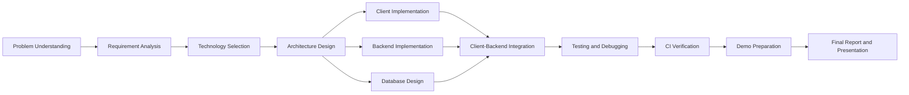

This journey map is important for the management assessment because it proves that the project was not only implemented at code level, but also planned, scoped, designed, verified, and prepared as a deliverable internship project.

## 1.10 Agile Project Conduct Evidence

The project was managed using a sprint-oriented approach. Each sprint had a clear goal, a feature scope, and an expected evidence output. The table below maps sprint activities to management evidence required by the final assessment.

| Sprint | Sprint Goal | Sprint Backlog Evidence | Completion Evidence |
| --- | --- | --- | --- |
| Sprint 0 | Build the project foundation | Android project setup, Go service bootstrap, PostgreSQL schema, Docker Compose, GitHub repository | Client and backend can start independently; database service is available |
| Sprint 1 | Complete core feed workflow | Feed API, DTO structure, Compose feed list, cursor pagination, mixed card rendering | First-screen feed and pagination can be demonstrated |
| Sprint 2 | Complete refresh and cache system | Pull-to-refresh state machine, Room cache, cache-first strategy, skeleton UI, offline fallback | Refresh, weak-network fallback, and skeleton transition can be verified |
| Sprint 3 | Improve architecture quality | Repository optimization, mapper decoupling, lightweight DDD backend split, StateFlow optimization | Architecture diagrams and core module boundaries become stable |
| Sprint 4 | Prepare documentation and verification | UML diagrams, ER diagram, API documentation, test cases, integration verification | Report artifacts, screenshots, and API logs are available |
| Sprint 5 | Final delivery and demonstration | CI/CD pipeline, final demo polish, presentation videos, final report | Delivery package and presentation materials are ready |

### Planned Effort vs Actual Effort

The internship working period is recorded as **2026-03-23 to 2026-08-14**. This equals **145 calendar days** and **105 weekdays**. Using a full-time estimation of **8 hours per weekday**, the overall project effort baseline is **840 hours**. The effort is reported by workstream to avoid inventing individual member names.

| Workstream | Main Responsibility | Planned Effort | Actual Effort | Evidence |
| --- | --- | --- | --- | --- |
| Overall Project | Complete internship project delivery from setup to final report preparation | 840 hours | 840 hours | SE33 internship schedule, project repository, final evidence pack |
| Android Client | Compose UI, FeedViewModel, Repository, Room cache, refresh, pagination | Part of 840 hours | Part of 840 hours | Android source files, client architecture docs, app demo screenshots |
| Backend and Database | Go backend, PostgreSQL schema, feed API, cursor pagination, seed data, Docker | Part of 840 hours | Part of 840 hours | Backend source files, Docker files, API logs, database screenshots |
| DevSecOps and Documentation | GitHub Actions, Docker evidence, testing, screenshots, final report | Part of 840 hours | Part of 840 hours | CI workflow files, test files, evidence CSV files, final report pack |

### Burndown Tracking

The following burndown view explains how project work decreases across sprints. It is reconstructed from project backlog and delivery artifacts for final assessment traceability. The generated chart evidence is stored as `assets/E02-burndown-chart.png` in the project repository.

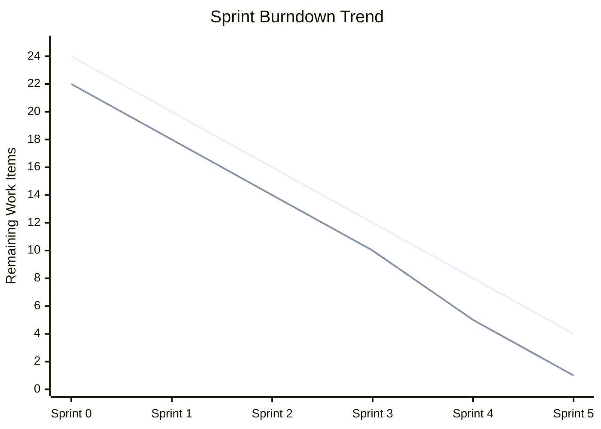

## 1.11 Client/Sponsor Management

Because the project simulates a realistic internship delivery, sponsor management is treated as the process of aligning project scope, evidence, and acceptance expectations.

| Management Area | Handling Method | Evidence to Include in Final Submission |
| --- | --- | --- |
| Scope alignment | Define what is included in the demo and what is deferred as future extension | In-scope / out-of-scope table, backlog priority table |
| Technical expectation | Explain that the project focuses on recommendation-feed architecture verification rather than a production recommendation algorithm | Architecture scope statement, known issues, future planning |
| Progress visibility | Use sprint milestones to show how work progresses from foundation to final delivery | Sprint table, screenshots, commits, CI records |
| Acceptance evidence | Demonstrate runnable app, backend API, database, and CI verification | App demo video, API logs, Docker/PostgreSQL screenshots, GitHub Action screenshot |
| Confidentiality handling | Use sanitized diagrams, screenshots, and demo evidence instead of exposing sensitive company information | Sanitized report artifacts and proof-of-work evidence |

# **2. Solution Research**

This chapter conducts selection research from three dimensions: client, backend technology stack, and pagination strategy, and presents the final architecture solution.

## 2.1 Client Technology Selection Comparison (Compose / MVVM / MVI)

### **2.1.1 UI Technology Framework Comparison: XML vs Compose**

**Conclusion** : This project uses **Jetpack Compose** to build the UI.

### **2.1.2 State Management Solution Comparison: MVVM vs MVI**

**Conclusion** : Adopt **MVVM + StateFlow** to manage the home page recommendation feed state.

## 2.2 Backend Technology Selection Comparison (Go / Node / Java)

**Final Choice: Go + PostgreSQL**Reasons:

- Extremely fast development speed
- Friendly to concurrent processing
- Simple code, very suitable for teaching and Demo projects
- Go is widely used in modern backend engineering practice, so it is suitable for demonstrating enterprise-style service layering in this demo

## 2.3 Pagination Solution Research (Offset vs Cursor)

The pagination strategy determines the recommendation feed experience and is crucial for news feeds.The recommendation feed homepage must use **Cursor Pagination** ; otherwise, the more it loads, the more laggy it becomes.

## 2.4 Final Selection Conclusion and Reasons

The project ultimately adopts the following technical solutions:

### **Client: Jetpack Compose + MVVM**

#### Reasons for Selection:

- Compose's declarative UI is more suitable for **highly dynamic UIs** like recommendation feeds
- MVVM + StateFlow makes it easy to manage refresh/pagination states
- Overall code maintenance costs are significantly reduced
- Aligns with the broader mobile engineering direction toward declarative UI and state-driven rendering

### **Backend: Go + PostgreSQL + REST API**

#### Reasons for Selection:

- Go's goroutine model is naturally suitable for high-concurrency APIs
- Concise and easy-to-maintain code, suitable as a training camp example
- PostgreSQL is powerful, supporting JSON, arrays, and complex sorting
- Superior performance in querying recommendation feed data

### **Pagination Strategy: Cursor Pagination**

#### Reasons for Selection:

- Recommendation feeds must ensure: **no duplicates, no skipped pages, high performance**
- Cursor can stably locate the next page based on publish\_time
- Simple backend logic: `WHERE publish_time < cursor`
- Can simulate the effect of "latest content 置顶" from a business perspective

### **Summary of Final Architecture Decisions**

# **3.** Requirements Analysis

This chapter clarifies the system's required behaviors, performance boundaries, and acceptance criteria through use cases, functional requirements, and non-functional requirements, providing a business foundation for subsequent architecture design.

## 3.1 Use Case List

### Regular Users

| Use Case ID | Use Case | Description | Priority |
| --- | --- | --- | --- |
| UC-01 | View recommendation feed | User enters the homepage and views the first-screen recommendation feed | P0 |
| UC-02 | Pull down to refresh feed | User pulls down the feed and receives newer content when available | P0 |
| UC-03 | Scroll down to load more | User scrolls to the bottom and loads the next page through cursor pagination | P0 |
| UC-04 | View multi-type content cards | User views text, image-text, video-style, and official top cards in one mixed feed | P0 |
| UC-05 | Open content detail page | User taps a feed card and enters the corresponding content detail page when supported | P1 |
| UC-06 | Use feed under weak network | User can still see local cached content when network is unavailable | P1 |

### Recommendation System

| Use Case ID | Use Case | Description | Priority |
| --- | --- | --- | --- |
| UC-07 | Provide Top5 official content | System places official or high-priority content at the top of the first screen | P0 |
| UC-08 | Rank feed items | System orders feed items by publish time, weight, and display rules | P0 |
| UC-09 | Return cursor pagination metadata | System returns `next_cursor` and `has_more` for stable load-more behavior | P0 |

### System Maintainers

| Use Case ID | Use Case | Description | Priority |
| --- | --- | --- | --- |
| UC-10 | Generate seed data | Maintainer initializes demo content, authors, media, stats, and feed items | P0 |
| UC-11 | Append refresh data | Maintainer appends newer feed items to verify pull-to-refresh behavior | P1 |
| UC-12 | Maintain feed item weight | Maintainer adjusts feed item weight to simulate ranking control | P1 |
| UC-13 | Verify API and system health | Maintainer checks `/health`, `/seed`, and `/api/v1/feed` during demo preparation | P0 |

## 3.2 Use Case Diagram

The following use case diagram provides the functional overview required by the final report. It separates the responsibilities of regular users, recommendation capability, and system maintainers.

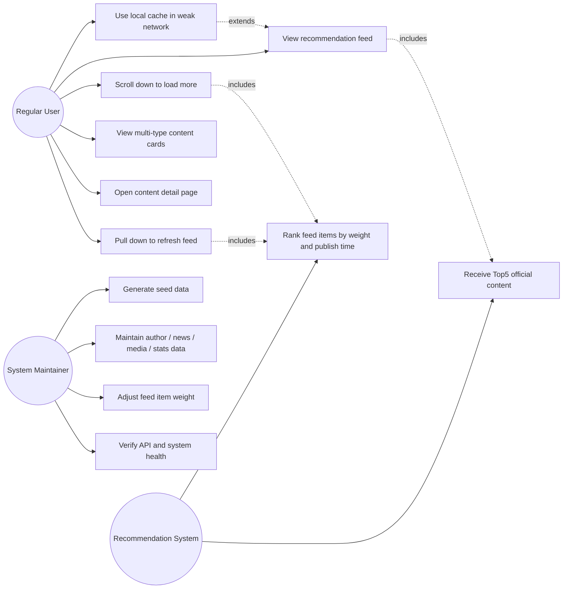

## 3.3 Functional Requirements

### **3.3.1 Recommendation Feed Homepage Display**

**FR-01** : The system must display the recommendation feed list when entering the homepage.

**FR-02** : The recommendation feed must include a Top5 official content area + a regular content area.

**FR-03** : Regular content must support rendering of multi-type cards such as text, image-text, and video.

**FR-04** : The system must load news content and card information from the backend and sort them by weight.

**FR-05** : Users can click on a card to jump to the detail page (NewsDetailPage / VideoDetailPage).

### **3.3.2 Pull-to-Refresh**

**FR-06** : The system must display a damped follow-hand effect when the user pulls down.

**FR-07** : After reaching the trigger threshold and releasing, it must enter the refresh state.

**FR-08** : The Header must be fixed and sticky during the refresh process.

**FR-09** : After refresh completion, it must rebound naturally and update with the latest content.

**FR-10** : Pagination behavior is prohibited during refresh.

**FR-11** : After a successful refresh, a "X new items updated" prompt can be displayed (optional).

### **3.3.3 Scroll-Down Pagination**

**FR-12** : Pagination loading should be triggered automatically when the user scrolls down to the bottom.

**FR-13** : The system must use cursor (publish\_time) for pagination.

**FR-14** : Pagination must satisfy "no duplicates, no skipped pages, no reverse order".

**FR-15** : If pagination fails, a Footer error must be displayed and support retryLoadMore().

### **3.3.4 Navigation and Redirection**

**FR-16** : Users can click on a card to jump to the corresponding news detail page.

**FR-17** : Users clicking on a video card must automatically play the video.

**FR-18** : Users can click on Tabs to switch between different channels (Recommend/Follow/City, etc.).

**FR-19** : Users can enter the search page (UI layer implementation only).

**FR-20** : Users can enter the Chat interface (simple redirection only).

**FR-21** : Users can enter the "Demolition 3-Second Block Page" simulation page (for teaching purposes).

### **3.3.5 Content Card Rendering**

**FR-22** : The system must map content\_type to FeedCardType (Text/Image/Video).

**FR-23** : Card rendering must be uniformly distributed through FeedCardFactory.

**FR-24** : The UI must not contain if-else logic to judge card types.

**FR-25** : The system must ensure stable mixed arrangement of multiple cards without flickering.

### **3.3.6 Skeleton Screen**

**FR-26** : The system must display a Skeleton list on the first screen.

**FR-27** : Each card type must correspond to its own Skeleton UI.

**FR-28** : Real data must smoothly replace the skeleton screen content when it arrives.

### **3.3.7 Local Cache**

**FR-29** : The system must use Room for local caching.

**FR-30** : The first screen must prioritize loading local cache (Cache-first).

**FR-31** : Old cache must be overwritten during refresh.

**FR-32** : Cache must be appended during pagination.

**FR-33** : Local cached content must be displayable under weak network/no network conditions.

### **3.3.8 Recommendation System Capabilities**

**FR-34** : The backend must return recommended content according to feed\_item rules.

**FR-35** : The backend must concatenate news + author + media + stats to form a complete DTO.

**FR-36** : Cursor pagination must return next\_cursor + has\_more.

**FR-37** : The system must support city/channel customized feeds (i.e., future expansion capability).

**FR-38** : The system must provide weight control capability (feed\_item.weight).

### **3.3.9 Backend Maintenance Capabilities**

**FR-39** : The system must support Seed scripts to generate data such as authors, media, content, and statistics.

**FR-40** : Administrators can manually maintain the database.

**FR-41** : Administrators can adjust feed\_item.weight.

## 3.4 Non-Functional Requirements

### 3.4.1 Performance

**NFR-01** : First-screen rendering should be optimized through a cache-first strategy. The design target is to make cached first-screen rendering fast enough for a smooth demo experience.

**NFR-02** : Pull-to-refresh should complete UI state transition quickly after the backend returns data. The exact latency should be verified through demo logs or profiling before being claimed as a measured result.

**NFR-03** : List scrolling should remain visually smooth through stable keys, limited recomposition, and lazy rendering. If a numeric FPS target is used in the final report, it should be supported by profiler evidence.

**NFR-04** : Pagination loading must have no obvious lag.

### 3.4.2 Stability

**NFR-05** : Cached content must be displayable under weak network/no network conditions.

**NFR-06** : Refresh and pagination failures must have corresponding UI states.

**NFR-07** : The system must not have issues such as duplicate content, disordered order, or screen flickering.

**NFR-08** : The system must not crash under invalid cursor requests.

### 3.4.3 Scalability

**NFR-09** : The card system must support extending new types (ads, multi-image, large image).

**NFR-10** : Repository must support extending Paging3 / RemoteMediator.

**NFR-11** : The backend supports future integration of strategies, sorting, and recommendation algorithms.

### 3.4.4 Engineering Maintainability

**NFR-12** : The client must adopt an MVVM layered architecture.

**NFR-13** : Core logic (refresh/pagination) must be modularized, and the UI must not contain business judgments.

**NFR-14** : All ViewModels must drive the UI through state, and there must be no side-effect UI updates.

### 3.4.5 User Experience

**NFR-15** : Refresh animation must be smooth without interruptions.

**NFR-16** : Skeleton screen → real content must transition smoothly.

**NFR-17** : Pagination Footer status must conform to the headline-style experience.

# 4. System Architecture and Design

This chapter provides an end-to-end description of the project's technical implementation, from the overall system structure, engineering layering, data flow design to database and API definitions.

## **4.1 Overall System Architecture Diagram**

The system adopts a three-tier structure of **Android client + Go Backend service + PostgreSQL database** .The core goal is to support the "instant opening + pull-to-refresh + Cursor pagination + high dynamic content rendering" requirements of the recommendation feed.The overall system architecture consists of the following parts:

**Overall Architecture Summary.** The system can be understood as a three-layer end-to-end architecture: the Android client is responsible for UI interaction and state management, the Go backend is responsible for business aggregation and response assembly, and PostgreSQL provides the structured persistence layer. The Repository layer on the client side acts as the coordination boundary between local cache and remote APIs.

| Layer               | Core Responsibilities                                                                                               | Representative Components                                                |
| ------------------- | ------------------------------------------------------------------------------------------------------------------- | ------------------------------------------------------------------------ |
| Android Client      | Handle feed UI rendering, pull-to-refresh, pagination state, local cache reading, and state-driven interaction      | Compose UI, ViewModel, Repository, Room local cache, Retrofit API client |
| Go Backend          | Process requests, aggregate feed data, validate business rules, apply cursor pagination, and assemble DTO responses | Handler, Service, Repository, DTO aggregation                            |
| PostgreSQL Database | Provide structured storage and query support for feed items, news content, author data, media data, and statistics  | `feed_item`, `news`, `author`, `media`, `stats`                          |

**Architecture characteristics.** The Android client focuses on UI interaction, state management, and local caching. The backend focuses on feed aggregation, sorting, and cursor pagination. PostgreSQL acts as the structured data foundation, while the client-side Repository remains the unified coordination layer between cache and remote APIs.

- **Android client** (Compose UI, ViewModel, Repository, Room)
- **Backend service** (Go + DDD three-tier structure)
- **Database layer** (PostgreSQL)
- **Local + Remote dual data source integration**
- **Frontend-backend consistency of Cursor pagination**

### **4.1.1 Full-Link Architecture Diagram**

The following architecture diagram shows the complete data flow from "user gesture → UI → ViewModel → Repository → Local/Remote → Backend → DB".

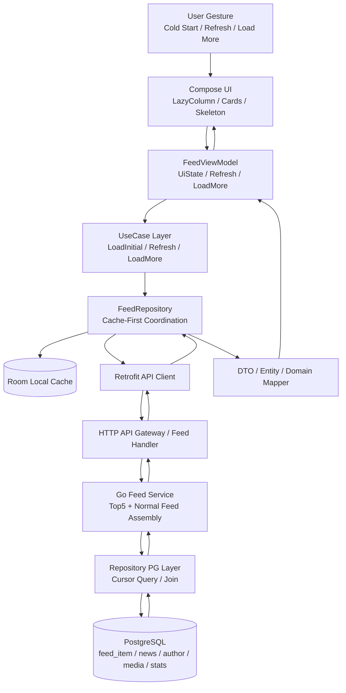

The key architectural decision is to keep the UI free from data-source decisions. The UI only observes `FeedUiState`, while the Repository decides whether data should come from Room cache, remote API, or a merged result.

### **4.1.2 Architecture Layer Description**

#### **Android Client Four-Layer Structure**

##### **UI Layer (Compose)**

- Responsible for card rendering, animations, and pull-to-refresh interactions
- Driven by state, dependent on ViewModel's UIState
- Uses LazyColumn + Skeleton + multi-type card rendering

##### **ViewModel Layer**

- Exposes `UIState`, `refresh()`, `loadMore()`
- Manages business states: loading, refreshing, paging, error
- Aggregates Repository results → drives Compose recomposition

##### **Repository Layer**

- Responsible for coordinating Local (Room) and Remote (Retrofit)
- Implements home page instant loading using Cache-First strategy
- Writes network response data to Room (supports incremental updates)
- Ensures continuity and correctness of Cursor pagination

##### **Data Layer (Room / Retrofit DTO)**

- Room handles local caching, instant loading, and offline availability
- Retrofit is responsible for initiating API requests
- DTO → Domain Model conversion ensures UI decoupling

#### **Go Backend DDD Three-Layer Structure**

##### **Handler Layer (API Layer)**

- Receives client requests (refresh / loadMore)
- Validates parameters (cursor, limit)
- Returns uniformly formatted JSON (code + message + data)

##### **Service Layer (Business Layer)**

- Combines home page content (Top5 official + Normal15)
- Implements stable pagination based on cursor
- Handles multi-dimensional sorting logic (weight + time + official status)

##### **Repository PG Layer (Database Access)**

- Executes SQL queries, ensuring performance with index hits
- Returns merged results to the Service layer
- Responsible for processing sorting fields such as timestamps/weights

#### **Database Layer (PostgreSQL)**

Mainly stores the following entity tables:

- **feed\_item**
- **author**
- **media (images/videos)**
- \*\*stats (views, likes)\*\*Features:
- Uses entity splitting to reduce redundancy and improve scalability
- Creates indexes for publish\_time / id to support cursor pagination
- Supports flexible sorting based on business weights

### **4.1.3 Physical Architecture Diagram**

This diagram presents the physical deployment view of the Toutiao News Feed Demo. It complements the logical layer description in **Architecture Layer Description** by explaining how the system is deployed and operated across the client, edge access layer, runtime services, storage components, and platform infrastructure.

- **Client and edge access** The Android client is the runtime entry for end users. External traffic is first admitted through the edge layer, including DNS, CDN, WAF, and API Gateway / Ingress, which handle routing, access protection, and request forwarding.
- **Application runtime cluster** The Go backend is modeled as a distributed runtime cluster. Feed gateway, refresh, pagination, cache coordination, and supporting service units are separated so that recommendation-feed responsibilities can scale independently as the system grows.
- **Data and storage layer** PostgreSQL remains the primary persistent store for feed, author, media, and statistics data. Redis is positioned as the high-speed cache tier, while object storage and persistent volumes represent the supporting storage path for assets, snapshots, and deployment data.
- **Platform support and asynchronous collaboration** Service discovery, internal RPC, and message queue components are shown as infrastructure support for service-to-service communication, refresh triggers, cache invalidation, and behavior-event processing.
- **CI/CD and operations** The physical view also includes the delivery chain from repository to build, container packaging, registry, and rollout, together with monitoring, logging, alerting, and health checks to show how the system is maintained after deployment.

**Main request path.** In the normal request flow, the Android client sends a feed request to the API gateway, the gateway forwards it to the feed service cluster, the service layer reads and composes data from PostgreSQL and Redis, and the final result is returned to the client for Room persistence and Compose rendering.

**Alignment with the current project scope.** In the current implementation, the **Android client**, **Go backend service**, and **PostgreSQL-based data model** are the directly implemented core. The distributed cluster, cloud edge services, Redis cluster, message queue, and observability stack shown in the diagram should therefore be understood as a **future scalable physical architecture blueprint** and an **evolution path**, rather than a mandatory requirement for the local single-developer environment.

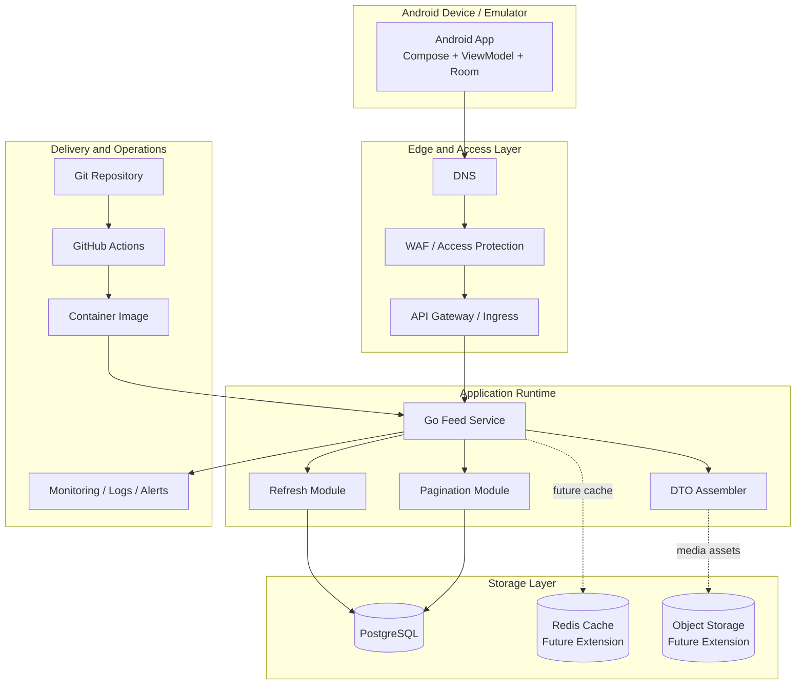

The diagram separates the **implemented local MVP** from the **future scalable architecture**. In the current demo, the Android app, Go service, PostgreSQL, Docker Compose, and GitHub Actions are implemented or demonstrated. Redis, WAF, object storage, monitoring, and cluster deployment are architectural extension points.

## **4.2 Engineering Architecture Diagram**

### **4.2.1 Android Engineering Architecture (Four-Layer Structure)**

The Android client adopts a standard Clean Architecture layered structure of **UI → ViewModel → Repository → Data** .

#### **Layered Description**

- **UI Layer**
  - Fully declarative, UI driven by state (Composable recomposition mechanism)
  - No business logic or data processing
- **ViewModel Layer**
  - Manage UIState (loading, refresh, paging, error)
  - Communicate with Repository to trigger refresh and pagination logic
- **Repository Layer**
  - Unique communication channel
  - Cache-First strategy → Room + Retrofit
- **Data Layer**
  - Room is responsible for local caching, supporting instant opening
  - Retrofit is responsible for network requests
  - DTO/Entities ensure data structure isolation

### **4.2.2 Go Backend Project Architecture (DDD Three-Tier Structure)**

**Server-Side Module Overview.** The backend is not just a data provider. It is the execution layer that accepts client requests, validates input, applies business rules, coordinates data access, and returns a stable API contract to the Android client. In this project, the backend follows a lightweight DDD-style separation so that each module has a single responsibility and can evolve independently.

#### **Server-Side Module Overview**

| Module                       | Primary Responsibility                                                                                                                                                             | What It Produces for Downstream                                                               |
| ---------------------------- | ---------------------------------------------------------------------------------------------------------------------------------------------------------------------------------- | --------------------------------------------------------------------------------------------- |
| **Handler / Controller**     | Acts as the HTTP entry point. It receives query parameters such as `cursor` and `limit`, performs basic request parsing, and maps the request into a service call.                 | A clean business input for the Service layer and a unified `ApiResponse<T>` for the client.   |
| **Service**                  | Acts as the business decision layer. It owns feed assembly rules, sorting rules, Top content insertion, cursor pagination rules, and any future recommendation strategy extension. | A business-complete result that is ready to be returned or further formatted.                 |
| **Repository**               | Acts as the persistence coordination layer. It encapsulates SQL queries, cursor-based filtering, ordering conditions, joins, and data lookup details.                              | Raw or assembled domain data fetched from PostgreSQL in a form the Service layer can consume. |
| **DTO / Response Assembler** | Transforms internal domain data into a stable API schema so the client receives predictable fields and pagination metadata.                                                        | Serialized JSON payloads such as `items`, `next_cursor`, and `has_more`.                      |
| **Database (PostgreSQL)**    | Stores content entities, author information, statistics, and other structured feed data required by the Repository layer.                                                          | The persisted source of truth for content retrieval, sorting, and pagination.                 |

**Typical server-side execution path:**

HTTP Request -> Handler -> Service -> Repository -> PostgreSQL -> Repository -> Service -> ApiResponse -> Client.

**Why this split matters:** the Handler stays thin, the Service remains focused on business rules, the Repository hides storage complexity, and the response layer keeps the client contract stable. This separation makes the backend easier to test, easier to extend, and safer to evolve when new feed rules or recommendation capabilities are introduced later.

The server adopts a layered structure of Domain-Driven Design (DDD):

- API Handler (interface input and output)
- Service (business logic)
- Repository (database access)

#### **Layered Description**

- **Handler Layer**
  - Parse HTTP request parameters (cursor, limit)
  - Return standard ApiResponse structure (code / message / data)
- **Service Layer**
  - Homepage combination logic: Top5 official + Normal content
  - Pagination logic: Accurate truncation by cursor
  - Sorting logic: Weight + Time + Official status
- **Repository PG Layer**
  - Execute SQL (with sorting and cursor conditions)
  - Assemble Domain model
  - Provide data access capabilities for the business layer

### **4.2.3 Android ↔ Backend Module Dependency Relationship (Full Link Engineering Dependency)**

This section shows how the client and server connect.

#### **Dependency Logic Explanation**

- Android's **Retrofit API interface** directly requests the server Handler
- The Handler hands over parameters to the Service
- The Service calls the Repository to perform PG database queries
- The returned data is passed back up the chain to Android layer by layer
- After the Android Repository merges the data → ViewModel → UI

### **4.2.4 Lightweight DDD Boundary Diagram**

The backend uses a lightweight DDD-oriented structure. It does not introduce heavyweight domain complexity, but it still keeps clear boundaries between input handling, business decisions, persistence, and API response assembly.

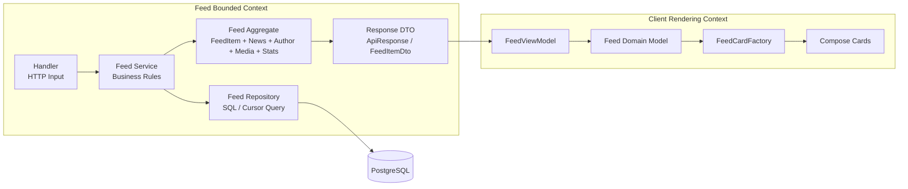

This boundary design ensures that the backend owns feed assembly and cursor rules, while the Android client owns UI state, local cache coordination, and rendering distribution.

### **4.2.5 CI/CD Pipeline Architecture**

The following consolidated architecture view connects the automated DevSecOps delivery pipeline with the implemented runtime architecture. Solid connectors represent components and flows implemented in the current project, while dashed connectors identify explicitly scoped future extensions.

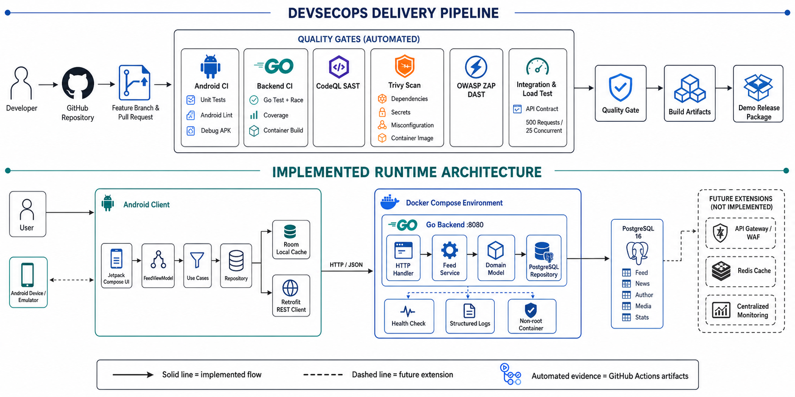

**Figure 4-5. DevSecOps Delivery Pipeline and Implemented Runtime Architecture.** The upper flow shows pull-request quality gates, automated testing, security scanning, load testing, and build artifacts. The lower flow traces the Android client through the Go backend to PostgreSQL, while separating optional future infrastructure from the current Docker Compose deployment.

The CI/CD pipeline is used as engineering evidence for delivery readiness. It verifies that changes do not silently break the feed architecture.

```mermaid
flowchart LR
    DEV[Developer Commit] --> PR[Pull Request]
    PR --> STATIC[Static Validation\nLint / Format / Dependency Check]
    STATIC --> UNIT[Unit Tests\nViewModel / UseCase / Mapper]
    UNIT --> INTEG[Integration Verification\nAPI Contract / Cache / Pagination]
    INTEG --> BUILD[Build Acceptance\nDebug Build / Artifact]
    BUILD --> SECURITY[Security Checks\nSAST / Dependency Scan]
    SECURITY --> MERGE[Merge Ready]
    MERGE --> DEMO[Demo Release Package]
```

## **4.3 Core Function Design**

### 4.3.1 Refresh Module

#### **Module Design**

The goal of the refresh module is to simulate a modern news-feed style refresh experience, providing a stable, predictable, and maintainable refresh chain:

- **Followed pull-down + damping effect** (the Header moves as much as the finger pulls)
- **Trigger refresh when exceeding the threshold** (enter refresh after releasing the hand)
- **Stay fixed at the top during refresh** (fix the Header height to avoid jitter)
- **Natural rebound after refresh completion** (animation retracts to restore the list)
- **"X new items updated" Banner prompt** (with fade in/out effect)
- **Disable pagination/secondary trigger during refresh** (to avoid concurrent state confusion)To avoid complexity caused by coupling of gestures, animations, and states in the refresh chain, this module adopts a **layered + responsibility-refined architecture design** :
- **Gesture Input Layer**RawPullRefreshNestedScroll captures NestedScroll gestures,PullGestureState maintains the gesture progress model,and clearly separates physical displacement (dragOffset) from business events (onPull / onRefreshTriggered).
- \*\*State Source Layer (FeedViewModel)\*\*As the only state source, it uniformly manages the refresh lifecycle, network requests, and UI state snapshots,and delivers immutable FeedUiState to the UI through StateFlow.
- \*\*Logic Judgment Layer (RefreshStateLogic / UpdateBannerLogic)\*\*Defines the display rules for refresh animations, rebounds, and prompt Banners in the form of pure functions,independent of UI and ViewModel, ensuring logic is testable and reusable.
- \*\*UI Rendering Layer (Composable UI)\*\*Only renders the interface based on state snapshots and logic judgment results, without business decision-making.All UIs are only responsible for display and do not perform logic judgment, ensuring a stable and maintainable refresh experience.

#### Refresh Chain Sequence Diagram

- The user pulls down, and the Gesture Layer continuously calculates dragOffset / progress
- The Gesture Layer continuously calls back onPull(progress)
- The ViewModel updates the pullProgress state
- The UI moves the Header following the hand based on pullProgress
- The user releases their hand, and the Gesture Layer determines if the threshold is exceeded
- If the threshold is not exceeded, no refresh is triggered, and the UI rebounds directly
- If the threshold is exceeded, the Gesture Layer triggers onRefreshTriggered()
- The ViewModel enters the refreshing state (isRefreshing / isHoldingRefreshHeader = true)
- The UI plays the refresh animation according to the state, prohibiting pagination and secondary refresh
- The ViewModel executes refreshFeedUseCase
- After the refresh is completed, the ViewModel updates the data and calculates newCount
- The ViewModel turns off isRefreshing and turns on showUpdateBanner
- The UI displays the "X updates" Banner
- When the Banner ends, the ViewModel releases the Header
- The UI rebounds naturally according to the state and returns to idle

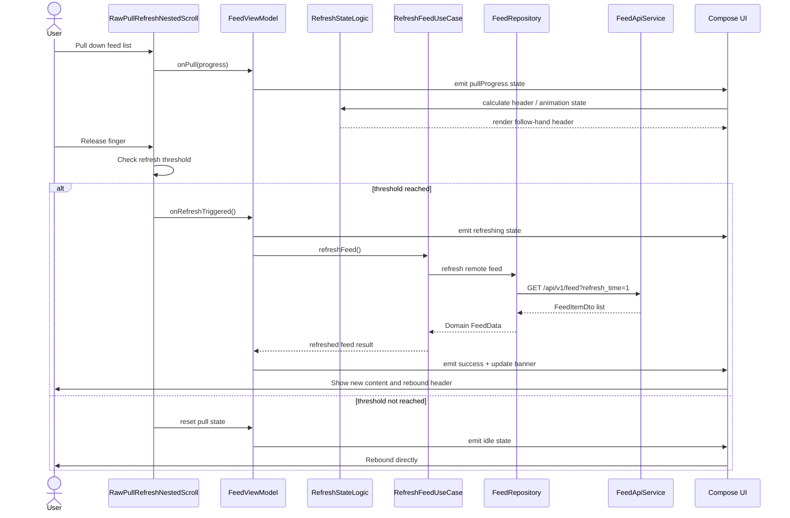

#### **Interface Definition**

PullGestureState (gesture model)

```Kotlin
class PullGestureState {
fun applyPull(deltaY: Float)
fun reset()

    fun progress(maxPullPx: Float): Float
}
```

RawPullRefreshNestedScroll

```Kotlin
class RawPullRefreshNestedScroll(val gesture: PullGestureState,val maxPullPx: Float,val isAtTop: () -> Boolean,val isRefreshing: () -> Boolean,val isHoldingRefreshHeader: () -> Boolean,val onPull: (Float) -> Unit,val onRefreshTriggered: () -> Unit,val haptic: HapticFeedback,val setDragOffset: (Float) -> Unit
) : NestedScrollConnection
```

RefreshStateLogic

```Kotlin
class RefreshStateLogic {
fun isRebounding(
        pullProgress: Float,
        isRefreshing: Boolean,
        showUpdateBanner: Boolean,
        headerHeightPx: Float,
        fixedHeaderPx: Float
    ): Boolean

    fun shouldShowAnimation(
        pullProgress: Float,
        isRefreshing: Boolean,
        showUpdateBanner: Boolean,
        isHoldingRefreshHeader: Boolean,
        isRebounding: Boolean,
        showRefreshAnimation: Boolean
    ): Boolean
}
```

UpdateBannerLogic

```Kotlin
class UpdateBannerLogic {
fun shouldShowBanner(
        showUpdateBanner: Boolean,
        newCount: Int
    ): Boolean
}
```

FeedUiState

```Kotlin
sealed interface FeedUiState {
object Loading : FeedUiState
data class Success(val isRefreshing: Boolean,val isHoldingRefreshHeader: Boolean,val showRefreshAnimation: Boolean,val showUpdateBanner: Boolean,val newCount: Int,val pullProgress: Float
    ) : FeedUiState
}
```

FeedViewModel

```Kotlin
class FeedViewModel {
val state: StateFlow<FeedUiState>
fun updatePullProgress(progress: Float)
fun refresh()

    fun hideUpdateBanner()
}
```

RefreshFeedUseCase

```Kotlin
interface RefreshFeedUseCase {
suspend fun execute(
        latestPublishTime: Long
    ): FeedData
}
```

#### **Summary**

For specific details, please refer to the following:

##### Gesture Input Layer

**Break down the user's "physical pull-down behavior" into three outputs of different natures:**

**Displacement data for UI (** `dragOffset` \*\*):\*\*Synchronize *visual displacement*, only determining "how much the interface appears to move".

**Gesture model for logic (** `PullGestureState` \*\*):\*\*Synchronize *gesture progress and rule judgment*, used to calculate progress, thresholds, and rebound timing.

**Event callbacks for business (** `onPull / onRefreshTriggered` \*\*):\*\**Notify gesture events* to the business layer, trigger the refresh process, and the ViewModel determines the refresh result.

RawPullRefreshNestedScroll is a gesture dispatcher that does not save state.

**dragOffset Path.** Convert the user's physical pull-down gesture into a displacement value `dragOffset` that the UI can consume directly.

```Plain
Finger drag
↓
NestedScroll capture
↓
RawPullRefreshNestedScroll calculates px
↓
setDragOffset(px)
↓
dragOffset (UI State) changes
↓
Composable recomposition↓headerTargetPx = dragOffset
↓
headerHeightPx animation changes
↓
UI refresh header height changes
```

**Note:** This is callback-driven data: first declare the callback, then read the value, and finally use it to control rebound distance in the UI. **PullGestureState Path.** This path abstracts a distinguishable gesture state from continuous and noisy finger movement. **onPull / onRefreshTriggered Path.** `onPull` only synchronizes the current pull-down progress to the ViewModel state. The visible movement is ultimately driven by state values such as `pullProgress` and `gesture.progress`, not by direct imperative UI updates.

```Plain
Finger drags downward
 ↓
NestedScroll captures the drag distance (deltaY)
 ↓
RawPullRefreshNestedScroll
 ↓
gesture.applyPull(deltaY)
 ↓
PullGestureState internally updates dragOffset
 ↓
PullGestureState calculates progress = dragOffset / triggerDistance
 ↓
gesture.progress(progress)
 ↓
Callback_onPull(progress)
 ↓
FeedScreen.onPull { viewModel.updatePullProgress(progress) }
 ↓
FeedViewModel.updatePullProgress
 ↓
UI State.pullProgress = progress
 ↓
Compose recomposition
 ↓
UI uses pullProgress for:
- Displacement
- Scaling
- Lottie progress
- Header visibility
```

**onRefreshTriggered is a "discrete event"**

- Gesture Layer:Only judges **"whether the threshold is reached + whether the gesture has ended"**
- ViewModel: Decides **"whether to actually enter the refresh business"**

```Plain
RawPullRefreshNestedScroll
        ↓
Callback_onRefreshTriggered
        ↓
FeedViewModel.refresh()
```

### 4.3.2 Pagination Module

##### State Source Layer

##### Decision Logic Layer

`RefreshStateLogic` and `UpdateBannerLogic` are two Boolean decision helpers. The UI passes the current situation into them, and they answer one question only: **"Is it appropriate to draw the screen in this way right now?"**

##### UI Rendering Layer

**Source:** convert input data into values used by the UI, determine what to draw based on Boolean decisions, and combine all pieces into the final rendered screen.

**Gesture derivation** (`pullProgress` / `dragOffset`): from the Gesture Layer, describing how far the user has pulled and to what extent.

**State input** (from ViewModel): from the State Source Layer `FeedViewModel`, describing the current stage of refresh.

**Judgment result** (from Logic): from the Decision Logic Layer, giving the final answer to **"Is it reasonable to draw the screen like this now?"**

**Internal Derivation:**

**headerTargetPx** (sticky or follow finger): if the ViewModel says the header should stick to the top, use a fixed refresh-header height; otherwise, let the refresh header follow the finger movement. **headerHeightPx** (animated): the UI converts the target height into a smooth animated height as a rendering optimization.

**Bottom Layer:**

Draw UI

Finally, the UI merges **state + gesture input → derived values → Boolean decisions → conditional rendering** into the final screen output.

#### **Module Design**

The recommendation feed pagination module needs to ensure data continuity and interaction stability under the conditions of high-frequency scrolling, weak network environment, and coexistence of complex UI states. The design goals of this module include:

- **Stable bottom detection** : Pagination triggering only relies on scrolling status and is not coupled with UI rendering logic
- **No repeated pagination requests** : Avoid concurrent loading and invalid requests
- **Retryable in weak network or failure scenarios** : Pagination failure does not affect the display of existing content
- **Cursor pagination without repetition or data loss** : Avoid page skipping, rollback, or data missing
- **Independent rendering of pagination Footer** : Pagination status does not pollute the main Feed list structureTo meet the above goals, the pagination module adopts a **Cursor + state machine-driven** design scheme and splits responsibilities at the architectural level:
- **ViewModel pagination state machine**
  - Uniformly control pagination triggering conditions
  - Manage pagination Loading / Error / End states
  - Prevent repeated requests and illegal state transitions
- **UseCase encapsulates pagination business semantics**
  - Receive pagination cursor parameters
  - Return a unified pagination result structure (FeedData)
  - Do not participate in UI or state judgment
- **Repository unified Cursor strategy**
  - Interact with the backend to get the next page of data
  - Maintain the only trusted source of nextCursor and hasMore
  - Ensure pagination continuity and consistency
- **Independent rendering of pagination Footer**
  - Footer is only driven by pagination status
  - Mutually exclusive display of Loading / Error / End states
  - Does not affect the main FeedItem list Diff and renderingThe pagination process starts with **user scrolling to the bottom** , and the UI layer triggers an event to notify the ViewModel, but whether to actually initiate a pagination request is determined by the internal state machine of the ViewModel:
- The UI detects that the list has reached the bottom and calls `FeedViewModel.loadMore()`
- The ViewModel judges whether it is currently in pagination or whether there is more data
- Construct pagination request parameters through the current cursor
- Call `LoadMoreFeedUseCase` to get the next page of data
- The Repository returns the pagination result (items / nextCursor / hasMore)
- The ViewModel merges the old and new data and updates the pagination status
- The UI renders the Footer according to the latest status (Loading / Error / End)

#### Sequence Diagram

When pagination trigger conditions are not met (e.g., loading in progress or no more data available), the ViewModel will directly ignore the pagination event without initiating a request or changing the current UI state.

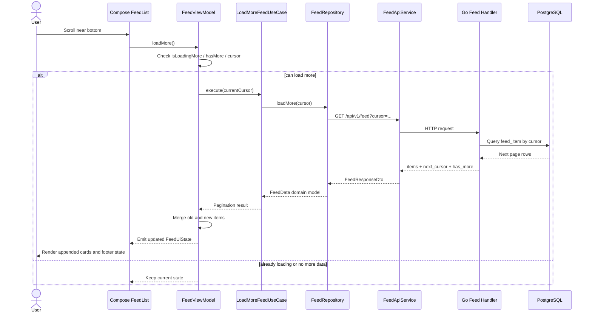

#### Interface Definitions

- **FeedViewModel**

```Kotlin
fun loadMore()
fun retryLoadMore()
```

- **Pagination UseCase Interface**

```Kotlin
suspend fun execute(cursor: Long): FeedData
```

#### Summary

Through **Cursor pagination mechanism + ViewModel state machine control** , the pagination module achieves:

- Mutually exclusive execution of pagination requests to avoid duplicate triggers
- Cursor-driven continuous pagination to prevent page skipping and data loss
- Local recoverability from pagination failures without affecting loaded content
- Complete decoupling between pagination and pull-to-refresh workflows
- Independent rendering of pagination UI states to ensure stable list structure

This design provides excellent stability, maintainability, and scalability in complex recommendation feed scenarios.

### 4.3.3 Content Display Module

#### Module Design

The homepage recommendation feed needs to ensure the following while carrying pinned content, mixed content, pagination states, and refresh behaviors:

- Stable page structure during refresh and pagination processes
- No interference between UI states of different regions
- Smooth scrolling performance even with a large number of mixed cards

To achieve this, the module adopts a **Multi-section Rendering architecture** , dividing homepage content into multiple independent rendering sections by responsibility:

1. **Top5 Official Content Section**Displays fixed-priority content, always pinned at the top and not involved in pagination or refresh rearrangement.
2. **Mixed Main Content Stream Section**Carries core recommended content, supports mixed rendering of multiple card types, and serves as the main scrollable area of the list.
3. **Pagination Footer Section**Displays pagination states like loading/error/end, decoupled from main content data.
4. **Safe Area (Bottom Padding) Section**Adapts to system gesture areas and bottom navigation to prevent content occlusion.

The core purpose of multi-section rendering is not UI grouping, but **state isolation and recomposition boundary control** :

- **Refresh actions do not disrupt list structure**Refresh only updates data content without changing section structure, avoiding full list reconstruction.
- **Top5 content remains stable**The pinned area is not affected by pagination and mixing logic, ensuring stable rendering at all times.
- **Pagination Footer is easily extensible**As an independent section, the Footer can flexibly extend states like Loading/Error/End.
- **Supports mixed rendering of multiple card types**The main content section freely expands card types through the Card Factory mechanism without affecting other sections.
- **High-performance scrolling and local recomposition**Data changes in different sections only trigger local recomposition, reducing invalid Recomposition and improving scrolling performance.

#### Rendering Process Description

Page rendering follows these rules:

- Upon page entry, a fixed multi-section rendering structure is built based on the current `FeedUiState`
- Different sections only depend on their corresponding data and states
- Data updates only trigger UI recomposition of the corresponding section
- Pagination and refresh only affect data without changing the rendering structure itself

This design ensures high predictability of the content display layer under complex interactions.

#### Interface Definitions

- **FeedList**

```Kotlin
@Composable
fun FeedList(
    officialItems: List<FeedItem>,
    mixedItems: List<FeedItem>,
    footerState: FooterState,
    onItemClick: (Long) -> Unit
)
```

- `FeedList` serves as the unified entry of the content display module, only receiving **preprocessed display data** without participating in any business judgment or state calculation.

#### Summary

Through the multi-section rendering architecture, the content display module achieves:

- Stable page structure and smooth scrolling
- Isolation between refresh, pagination, and mixing logic
- Free expansion of card types without disrupting structure
- High consistency with the real "Toutiao" recommendation stream

This design provides reliable guarantees for UI stability and performance in complex information flow scenarios.

### 4.3.4 Skeleton Screen Module

#### Module Design

- Skeleton is only responsible for **first-screen Loading placeholder**
- Goal is **instant first-screen display + avoiding white screen**
- Current implementation is **full-page Skeleton**
- Does not participate in refresh, pagination, or card-level replacement
- Decoupled from the main Feed workflow through `FeedUiState.Loading`

#### Skeleton Sequence Diagram

#### Summary

- Skeleton currently implements **full-page level Loading placeholder**
- Switching granularity is at the **UI State layer**
- No card-level Skeleton or smooth replacement exists
- Current implementation fully aligns with code requirements without over-engineering
- Card-level Skeleton can be expanded based on this implementation in the future

### 4.3.5 Cache-First Local Cache Module

#### **Module Design**

##### Design Background and Goals

The recommendation feed faces the following challenges in real-world usage scenarios:

- Uncontrollable network latency during cold start
- Frequent weak network or temporary disconnection
- Large data volume and frequent refreshes of the recommendation feed
- High UI requirements for first-screen stability and continuityTherefore, this module is not simply data persistence but a designed **Cache-First local cache system** to provide a stable and predictable data source for the recommendation feed under different network conditions.
- **First-screen instant loading (Cache-First)** : Prioritize using local cache to render the homepage
- **Weak network/offline availability** : Automatically fall back to local data when network fails
- **Stable data structure** : Avoid UI jitter during refresh/pagination
- **Centralized complexity management** : Cache strategy exists only in the Repository layerThe local cache adopts a **three-table split structure** :
- `FeedItemEntity` : Content body (title, release time, content attributes, etc.)
- `AuthorEntity` : Author information (nickname, avatar, authentication status)
- `StatsEntity` : Statistical information (likes, comments, shares, etc.)

#### Full-Link Description of Data Flow

##### Cold Start/First Entry (Cache-First)

First screen rendering does not wait for the networkNetwork updates proceed asynchronouslyUI is always driven by the latest state

##### Refresh/Weak Network Fallback

Network Success: Cache and UI Update SynchronouslyNetwork Failure: Automatically Roll Back Local DataUI Behavior is Stable with No Error Flashes

#### Domain / Entity / DTO Mapping Relationship Description

To ensure a clear architecture, there are **two sets of Mappers** in the project:\*\*Unified Principle:\*\*Repository, ViewModel, and UI **only handle Domain models** ,Remote formats and local structures are completely isolated.

#### **Summary**

Through the Cache-First local cache system, this module achieves:

- Second-opening experience for cold start
- Stable display in weak network / offline scenarios
- Long-term consistency of recommendation feed data structure
- Clear cache strategy boundaries and evolvable architectureThis design concentrates complexity in the Repository layer, effectively reducing the cognitive burden on UI and ViewModel.

### 4.3.6 Multi-Card Rendering Module

#### **Module Design**

The recommendation feed homepage consists of a mix of content types, including text news, single-image cards, video content, official pinned content, etc.If conditional judgments are made directly at the UI layer based on data fields (whether there is an image, whether it is a video), it will lead to:

- Rendering logic scattered across multiple UI components
- List complexity growing linearly with the number of card types
- Frequent modifications to existing UI code when adding new card typesTo prevent the UI layer complexity from getting out of control, this module introduces the **Multi-Card rendering system** , which manages the rendering of different content types through a unified card distribution mechanism.

##### Card Types are Predefined and Determined by the Domain Layer

Each piece of recommendation feed data is labeled with a clear `FeedCardType` before entering the UI layer, serving as the sole basis for rendering:

```Kotlin
sealed class FeedCardType {
    object Text : FeedCardType()
    object Image : FeedCardType()
    object Video : FeedCardType()
    object OfficialTop : FeedCardType()
}
```

The UI no longer infers content types based on fields but directly renders according to business semantics, fundamentally avoiding the expansion of UI decision logic.

##### FeedCardFactory for Unified Rendering Distribution

All card rendering is completed through the unified entry of `FeedCardFactory`:

```Kotlin
@Composable
fun RenderCard(item: FeedItem)
```

The responsibilities of the Factory are strictly limited to:

- Distributing the corresponding Card Composable based on `FeedCardType`
- Not containing any business judgment or data processing logicThis ensures that the Factory itself remains a **pure UI mapping layer** and does not get out of control as business complexity increases.

##### UI Layer Completely Avoids Conditional Judgments

During list rendering:

- No `if (item.hasImage)`
- No `if (item.isVideo)`
- No content type-related `when / if` judgmentsThe UI layer only needs to call:`FeedCardFactory(item)`The FeedList itself always maintains a stable structure and is decoupled from the number of card types.

#### Rendering Process Description

##### Card Rendering Process

**Key Points:**

- Card types are determined at the Domain layer
- The UI layer does not participate in business judgments
- Factory is only responsible for mapping types to components

#### Sequence Description

#### Extensibility Description

When new content forms need to be added (such as ad cards, multi-image cards, special topic cards), only the following steps are required:

- Extend `FeedCardType`
- Add the corresponding Card Composable
- Register the mapping in `FeedCardFactory`There is no need to modify the FeedList or existing card logic.

#### **Summary**

The Multi-Card rendering system constrains the complex and variable content forms in the recommendation feed within a controllable boundary through **type pre-classification + factory dispatch**, keeping the UI layer pure, stable, and sustainable for evolution.

## **4.4 Database Design**

This system uses PostgreSQL as the main data storage to host news content, media resources, author information, data statistics, and recommendation feed item data. The database design follows the principles of " **separation of entity responsibilities, structural extensibility, and indexes supporting high-frequency queries** ".The database is composed of five core entities:

- author
- news (main news table)
- news\_content (news content)
- media (media resources)
- stats (data statistics)
- feed\_item (recommendation feed display dimension table)

### 4.4.1 ER Diagram

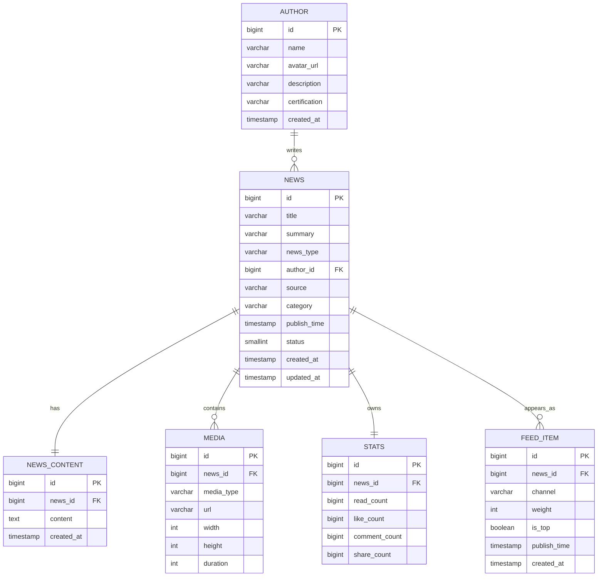

This ER diagram explains why the backend can assemble a complete recommendation-feed DTO through multi-table joins. `feed_item` is the display and ranking dimension, while `news`, `author`, `media`, and `stats` provide the content details required by the client.

### 4.4.2 Business Table Structure

#### **author**

Purpose: Store information about news authors/media.

```SQL
CREATE TABLE IF NOT EXISTS author (
    id            BIGSERIAL PRIMARY KEY,
    name          VARCHAR(50) NOT NULL,
    avatar_url    VARCHAR(255),
    description   VARCHAR(255),
    certification VARCHAR(50),
    created_at    TIMESTAMP DEFAULT NOW()
);
```

#### **news (News Main Table)**

Purpose: Basic metadata for news content (title, author, category, publication time, etc.).

```SQL
CREATE TABLE IF NOT EXISTS news (
    id           BIGSERIAL PRIMARY KEY,
    title        VARCHAR(255) NOT NULL,
    summary      VARCHAR(255),
    news_type    VARCHAR(50) NOT NULL,
    author_id    BIGINT REFERENCES author(id),
    source       VARCHAR(100),
    category     VARCHAR(50),
    publish_time TIMESTAMP,
    status       SMALLINT DEFAULT 1,
    created_at   TIMESTAMP DEFAULT NOW(),
    updated_at   TIMESTAMP DEFAULT NOW()
);
```

#### **news\_content (News Content)**

Purpose: Stores the main body of the article (HTML + JSON).

```SQL
CREATE TABLE IF NOT EXISTS news_content (
    news_id      BIGINT PRIMARY KEY REFERENCES news(id) ON DELETE CASCADE,
    content_html TEXT,
    content_json JSONB,
    word_count   INT
);
```

#### **media (Multimedia Table)**

Purpose: Stores media resources such as images/videos, associated with news.

```SQL
CREATE TABLE IF NOT EXISTS media (
    id          BIGSERIAL PRIMARY KEY,
    news_id     BIGINT REFERENCES news(id) ON DELETE CASCADE,
    group_id    BIGINT,
    media_type  VARCHAR(50) NOT NULL,
    url         VARCHAR(255),
    cover_url   VARCHAR(255),
    duration    INT,
    width       INT,
    height      INT,
    order_index INT,
    created_at  TIMESTAMP DEFAULT NOW()
);
```

#### **stats (Data Statistics)**

Purpose: Statistical indicators such as likes/comments/favorites/views.

```SQL
CREATE TABLE IF NOT EXISTS stats (
    news_id        BIGINT PRIMARY KEY REFERENCES news(id) ON DELETE CASCADE,
    like_count     INT DEFAULT 0,
    comment_count  INT DEFAULT 0,
    favorite_count INT DEFAULT 0,
    share_count    INT DEFAULT 0,
    play_count     INT DEFAULT 0,
    version        INT DEFAULT 0,
    updated_at     TIMESTAMP DEFAULT NOW()
);
```

#### **feed\_item (Recommendation Feed Display Table)**

Purpose: Provides business data for recommendation feed display, including all features required for UI rendering.

```SQL
CREATE TABLE IF NOT EXISTS feed_item (
    id              BIGSERIAL PRIMARY KEY,
    news_id         BIGINT REFERENCES news(id) ON DELETE CASCADE,
    display_type    VARCHAR(50) NOT NULL,
    weight          FLOAT,
    scene           VARCHAR(30),
    model_id        VARCHAR(50),
-- Corresponding fields of Android FeedItemDto
    content_type       VARCHAR(50),
    category           VARCHAR(50),
    sub_category       VARCHAR(50),
    tags               TEXT[],
    city               VARCHAR(50),
    is_official_media  BOOLEAN DEFAULT false,
    is_top_official    BOOLEAN DEFAULT false,
    source             VARCHAR(100),
    publish_time    TIMESTAMP,
    seq_id          BIGSERIAL,
    created_at      TIMESTAMP DEFAULT NOW()
);
```

feed\_item is the **core table of the recommendation feed** in this project, corresponding to Android's FeedItemDto.

### 4.4.3 Field Description

#### **author**

#### **news**

#### **media**

#### **stats**

#### **feed\_item (Recommendation Feed Core)**

## **4.5 API Interface Design**

This chapter specifies the externally exposed API contracts used by this demo, with a primary focus on the recommendation feed interface and the unified response structure that supports refresh, cursor pagination, and client-side parsing.

### 4.5.1 Recommendation Feed Interface

#### **Interface Address**

`GET /api/v1/feed?cursor=&refresh_time=`

#### **Function Corresponding Use Case**

#### **Request Parameters**

This interface uses a **dual-channel pagination mechanism**:

If both appear, `refresh_time` is processed first (refresh has higher business priority).

#### **Backend Pagination Logic (Core Design)**

##### **First Entry to Homepage (RC01)**

```Plain
GET /api/v1/feed
```

The backend returns the latest sorted content:

```SQL
SELECT *
FROM feed_item
ORDER BY seq_id ASC
LIMIT 20;
```

##### **Pull-Down to Refresh (RC02)**

```Plain
GET /api/v1/feed?refresh_time=1737282834
```

Returns content "newer" than the current list:

```SQL
SELECT *
FROM feed_item
WHERE publish_time > refresh_time
ORDER BY publish_time DESC
LIMIT 20;
```

**Advantages:** No duplicates. Can return an explicit `"You have X new items"` result. Supports timely and reliable content updates.

##### **Pull-Up to Load More (RC03)**

```Plain
GET /api/v1/feed?cursor=1234
```

Extend backward from the sequence chain:

```SQL
SELECT *
FROM feed_item
WHERE seq_id > cursor
ORDER BY seq_id ASC
LIMIT 20;
```

**Advantages:** Stable ordering. No duplicates or missing items. Strong robustness for recommendation-feed scenarios.

#### **Response Structure**

Corresponding client:

```Plain
ApiResponse<FeedResponseDto>
```

JSON example:

```JSON
{
  "code": 0,
  "data": {
    "items": [...],
    "next_cursor": 2003,
    "has_more": true,
    "latest_publish_time": 1737283001
  },
  "message": "success"
}
```

Field description:

#### **Recommendation Feed Content Structure (FeedItemDto)**

The actual structure used on the mobile side is as follows (exactly the same as your current DTO):

```JSON
{
  "id": 1123,
  "title": "Title…",
  "summary": "Summary…",
  "content_type": "text | image | video | gallery",

  "media": [
    {
      "media_type": "image",
      "url": "...",
      "cover_url": "...",
      "width": 720,
      "height": 1280
    }
  ],

  "author": {
    "id": 9,
    "name": "央视新闻",
    "avatar_url": "...",
    "certification": "red_v"
  },

  "stats": {
    "like_count": 314,
    "comment_count": 175,
    "favorite_count": 10,
    "share_count": 22
  },

  "publish_time": 1737282834,

  "category": "tech",
  "sub_category": "ai",
  "tags": ["深圳", "热点"],
  "city": "shenzhen",

  "is_official_media": true,
  "is_top_official": false,
  "source": "新华社",
  "weight": 0.87
}
```

### 4.5.2 Unified Response Structure (ApiResponse\<T>)

```SQL
data class ApiResponse<T>(
    val code: Int,
    val data: T?,
    val message: String?
)
```

The three layers of DTO correspond to the protocol layer, interface layer, and data item layer respectively. After splitting, each layer has a single responsibility and clear boundaries, which not only facilitates unified error handling but also avoids coupling between interface semantics and business models. This is for maintainability rather than complexity.

## **4.6 DTO / Domain / Entity Design**

This chapter explains the data model design of the system on the Android client and Go backend from the perspective of data structure, including:

- DTO (Network layer transmission model)
- Domain Model (Domain model)
- Entity (Local database storage structure)
- Correspondence between models on both ends
- Conversion process of DTO ↔ Domain ↔ Entity

### 4.6.1 Android DTO (Data Transfer Object)

DTO is used for the data structure returned by network requests and is completely consistent with the backend JSON. Its characteristics are:

- Optional fields (null-safe)
- No UI or business logic
- Only used for input and output of the API layerExample (simplified):

```Kotlin
data class FeedItemDto(
    val id: Long,
    val title: String,
    val summary: String?,
    val content_type: String,
    val publish_time: Long,
    val author: AuthorDto,
    val media: List<MediaDto>,
    val stats: StatsDto
)
```

DTO is only a carrier of network responses and does not participate in page rendering.

### 4.6.2 Domain Model

Domain Model is the **core model of the recommendation feed business** :

- Strong typing (ContentType, CardType)
- Already merged author, media, and statistical data
- Can be directly used by UI
- Independent of database and network layerExample:

```Kotlin
data class FeedItem(
    val id: Long,
    val title: String,
    val summary: String?,
    val contentType: FeedContentType,
    val media: List<FeedMediaItem>,
    val author: FeedAuthorItem,
    val stats: FeedStatsItem,
    val publishTime: Long,
    val cardType: FeedCardType
)
```

Domain Model is determined by **DTO + local logic + UI rules** and is the "true identity" of the entire recommendation feed.

### 4.6.3 Entity (Room Local Database Entity)

Entity is used for local persistence, and the structure is generally **split into three tables** (consistent with your ER diagram):

- feed\_item\_entity
- author\_entity
- stats\_entityCharacteristics:
- Structured fields (avoid nested JSON)
- Support Room query and index optimization (Cursor pagination)
- No UI or business logic fieldsExample:

```Kotlin
@Entity
data class FeedItemEntity(
    @PrimaryKey val id: Long,
    val title: String,
    val summary: String?,
    val contentType: String,
    val publishTime: Long,
    val category: String?,
    val subCategory: String?
)
```

Entity is a pure database structure.

### 4.6.4 Go Struct (Backend Data Model)

The backend uses Go struct as the domain model:

```Go
type FeedItem struct {
    ID          int64
    Title       string
    Summary     string
    ContentType string
    Media       []Media
    Author      Author
    Stats       Stats
    PublishTime int64
}
```

The backend struct is **almost isomorphic** with the Android DTO, facilitating serialization.

### 4.6.5 DTO ↔ Domain ↔ Entity Mapping Process (Core)

#### **Remote (DTO → Domain)**

Completed by **DtoMapper** :

```Go
FeedItemDto
   ↓ transform
FeedItem (Domain)
   ↓ derive
FeedCardType (based on number of media, official status, etc.)
```

Key points:

- DTO is raw data
- Domain is the business model
- UI rules are added here to calculate cardType (image-text/video/official position)

#### **Local (Entity ↔ Domain)**

Completed by **LocalMapper** :

```Go
FeedItemEntity + AuthorEntity + StatsEntity
          ↓ merge
FeedItem (Domain)
```

The local cache is merged into a complete `FeedItem` that the UI can consume directly. When writing back to cache:

```Go
FeedItem (Domain)
   ↓ split
Entity (three tables: item / author / stats)
```

#### **Complete Data Flow of Recommendation Feed (From Network to UI)**

```Go
Backend JSON
  ↓ Retrofit
FeedItemDto
  ↓ DtoMapper
FeedItem (Domain)
  ↓ LocalMapper
Write to Room
  ↓ Query
FeedItemEntity
  ↓ LocalMapper
FeedItem (Domain)
  ↓ ViewModel
UIState
  ↓ Compose
Interface rendering
```

#### **Typical Scenario Description**

##### **First Screen Cache-First**

```Go
Room Entity → Domain → UI
```

##### **Network Update**

```Go
DTO → Domain → Write to Room → Entity → Domain → UI
```

##### **Pagination Loading**

```Go
DTO → Domain → append → UI
```

#### Domain / DTO / Entity Class Diagram

**DTO:** Network transmission models with weak business semantics and weak constraints. **Domain:** The strongly typed core model of the recommendation feed and the single source of truth for UI and business logic. **Entity:** Local database structures split into multiple tables for storage. **Mapper:** Ensures safe conversion between the three layers. **Process:** DTO → Domain → Entity (storage) → Domain (reading) → UI.

### **4.6.6 DDD Mapping Diagram**

**Important note:** this project does not apply a heavy, textbook-style DDD model. Instead, it follows a **pragmatic / lightweight DDD approach**: keep the business meaning concentrated in the Domain layer, keep persistence and transport structures isolated, and use Repository + Mapper + UseCase to maintain a stable recommendation-feed model.

**In other words:** the project is not designed around rich domain objects with large amounts of behavior on every class, but it already follows the core DDD principle of **separating transport models, business models, and persistence models**, while letting business rules stay closer to the Domain and Service side instead of leaking into the UI.

| DDD Concept                                | Current Mapping in This Project                                                              | Design Meaning                                                                                                                                   |
| ------------------------------------------ | -------------------------------------------------------------------------------------------- | ------------------------------------------------------------------------------------------------------------------------------------------------ |
| **DTO**                                    | `FeedItemDto`, `AuthorDto`, `StatsDto`, backend JSON response models                         | Pure transport models. They describe what comes from the network, but do not define business meaning.                                            |
| **Domain Model**                           | `FeedItem`, typed content/card information, merged author/media/stats data                   | The real business-facing model used by the application. It is the single source of truth for rendering and interaction decisions.                |
| **Persistence Entity**                     | `FeedItemEntity`, `AuthorEntity`, `StatsEntity`                                              | Storage-oriented structures optimized for Room and cache queries. They are database models, not the final business model seen by UI.             |
| **Repository**                             | `FeedRepositoryContract` + `FeedRepository`                                                  | The convergence layer of remote data, local cache, and business-oriented output. It shields the upper layers from transport and storage details. |
| **Domain Service / Business Rule Carrier** | Card type derivation, Top insertion rules, cursor pagination rules, cache-first merge policy | These rules are not owned by DTO or Entity. They belong to the business side of the system and should stay close to Domain / Service logic.      |
| **Aggregate / Aggregate Root**             | `FeedData` can be understood as the practical aggregate boundary for pagination results      | It groups `items`, `nextCursor`, and `hasMore` into one consistency boundary, which is exactly what the pagination flow needs.                   |

#### **How to understand Entity, Domain, and Aggregate here**

- **FeedItem in the Domain layer** is the business identity of a feed card. It already carries merged data and UI-facing semantic information such as `cardType`.
- **FeedItemEntity in Room** is not the same thing as a DDD business Entity. It is primarily a persistence structure optimized for storage and query.
- **FeedData** is the closest thing to an Aggregate Root in the current design, because pagination correctness depends on keeping `items`, `nextCursor`, and `hasMore` consistent as one unit.
- **FeedRepository** is the boundary keeper. It decides whether data comes from cache or network and always returns a stable Domain model upward.

#### **Why this is a lightweight DDD design instead of a heavy one**

- The client side is still UI-driven and performance-sensitive, so not every business concept is modeled as a rich object with methods.
- The architecture intentionally keeps transformation explicit through `DtoMapper` and `LocalMapper` rather than hiding all rules inside one giant object graph.
- The strongest DDD signal in this project is **boundary separation**: DTO only for transport, Entity only for storage, Domain only for business meaning.
- This is enough for a recommendation-feed project where correctness of pagination, cache-first behavior, rendering type derivation, and frontend-backend contract stability matter more than pure object-oriented formalism.

#### **Final design conclusion**

The current system can be described as a **DDD-inspired recommendation-feed architecture**: transport models are isolated, persistence models are isolated, Domain is the business center, Repository is the boundary coordinator, and `FeedData` acts as the practical aggregate boundary for pagination. This gives the project a balance between architectural clarity and implementation efficiency.

## **4.7 Class Diagram**

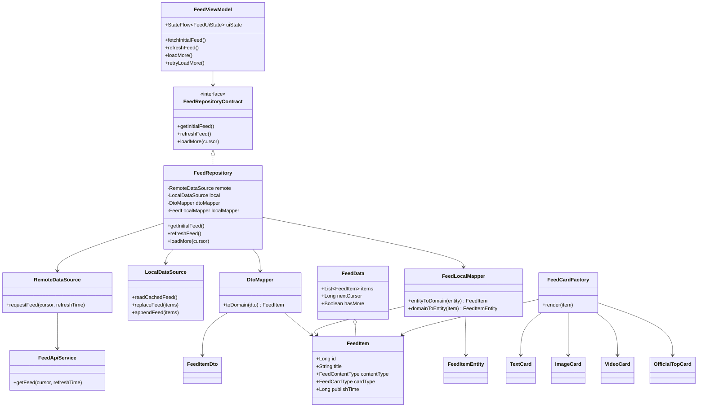

This class diagram focuses on the critical recommendation-feed design path: `FeedViewModel` owns UI state, `FeedRepository` coordinates remote and local data sources, mappers isolate model transformations, and `FeedCardFactory` distributes rendering based on the domain-level `FeedCardType`.

### Domain Layer

1. **FeedItem** : The core domain object of the recommendation feed, aggregating information such as authors, media, and statistics, and determining the final UI rendering type.
2. **FeedAuthorItem** : Describes the basic information of content authors or media accounts, used to identify the source of content.
3. **FeedMediaItem** : Encapsulates the properties of media resources such as images/videos, and is the visual main body of content cards.
4. **FeedStatsItem** : Records interactive data such as likes, comments, and shares, used to display user feedback status.
5. **FeedContentType** : Encapsulates the essence of content (text/image/video) with strong typing, serving as the basis for card type judgment.
6. **FeedCardType** : The final card rendering type calculated by the front-end according to business rules (text/text-image/video/official position).
7. **FeedData** : Pagination result structure, including list data, next page cursor, and loading status.
8. **TextCard / ImageCard / VideoCard / OfficialTopCard** : Specific UI card components rendered according to FeedCardType.
9. **FeedCardFactory** : A UI factory that distributes and renders corresponding card components according to FeedCardType.

### Repository Layer

1. **FeedRepositoryContract** : Defines the abstract interface for all data operations of the recommendation feed, responsible for isolating business logic from specific data sources.
2. **FeedRepository** : The unified scheduling center for recommendation feed data, responsible for coordinating remote and local data sources and implementing the overall strategy of "cache first + asynchronous refresh".
3. **RemoteDataSource** : Encapsulates all network request logic, responsible for requesting the Feed API and handling business status verification and unpacking of ApiResponse.
4. **LocalDataSource** : Responsible for reading and writing the Room local database, enabling capabilities such as home page instant loading, offline availability, and weak network fallback.
5. **RetrofitClient** : Constructs a Retrofit + OkHttp network client, providing a globally reusable FeedApiService instance.
6. **FeedApiService** : Defines the backend API structure (getFeed, getNewsDetail, getComments), only declares without implementing business logic.
7. **DtoMapper (Remote Mapper)** : Responsible for converting backend DTOs (FeedItemDto, MediaDto, etc.) into strongly typed Domain models (FeedItem).
8. **FeedLocalMapper (Local Mapper)** : Responsible for mutual conversion between Domain and Entity, used for reading and storing in the local database.
9. **FeedItemDao / AuthorDao / StatsDao** : Room DAO interfaces, respectively responsible for adding, deleting, and querying three tables.
10. **FeedData** : Serves as the return structure for loadMore, carrying the paginated list, cursor, and hasMore status.

### UI Layer: FeedCardFactory

1. **FeedCardType (sealed class)** : Defines all renderable card types and serves as the core enumeration system for UI rendering decisions.
2. **FeedCardFactory** : A unified UI factory function that distributes to different actual card components based on cardType.
3. **TextCard / ImageCard / VideoCard / OfficialTopCard** : Each card type corresponds to an independent Compose UI component responsible for actual rendering.
4. **FeedItem** : Carries a determined cardType as an input model, thereby driving the CardFactory to select the correct UI.

# 5. API Debugging and Verification

This chapter describes the communication protocol, interface definitions, and data flow between the client and backend to ensure consistent and aligned development on both ends.

## 5.1 Request Flow

The interaction between the client and backend follows the typical **MVVM → Repository → API → Backend → DB** link.Taking the homepage recommendation feed request as an example, the complete process is as follows:

### **User Triggers Request (Trigger)**

Trigger methods include:

- **First entry to the homepage (cold start)**
- **Pull-down refresh (refresh)**
- \*\*Scroll to the bottom to trigger pagination (loadMore)\*\*Each trigger method will eventually call the methods in ViewModel:`fun fetchInitialFeed() fun refreshFeed() fun loadMore()`

### **ViewModel Calls Repository to Initiate Request**

ViewModel is responsible for assembling UI states and delegating requests to Repository:`repository.getInitialFeed() repository.refreshFeed() repository.loadMore(cursor)`

### **Repository Handles Local Cache + Network Request Logic**

Repository is the client data center, responsible for:

- Determining whether the cache (Room) is hit
- Deciding whether a request to the backend is needed
- Integrating cache data and network data
- Outputting a unified Domain model

### **API Layer Sends Request to Backend (REST API)**

Request example:

#### **First Screen Interface**

`GET /api/feed/initial`

#### **Pagination Interface**

`GET /api/feed/list?cursor=1702293810`The backend returns a unified format:

```Kotlin
{
  "code": 0,
  "data": {
    "items": [...],
    "next_cursor": 1702293210,
    "has_more": true
  },
  "message": "ok"
}
```

### **Backend Controller Receives Request**

The Go backend Controller layer receives the request and calls the Service:

```Go
func (c *FeedController) GetFeed(ctx *gin.Context) {
    cursor := ctx.Query("cursor")
    result := feedService.GetFeed(cursor)
    ctx.JSON(200, result)
}
```

### **Service Calls Repository to Query Database**

The Service layer is responsible for business rules (Top5 + Normal merging):

```Kotlin
top := repo.GetTop5()
items, nextCursor := repo.GetFeed(cursor)
return Merge(top, items)
```

### **Database Query (PostgreSQL)**

Repository performs multi-table JOIN from feed\_item / news / author / media / stats:

```SQL
SELECT ... FROM feed_item
LEFT JOIN news ...
LEFT JOIN author ...
WHERE publish_time < cursor
ORDER BY publish_time DESC
LIMIT 15;
```

### **Backend Assembles DTO and Returns to Client**

Backend assembles:

- FeedItemDto
- AuthorDto
- MediaDto
- StatsDtoReturns a complete structure that can be directly rendered by the frontend.

### **Client JSON → DTO → Domain Conversion**

The client maps the received JSON to DTO:`val dto = gson.fromJson(response)`DTO is converted to Domain:`dto.toDomain()`

### **UI Layer Rendering (Compose)**

ViewModel exposes State:`val uiState: StateFlow<FeedUiState>`UI renders based on state:

- Skeleton → Cache → Real content
- Refresh animation
- Pagination Footer
- Multi-type cards (CardFactory)Complete the full-link refresh.

## 5.2 Json Field Description (ApiResponse<>)

```JSON
{
  "code": 0,
  "message": "success",
  "data": {
    "items": [
      {
        "id": 101,
        "title": "Today's AI Large Model Release",
        "summary": "Brief summary content",
        "content_type": "image",
        "publish_time": 1729300000,
        "author": {
          "id": 5,
          "name": "Technology Daily Talk",
          "avatar_url": "...",
          "certification": "red_v"
        },
        "media": [
          {
            "id": 99,
            "url": "...",
            "media_type": "image"
          }
        ],
        "stats": {
          "read_count": 10000,
          "like_count": 500,
          "comment_count": 80
        }
      }
    ],
    "next_cursor": 1729200000,
    "has_more": true
  }
}
```

### Top-Level Fields

### data.items (Recommendation Feed Card List)

### data.next\_cursor (Pagination Field)

Cursor is the core pagination field, and both frontend and backend must be consistent.

## 5.3 Docking Test Steps

To ensure correct docking between the client and backend, test according to the following steps:

### **Step 1: Verify Interface Connectivity**

- Call `/api/feed?cursor=0&limit=20` with Postman
- Should return `code = 0`

### **Step 2: Verify Field Integrity**

Check:

- Whether the items array contains author / media / stats
- Whether next\_cursor is returned correctly
- Whether the has\_more logic is correct

### **Step 3: Homepage First Screen Rendering**

- Launch the App → Local cache will be used (empty if none)
- Repository initiates a network request
- Verify whether the UI is refreshed correctly

### **Step 4: Pagination Test**

- Scroll to the bottom to trigger loadMore()
- Observe:
  - Whether next\_cursor changes
  - Whether duplicate content appears
  - Whether it stops when has\_more is false

### **Step 5: Weak Network Test**

- Disconnect the network → The client should display Room cache
- Reconnect → Automatically refresh

### Step 6: OfficialTop (Top5) Insertion Test

- Check whether Top5 is at the top of the first screen

# 6. Result Display

Based on the aforementioned requirements, this chapter lists the acceptance status of functional points to confirm that the system implementation meets expectations.

## 6.1 Demo


## 6.2 Screenshots of Functions During Development (Verification of Running Links)

### 6.2.1 Docker Compose Starts Database Service

**Docker desktop**


**Pgadmin**


### 6.2.2 Go Backend API Started Successfully (Feed Endpoint Test Passed)

**Backend startup**


**Postman Testing**


**Backend Response**


### 6.2.3 Android Studio Run Client (Startup Successful)

**Start Emulator**

### 6.2.4 Client successfully requests backend and renders recommendation feed

**Initiate initialization request backend response 200OK**

```YAML
2025-12-10 14:11:01.231  9610-9653  okhttp.OkHttpClient     com.xuziyi.toutiaoandroid            I  --> GET http://10.0.2.2:8080/api/v1/feed
2025-12-10 14:11:01.231  9610-9653  okhttp.OkHttpClient     com.xuziyi.toutiaoandroid            I  --> END GET
2025-12-10 14:11:01.293  9610-9653  okhttp.OkHttpClient     com.xuziyi.toutiaoandroid            I  <-- 200 OK http://10.0.2.2:8080/api/v1/feed (61ms)
2025-12-10 14:11:01.293  9610-9653  okhttp.OkHttpClient     com.xuziyi.toutiaoandroid            I  Content-Length: 14744
2025-12-10 14:11:01.293  9610-9653  okhttp.OkHttpClient     com.xuziyi.toutiaoandroid            I  Content-Type: application/json; charset=utf-8
2025-12-10 14:11:01.294  9610-9653  okhttp.OkHttpClient     com.xuziyi.toutiaoandroid            I  Date: Wed, 10 Dec 2025 06:11:03 GMT
```


**Backend Response**


### 6.2.5 Refresh Pull-Down Refresh Verification

**Refresh verification backend response 200OK**

```YAML
2025-12-10 14:12:32.168  9610-9691  okhttp.OkHttpClient     com.xuziyi.toutiaoandroid            I  --> GET http://10.0.2.2:8080/api/v1/feed?refresh_time=1
2025-12-10 14:12:32.168  9610-9691  okhttp.OkHttpClient     com.xuziyi.toutiaoandroid            I  --> END GET
2025-12-10 14:12:32.194  9610-9691  okhttp.OkHttpClient     com.xuziyi.toutiaoandroid            I  <-- 200 OK http://10.0.2.2:8080/api/v1/feed?refresh_time=1 (26ms)
2025-12-10 14:12:32.195  9610-9691  okhttp.OkHttpClient     com.xuziyi.toutiaoandroid            I  Content-Length: 14675
2025-12-10 14:12:32.200  9610-9691  okhttp.OkHttpClient     com.xuziyi.toutiaoandroid            I  Content-Type: application/json; charset=utf-8
2025-12-10 14:12:32.200  9610-9691  okhttp.OkHttpClient     com.xuziyi.toutiaoandroid            I  Date: Wed, 10 Dec 2025 06:12:34 GMT
```


**Backend Response**


### 6.2.6 LoadMore Pagination Loading Verification

**Client sends cursor and backend responds with 200 OK**

```YAML
2025-12-10 14:14:31.697  9610-9722  okhttp.OkHttpClient     com.xuziyi.toutiaoandroid            I  --> GET http://10.0.2.2:8080/api/v1/feed?cursor=1765347153
2025-12-10 14:14:31.697  9610-9722  okhttp.OkHttpClient     com.xuziyi.toutiaoandroid            I  --> END GET
2025-12-10 14:14:31.756  9610-9722  okhttp.OkHttpClient     com.xuziyi.toutiaoandroid            I  <-- 200 OK http://10.0.2.2:8080/api/v1/feed?cursor=1765347153 (51ms)
2025-12-10 14:14:31.757  9610-9722  okhttp.OkHttpClient     com.xuziyi.toutiaoandroid            I  Content-Length: 10822
2025-12-10 14:14:31.758  9610-9722  okhttp.OkHttpClient     com.xuziyi.toutiaoandroid            I  Content-Type: application/json; charset=utf-8
2025-12-10 14:14:31.759  9610-9722  okhttp.OkHttpClient     com.xuziyi.toutiaoandroid            I  Date: Wed, 10 Dec 2025 06:14:33 GMT
```


**Backend Response**

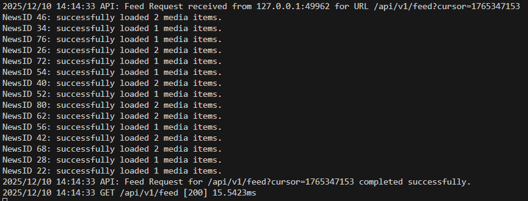

### 6.2.7 Offline Cache Validation

```YAML
2025-12-10 14:19:34.774  9786-9813  okhttp.OkHttpClient     com.xuziyi.toutiaoandroid            I  --> GET http://10.0.2.2:8080/api/v1/feed
2025-12-10 14:19:34.774  9786-9813  okhttp.OkHttpClient     com.xuziyi.toutiaoandroid            I  --> END GET
2025-12-10 14:19:35.045  9786-9786  Choreographer           com.xuziyi.toutiaoandroid            I  Skipped 48 frames!  The application may be doing too much work on its main thread.
2025-12-10 14:19:35.058  9786-9796  HWUI                    com.xuziyi.toutiaoandroid            I  Davey! duration=1142ms; Flags=1, FrameTimelineVsyncId=117203, IntendedVsync=22200434548064, Vsync=22200734548052, InputEventId=0, HandleInputStart=22200739015355, AnimationStart=22200739021352, PerformTraversalsStart=22200739145408, DrawStart=22201500439827, FrameDeadline=22200451214730, FrameStartTime=22200738659068, FrameInterval=16666666, WorkloadTarget=16666666, SyncQueued=22201508270038, SyncStart=22201534500239, IssueDrawCommandsStart=22201534742989, SwapBuffers=22201580490998, FrameCompleted=22201603049006, DequeueBufferDuration=2929, QueueBufferDuration=217954, GpuCompleted=22201603049006, SwapBuffersCompleted=22201588838805, DisplayPresentTime=0, CommandSubmissionCompleted=22201580490998, 
2025-12-10 14:19:35.098  9786-9786  InsetsController        com.xuziyi.toutiaoandroid            D  hide(ime(), fromIme=false)
2025-12-10 14:19:35.098  9786-9786  ImeTracker              com.xuziyi.toutiaoandroid            I  com.xuziyi.toutiaoandroid:9afec46f: onCancelled at PHASE_CLIENT_ALREADY_HIDDEN
2025-12-10 14:19:36.046  9786-9786  HWUI                    com.xuziyi.toutiaoandroid            W  Image decoding logging dropped!
2025-12-10 14:19:36.074  9786-9786  HWUI                    com.xuziyi.toutiaoandroid            W  Image decoding logging dropped!
2025-12-10 14:19:36.093  9786-9786  HWUI                    com.xuziyi.toutiaoandroid            W  Image decoding logging dropped!
2025-12-10 14:19:36.099  9786-9786  HWUI                    com.xuziyi.toutiaoandroid            W  Image decoding logging dropped!
2025-12-10 14:19:36.107  9786-9786  HWUI                    com.xuziyi.toutiaoandroid            W  Image decoding logging dropped!
2025-12-10 14:19:36.115  9786-9786  HWUI                    com.xuziyi.toutiaoandroid            W  Image decoding logging dropped!
2025-12-10 14:19:37.135  9786-9786  Choreographer           com.xuziyi.toutiaoandroid            I  Skipped 92 frames!  The application may be doing too much work on its main thread.
2025-12-10 14:19:37.138  9786-9797  HWUI                    com.xuziyi.toutiaoandroid            I  Davey! duration=1550ms; Flags=0, FrameTimelineVsyncId=117627, IntendedVsync=22202134547996, Vsync=22202134547996, InputEventId=0, HandleInputStart=22202136384396, AnimationStart=22202136384912, PerformTraversalsStart=22202711655284, DrawStart=22203669137696, FrameDeadline=22202151214662, FrameStartTime=22202136381842, FrameInterval=16666666, WorkloadTarget=16666666, SyncQueued=22203681955532, SyncStart=22203681976263, IssueDrawCommandsStart=22203682016669, SwapBuffers=22203682254812, FrameCompleted=22203684925505, DequeueBufferDuration=4669, QueueBufferDuration=170531, GpuCompleted=22203684925505, SwapBuffersCompleted=22203683065301, DisplayPresentTime=0, CommandSubmissionCompleted=22203682254812, 
2025-12-10 14:19:37.240  9786-9797  HWUI                    com.xuziyi.toutiaoandroid            I  Davey! duration=1628ms; Flags=0, FrameTimelineVsyncId=117663, IntendedVsync=22202151214662, Vsync=22203684547934, InputEventId=0, HandleInputStart=22203690921917, AnimationStart=22203690922676, PerformTraversalsStart=22203701914396, DrawStart=22203703822863, FrameDeadline=22203717881266, FrameStartTime=22203688667344, FrameInterval=16666666, WorkloadTarget=16666666, SyncQueued=22203703998793, SyncStart=22203704143069, IssueDrawCommandsStart=22203704229130, SwapBuffers=22203776108876, FrameCompleted=22203779454278, DequeueBufferDuration=3918, QueueBufferDuration=138120, GpuCompleted=22203779454278, SwapBuffersCompleted=22203777261333, DisplayPresentTime=0, CommandSubmissionCompleted=22203776108876, 
2025-12-10 14:19:40.179  9786-9820  ProfileInstaller        com.xuziyi.toutiaoandroid            D  Installing profile for com.xuziyi.toutiaoandroid
2025-12-10 14:19:44.794  9786-9813  okhttp.OkHttpClient     com.xuziyi.toutiaoandroid            I  <-- HTTP FAILED: java.net.SocketTimeoutException: failed to connect to /10.0.2.2 (port 8080) from /10.0.2.16 (port 39792) after 10000ms
2025-12-10 14:19:44.894  9786-9786  HWUI                    com.xuziyi.toutiaoandroid            W  Image decoding logging dropped!
2025-12-10 14:19:44.917  9786-9786  HWUI                    com.xuziyi.toutiaoandroid            W  Image decoding logging dropped!
2025-12-10 14:19:44.921  9786-9786  HWUI                    com.xuziyi.toutiaoandroid            W  Image decoding logging dropped!
2025-12-10 14:19:45.136  9786-9827  HWUI                    com.xuziyi.toutiaoandroid            W  Failed to choose config with EGL_SWAP_BEHAVIOR_PRESERVED, retrying without...
2025-12-10 14:19:45.136  9786-9827  HWUI                    com.xuziyi.toutiaoandroid            W  Failed to initialize 101010-2 format, error = EGL_SUCCESS
2025-12-10 14:19:45.308  9786-9807  HWUI                    com.xuziyi.toutiaoandroid            W  Image decoding logging dropped!
2025-12-10 14:19:45.356  9786-9823  HWUI                    com.xuziyi.toutiaoandroid            W  Image decoding logging dropped!
2025-12-10 14:19:45.473  9786-9806  HWUI                    com.xuziyi.toutiaoandroid            W  Image decoding logging dropped!
2025-12-10 14:19:45.474  9786-9807  HWUI                    com.xuziyi.toutiaoandroid            W  Image decoding logging dropped!
2025-12-10 14:19:45.474  9786-9808  HWUI                    com.xuziyi.toutiaoandroid            W  Image decoding logging dropped!
2025-12-10 14:19:45.482  9786-9823  HWUI                    com.xuziyi.toutiaoandroid            W  Image decoding logging dropped!
```

### 6.2.8 Current Cache, Detail, and Video Implementation Evidence

The final implementation closes the three previously incomplete client paths:

- `FeedRepository` reads scene-filtered Room data first. When cache exists it returns immediately and refreshes the cache from the remote API in a background scope; when cache is empty it loads from the network and persists the result. `FeedRepositoryTest.successfulInitialLoadWritesRemoteItemsToCache`, `cachedInitialLoadReturnsImmediatelyAndRefreshesCacheInBackground`, and `cachedInitialLoadSurvivesOfflineBackgroundRefresh` provide automated evidence.
- Feed card clicks navigate with a real `newsId` to `NewsDetailScreen`. `NewsDetailViewModel` calls `GET /api/v1/news/{id}`, and the Go `NewsDetailHandler` joins news content, author, statistics, and ordered media records from PostgreSQL. A runtime request to `/api/v1/news/1` returned HTTP 200 with all fields required by `NewsDetailDto`.
- Video records use the same detail route. The detail screen creates an Android `VideoView`, starts playback after preparation, pauses on lifecycle pause or stop, and releases playback when the Composable is disposed. This is a completed basic playback path; advanced preloading, visibility-based list playback, and ExoPlayer optimisation remain future work.

The Room schema stores content, author, statistics, media JSON, recommendation score, and recommendation reason. Cache updates use Room upsert semantics. The MVP does not yet implement time-based cache expiration, so a production deployment would require TTL and eviction policies.

## 6.3 CI (Client)

**Github Action**


**CI Pipeline Scope.** The CI pipeline is designed to validate both code quality and delivery readiness before merge. Each pull request is expected to go through automated verification so that architecture changes do not silently break the feed experience.

| CI Stage                     | Purpose                                                                    | Example Checks                                                                                                                       |
| ---------------------------- | -------------------------------------------------------------------------- | ------------------------------------------------------------------------------------------------------------------------------------ |
| **Static Validation**        | Catch structural and syntax issues as early as possible.                   | Gradle sync validation, Kotlin/Compose compilation checks, lint, formatting verification, dependency resolution validation.          |
| **Unit Test Execution**      | Verify business logic stability in isolated modules.                       | ViewModel tests, UseCase tests, Repository behavior tests, mapper conversion tests.                                                  |
| **Integration Verification** | Ensure that client-side modules still collaborate correctly after changes. | API contract verification, pagination flow validation, cache-first behavior verification, refresh/load-more state transition checks. |
| **Build Acceptance**         | Confirm that the project can still be packaged and delivered successfully. | Debug build generation, release build smoke verification, artifact generation, dependency packaging checks.                          |

**Expected CI outcome:** a change is considered merge-ready only after static checks, automated tests, and build verification all pass successfully.

**Unit test**


**Automated Test Coverage.** The automated test strategy focuses on protecting the most failure-prone parts of the feed architecture: state transitions, pagination continuity, cache fallback, and client-backend contract consistency.

- **Static checks**: lint rules, formatting checks, compiler validation, and dependency consistency checks.
- **Unit tests**: ViewModel state transition tests, UseCase input/output tests, Repository data merge tests, and mapper conversion tests.
- **UI-related verification**: critical Compose rendering smoke tests for homepage first-screen state, loading state, empty state, and error state.
- **Integration tests**: Retrofit to Repository contract verification, pagination cursor flow validation, refresh and load-more interaction checks, and Room cache fallback verification.
- **Regression-focused scenarios**: weak network behavior, duplicate pagination prevention, Top5 insertion stability, and multi-card rendering compatibility.

**Why these tests matter:** they do not only verify that functions run, but also protect the architectural promises of the project, including stable state management, recoverable pagination, and consistent data transformation across layers.


## 6.4 DevSecOps Evidence Matrix

The DevSecOps assessment requires not only CI screenshots, but also evidence that the project has considered testing, security, container management, vulnerability handling, and auditability. The table below maps the current evidence and the expected final-report evidence.

| DevSecOps Area | Current Evidence in This Project | Final Submission Evidence |
| --- | --- | --- |
| CI/CD pipeline | Android CI exists; Backend CI workflow has been added in the evidence pack | GitHub Actions screenshots for Android CI and Backend CI are still required after push |
| Static validation | Android build and unit-test workflow exists; backend build workflow exists | Workflow logs should be captured as final screenshots |
| Unit testing | Runnable JVM tests were added for refresh-state and banner logic | Capture Android CI test result screenshot after GitHub Actions execution |
| Integration testing | API docking steps, API screenshots, and client-backend logs exist | Existing `/api/v1/feed` screenshot is stored as `E09-api-verification-postman.png` |
| Load and stress testing | Not fully implemented in the current MVP | Documented as a limitation unless small-scale API stress evidence is added |
| SAST / Dependency scanning | Security scan workflow using Trivy has been added in the evidence pack | Capture Security Scan / Trivy Actions result after push |
| DAST-lite | API boundary validation can be performed through Postman or curl | Existing API verification can support integration testing; invalid cursor test remains optional |
| Container management | Docker Compose and PostgreSQL startup screenshots exist | Docker evidence is stored as `E08-docker-compose-running.png` |
| Image security | Trivy filesystem/dependency scan workflow exists; container image scan is optional for MVP | Use Security Scan result as vulnerability evidence; image-specific scan can be future work |
| Git audit trail | Repository commit history and PR history exist | Capture GitHub commit history or local git log screenshot |
| Infrastructure as Code | Docker Compose files and GitHub Actions workflows exist | Include `docker-compose.dev.yml`, `docker-compose.prod.yml`, and `.github/workflows/` |

## 6.5 Security Assessment

Although the project is an internship-level demo, security should still be discussed explicitly because the final assessment requires threats and mitigations.

| Threat | Risk Level | Impact | Mitigation |
| --- | --- | --- | --- |
| Invalid cursor or malformed request | Medium | Backend may return incorrect pages or trigger unexpected errors | Validate cursor format and boundary values in Handler layer |
| Duplicate or skipped feed items | Medium | User experience degradation and inconsistent pagination | Centralize cursor management and enforce stable ordering by `publish_time` / `id` |
| Excessive API requests during refresh/loadMore | Medium | Backend pressure and client state corruption | Use ViewModel state gatekeeping and mutual exclusion for refresh and pagination |
| Sensitive data exposure in logs | Medium | Debug logs may expose API payload or internal fields | Keep logs sanitized in final report and avoid exposing real tokens or private data |
| Dependency vulnerability | Medium | Vulnerable library may introduce security risk | Use dependency scanning, version lock, and CI checks |
| Container image vulnerability | Low to Medium | Vulnerable base image may affect deployment security | Scan images with Trivy or an equivalent tool before release |
| Unauthenticated backend endpoint | Medium | Demo API could be called by unexpected clients | For MVP, restrict local environment; for a deployed version, add authentication and access control |
| Weak network fallback inconsistency | Low | Cached data may become stale | Document cache strategy and add cache expiration in future work |

### Security Architecture View

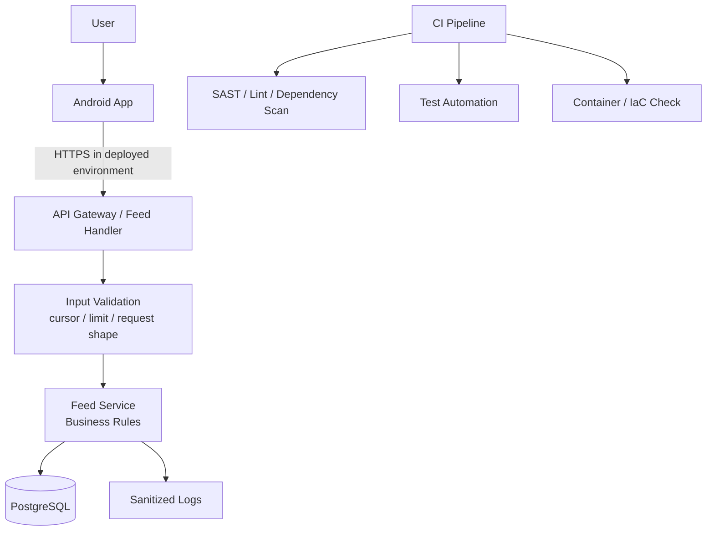

The main security principle is to protect the feed request boundary first: validate inputs, avoid excessive state-triggered requests, sanitize logs, and keep dependency checks in the delivery pipeline.

## 6.6 Test Summary

The current verification focuses on the failure-prone parts of a recommendation feed: first-screen loading, refresh, pagination, cache fallback, and data mapping.

| Test Type | Target | Evidence | Result |
| --- | --- | --- | --- |
| API connectivity test | Verify backend feed endpoint availability | Postman screenshot, 200 OK logs | Passed |
| First-screen rendering test | Verify app can request backend and render feed | Android logcat and UI screenshot | Passed |
| Pull-to-refresh test | Verify refresh request and UI state update | Refresh API log and UI screenshot | Passed |
| Pagination test | Verify cursor request, next page loading, and no obvious duplication | Cursor API log and backend response screenshot | Passed |
| Weak-network cache test | Verify local cache is available when backend times out | Offline timeout log and cache behavior evidence | Passed with known performance warning |
| CI unit test | Verify core state logic and mapper behavior | Unit test screenshot | Passed |

### Known Verification Caveat

The weak-network validation log contains `Skipped frames` and `Davey` warnings. This is useful evidence because it shows the test exposed a real performance risk under degraded conditions. In the final report, this should be explained as a known issue and linked to future optimization actions such as image decoding optimization, lazy loading, and more precise Compose recomposition control.

## 6.7 Evidence Index for Demonstration

| Evidence Type | Current Location | Assessment Supported |
| --- | --- | --- |
| App demo screenshot | Section 6.1 and 6.2 | Presentation Assessment, App Demo |
| Docker/PostgreSQL screenshots | Section 6.2.1 | DevSecOps, Deployment Evidence |
| Backend API startup and Postman screenshots | Section 6.2.2 | API Verification, Integration Test |
| Android client render screenshot | Section 6.2.4 | App Demo, Functional Verification |
| Refresh verification logs | Section 6.2.5 | Functional Requirement, Test Evidence |
| Pagination verification logs | Section 6.2.6 | Functional Requirement, Test Evidence |
| Offline cache logs | Section 6.2.7 | Stability Requirement, Known Issue |
| GitHub Actions screenshot | Section 6.3 | CI/CD Evidence |
| Unit test screenshot | Section 6.3 | Testing Evidence |

# 7. Final Summary Report

This chapter reviews the overall project, including architecture summary, future scalable directions for engineering capability improvement, and presents more in-depth exploration content through appendices.

## 7.1 Project Achievements

This project successfully implemented an **Android + Go + PostgreSQL full-link system** oriented toward a modern recommendation-feed demo experience, covering a complete information-flow architecture capability from the data layer, business layer, cache layer to UI rendering and interaction. The key achievements of this project include:

- **Complete front-end and back-end integration** : The Android end successfully calls the Go back-end API through Retrofit, and completes Cursor pagination, refresh, and content display.
- **Multi-card mixed arrangement system implementation** : Realizes rendering of multiple types of cards such as Text / Image / Video / official positions, and implements a highly scalable UI system based on sealed class + Factory architecture.
- **Complete refresh link (Toutiao-like)** : The entire process of pull-down → threshold → refresh animation → rebound → update prompt → state recovery.
- **Pagination link (stable, recoverable)** : The LoadMore state machine achieves a pagination experience with no repeated triggers, retry capability, and stability in weak networks.
- \*\*Local cache (Room) \*\* : Load local cache directly during initial rendering; network results are asynchronously overwritten, and stable display is maintained even in weak network environments.
- **Compose performance optimization system** : Multi-segment list structure, stable Key, on-demand rendering, state hoisting, recomposition boundaries and other solutions keep the home page smooth under scrolling scenarios.
- **Complete output of full-link architecture diagrams, flowcharts, module diagrams and class diagrams** : The document system fully reflects the architectural design of a real information flow product.Overall, this project ultimately achieved a recommendation feed Demo with real product-level experience and engineering quality.

## 7.2 Architecture Highlights

The highlights of this project lie not only in function implementation, but also in its **engineered, systematic, and evolvable architectural design** :

### **Clean Architecture full-link implementation**

- Independent Domain model, business logic encapsulated in UseCase.
- Repository serves as the convergence layer for Remote + Local, with centralized strategies.
- Complete separation of DTO, Domain, and UI Model, with obvious decoupling between layers.

### **Three major link reconstructions dedicated to recommendation feeds**

- **Refresh link** : Gesture layer → state layer → animation layer → business layer → data layer, with clear layering and no mutual interference.
- **Pagination link** : State machine design to avoid repeated triggers and error recovery capability.
- **Content rendering link** : FeedCardFactory + FeedCardType fully implement the UI distribution system.

### **Compose high-performance system**

- Multi-segment LazyColumn architecture (Top5 / Mixed / Footer)
- Stable Key to avoid list jumping
- Near-area rendering to reduce layout pressure
- AnimatedVisibility / derivedStateOf to control the scope of local recomposition

### **Professional local cache strategy**

- Cache-First, first screen opens in seconds
- Asynchronous refresh overwriting
- Complete isolation of business and storage through Domain ↔ Entity mapping

### **Error modeling + Crash defense**

- All errors are converted into UI State instead of exceptions
- Pagination failure recoverable
- Refresh failure fallback
- UI does not depend on unstable statesThis project is not only a Demo, but also a real information flow architecture template that can be migrated to large-scale products.

## 7.3 Known Issues

Although the system has reached a stable and usable state in the core link and overall architecture of the recommendation feed, as a Demo project targeting architecture verification, there are still some functions and experiences that are not fully covered, mainly reflected in the following aspects:

- \*\*Video card performance optimization has not been fully carried out \*\*The current video card mainly focuses on content display, and does not introduce visibility-based playback control and resource recycling mechanisms based on ExoPlayer to reduce the complexity of Demo implementation.
- \*\*Some interaction details still have room for optimization \*\*The gradient effect and red dot prompt function of the TabBar have completed the core logic implementation, but the animation details and interaction consistency can be further polished.
- \*\*Recommendation strategy is mainly based on static content \*\*The back-end recommendation logic uses static content return, and does not introduce real-time recommendation or personalized algorithms, which is in line with the design goal of this project focusing on client architecture verification.
- \*\*Local cache does not introduce automatic expiration strategy \*\*The current cache mechanism does not set validity period cleaning rules, which may lead to data accumulation in long-term use scenarios. This problem is acceptable within the Demo usage cycle.
- \*\*Channel management function is not included in the current implementation scope \*\*The addition, sorting and personalized management of channels are not core requirements at this stage and can be supplemented in the productization stage later.

## 7.4 Improvement Directions

The current project verifies the overall architectural design of the recommendation feed in terms of pagination, multi-card rendering, local cache and state management in the form of MVP. If further expanded into a complete product, enhancements and optimizations can be made in the following directions:

### 7.4.1 Upgrade of Pagination and Data Loading System

The current pagination logic is implemented based on custom Cursor and state gatekeeping, which can ensure the stability and error recoverability of pagination requests. In the future, **Paging3 + RemoteMediator** can be introduced to implement more standardized pagination loading, automatic prefetching and local cache coordination mechanisms, so as to further improve performance and engineering maintainability in long list scenarios.

### 7.4.2 List Rendering and Performance Optimization

The project has reduced Compose recomposition costs through stable keys, visible window cropping and other methods. When the data scale further increases, a **DiffUtil-like differential update strategy** can be introduced to reduce unnecessary UI redraws when the list data changes locally, thereby enhancing rendering performance in high-frequency refresh and mixed arrangement scenarios.

### 7.4.3 Expansion of Multi-Card System

The current FeedCardFactory supports text, single image, video and official top cards. In the future, more card types can be expanded without destroying the existing architecture, such as three-image cards, large-image cards, advertisement cards and topic cards, to verify the flexibility and scalability of the current card factory design in real business expansion.

### 7.4.4 Deepening of Local Cache Strategy

The current system adopts the Cache-First strategy to meet the basic needs of first-screen quick opening and weak network availability. In the future, more refined cache management mechanisms can be further introduced, including time-based automatic cleaning, cache isolation by city or channel, and multi-data source merged cache strategies, to adapt to more complex recommendation and content distribution scenarios.

### 7.4.5 Video Card and Multimedia Experience Optimization

The current video card mainly focuses on content display. In the future, multimedia capabilities can be further enhanced, such as visibility-based automatic playback control, small window playback mode, and reuse logic of video resource recycling pool, to improve users' immersive experience while ensuring performance.

### 7.4.6 Test Coverage and Engineering Quality Improvement

The project has currently introduced basic unit tests for the ViewModel layer. If further productized, the test scope can be expanded to UseCase, Repository and data mapping layers, and key UI test cases can be supplemented to improve the system's stability, maintainability and engineering quality.

## 7.5 Future Planning

On the basis that the current recommendation feed architecture has verified its feasibility, this project has the potential to evolve into a more complete information flow system. If further expanded into an engineering example or actual product, it can evolve step by step in the following directions:

### 7.5.1 Expansion of Multi-Information-Flow Architecture

Based on the existing Feed abstraction, more information flow forms can be further supported, such as recommendation flow, follow flow and local channel flow, and decoupling and reuse of different data sources and display strategies can be achieved under a unified architecture.

### 7.5.2 Closer Frontend and Backend Collaboration with Real Business

The current back-end is mainly based on static recommendation data. In the future, more real recommendation strategies and regional dimension rules can be connected to simulate a complete information flow business link, so as to enhance front-end and back-end collaboration and interface evolution capabilities.

### 7.5.3 Exploration of Cross-Screen and Multi-Terminal Experience

On the basis of the existing mobile terminal architecture, cross-screen display capabilities can be explored, such as external screen Widget and other lightweight forms, to verify the reusability and consistency of information flow in different terminal scenarios (there are currently parallel explorations in related directions).

### 7.5.4 AI Capabilities and Content Understanding Direction

On the premise of maintaining the stability of the recommendation feed basic architecture, AI capabilities can be gradually introduced, such as content summarization, semantic understanding or user preference modeling, to assist information organization and display, rather than directly affecting the core architecture design.

### 7.5.5 Engineering Abstraction and Platformization Direction

As functions gradually stabilize, general information flow capabilities can be abstracted into reusable modules or SDKs for different business scenarios, thereby verifying the feasibility of the current architecture in engineering reuse and long-term evolution.In general, this project has currently completed the verification of the core architecture of the information flow, and future planning takes "evolvability" as the core goal, emphasizing the gradual expansion of functions and capabilities without overthrowing the existing design.

# 8. Value Added Assessment

This project meets the minimum internship requirement by delivering a runnable Android + Go + PostgreSQL full-stack recommendation-feed demo. Beyond the baseline implementation, its value is reflected in engineering abstraction, architecture evidence, and future extensibility.

## 8.0 Runtime Evidence of Multi-Channel Value

The following screenshots were captured from the final Debug APK on a 1080x2400 Android emulator. They show that the added value is implemented in the running client rather than existing only as an architecture proposal.

| Explainable Recommend channel | Independent Following channel |
|---|---|
| 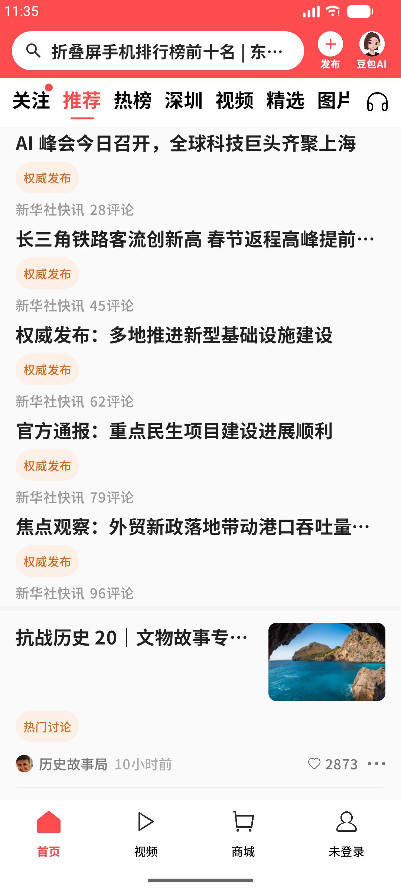 | 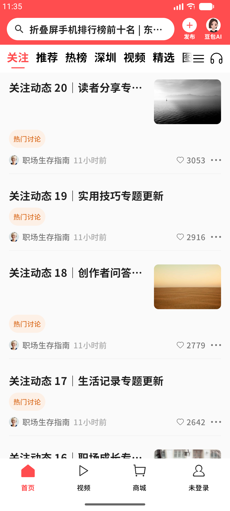 |

| Scene-specific Hot channel | Video content-type rendering |
|---|---|
| 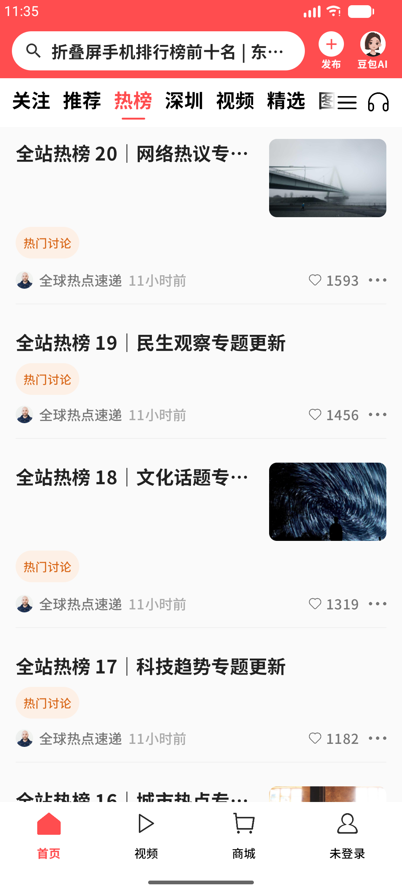 | 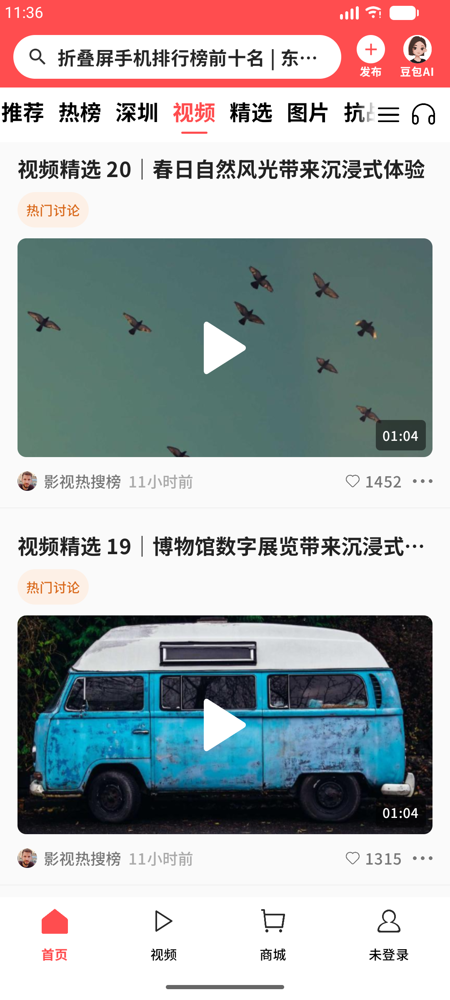 |

| Image content-type rendering |
|---|
| 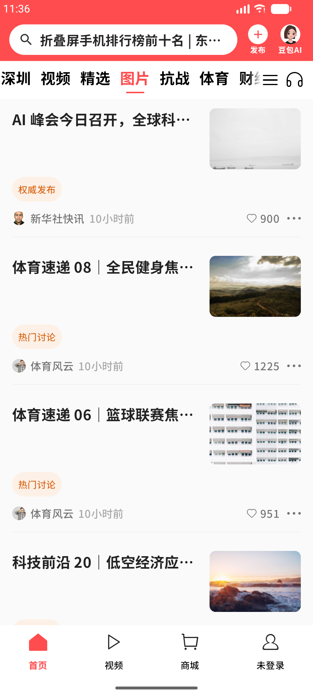 |

Together, these views demonstrate explainable recommendation labels, independent scene data, deterministic channel depth, and specialised video/image card rendering. They provide direct UI evidence for the value proposition used in `TeamXX- Value Added Assessment.mp4`.

## 8.1 Business Value

| Value Area | Explanation | Evidence |
| --- | --- | --- |
| Realistic feed experience | The project simulates a mainstream news-feed homepage instead of a static UI page | First-screen feed, refresh, pagination, skeleton, cache, multi-card rendering |
| End-to-end delivery | The project covers client, backend, database, API integration, and demo verification | Android logs, backend API logs, PostgreSQL screenshots, Postman results |
| Clear delivery scope | In-scope and out-of-scope items are explicitly separated | Scope table and backlog priority table |
| Demonstrable outcome | The app and backend can be demonstrated through videos and screenshots | App Demo, CI screenshots, API verification evidence |

## 8.2 Engineering Value

| Engineering Contribution | Why It Matters |
| --- | --- |
| Cache-first feed architecture | Improves first-screen availability and weak-network resilience |
| Cursor pagination | Avoids offset pagination problems such as duplicated or skipped feed items |
| State-machine-based refresh and pagination | Prevents repeated requests and invalid UI states |
| Multi-card factory rendering | Keeps UI scalable when new feed card types are added |
| DTO / Domain / Entity separation | Makes data transformation explicit and keeps UI independent from API schema |
| Lightweight DDD backend layering | Keeps HTTP handling, business logic, and persistence responsibilities separated |

## 8.3 Technical Innovation and Extension Potential

The project leaves clear extension points for technically advanced areas:

- **Data analytics**: feed click, refresh, and pagination events can be collected to analyze user behavior.
- **Machine learning**: static recommendation rules can be replaced by personalized ranking models.
- **Real-time processing**: future versions can introduce message queues for refresh triggers and content updates.
- **Gen AI / content understanding**: large models can be used for content summarization, topic extraction, and semantic tagging.
- **Cross-platform evolution**: the architecture can evolve toward shared domain/data layers through KMP-style design.

## 8.4 Sponsor Acceptance Evidence Plan

If formal sponsor acceptance evidence is available, it should be added to the final report. If the project cannot expose internal company information, sanitized evidence should be used.

| Evidence Type | Suggested Material |
| --- | --- |
| Mentor feedback | Approval message, review comments, or sanitized feedback screenshot |
| Task acceptance | Completed task card, issue closure record, or sprint review note |
| Code review evidence | Pull request, commit record, or sanitized review screenshot |
| Demo acceptance | Demo video, app screenshot, backend/API verification screenshot |
| Confidentiality-safe proof | Sanitized diagrams, masked logs, anonymized screenshots |

# 9. Final Presentation Mapping

The following table maps report evidence to the seven required final presentation videos. It can be used directly as the script-planning checklist.

| Required Video | Main Storyline | Evidence in This Report |
| --- | --- | --- |
| `TeamXX- Management Assessment.mp4` | Why the project is justified, how scope was managed, how sprint delivery was tracked, and what risks were mitigated | Sections 1.1-1.11 |
| `TeamXX- Architectural Assessment.mp4` | How the system is logically and physically designed, including DDD boundaries and security considerations | Sections 4.1-4.2, 6.5 |
| `TeamXX- Technical Assessment - Software Design.mp4` | How critical feed use cases are implemented at class/object level | Sections 4.3-4.7 |
| `TeamXX- Technical Assessment - DevSecOps.mp4` | How CI/CD, tests, container evidence, security checks, and Git audit support delivery quality | Sections 6.3-6.7 |
| `TeamXX- Value Added Assessment.mp4` | What value is created beyond baseline requirements | Section 8 |
| `TeamXX- Presentation Assessment App Demo.mp4` | Demonstrate the running app and core feed flow | Sections 6.1-6.2 |
| `TeamXX- Presentation Assessment CICD Demo.mp4` | Demonstrate the CI/CD pipeline and verification flow | Sections 6.3-6.4 |

# 10. Final Evidence Index

This evidence index is designed to help assessors quickly locate proof of work in the final report.

| Assessment Area | Required Proof | Where to Find It |
| --- | --- | --- |
| Project justification | Goals, pain points, benefits | 1.1, 1.4 |
| Project scoping | Scope, backlog, roadmap | 1.3, 1.5, 1.7 |
| Agile conduct | Sprint plan, risks, management evidence | 1.6, 1.8, 1.9, 1.10 |
| Effort tracking | Planned vs actual effort | 1.10 |
| Logical architecture | Full-link architecture, layer responsibilities | 4.1.1, 4.1.2 |
| Physical architecture | Deployment blueprint, runtime/storage/delivery view | 4.1.3 |
| DDD | Backend boundary and domain split | 4.2.4, 4.6.6 |
| Use case and software design | Functional requirements, sequence/class diagrams | 3.1-3.3, 4.3-4.7 |
| Data design | ER diagram, table structures, schema | 4.4 |
| API design | Request/response protocol and integration flow | 4.5, 5.1, 5.2 |
| App demo | Screenshots and running evidence | 6.1, 6.2 |
| CI/CD | GitHub Actions and pipeline explanation | 6.3, 6.4 |
| Testing | Test scope, test evidence, verification results | 5.3, 6.3, 6.6 |
| Security | Threats and mitigations | 6.5 |
| Value added | Business, engineering, and technical innovation value | 8.1-8.4 |
| Known issues | Limitations and future improvements | 7.3, 7.4 |

## 10.1 Final Evidence Status

The table below marks which final evidence screenshots have already been prepared and which still need to be completed before final submission.

| Evidence ID | Evidence | Status | Notes |
| --- | --- | --- | --- |
| E01 | Sprint backlog / project board | TODO | Generate table screenshot from `sprint-backlog.csv` or capture GitHub Project board |
| E02 | Burndown chart | DONE | Generated as `assets/E02-burndown-chart.png` |
| E03 | Effort tracking | TODO | Generate screenshot from `effort-tracking.csv` |
| E04 | Git commit history | TODO | Capture GitHub commit history after push, or local `git log --graph` |
| E05 | Android CI | TODO | Capture successful GitHub Actions run after push |
| E06 | Backend CI | TODO | Capture successful GitHub Actions run after push |
| E07 | Security scan | TODO | Capture Security Scan / Trivy result after push |
| E08 | Docker Compose running | DONE | Existing Docker/PostgreSQL screenshot copied into evidence folder |
| E09 | API verification | DONE | Existing `/api/v1/feed` verification screenshot copied into evidence folder |
| E10 | App demo screen | TODO | Capture emulator or demo video screenshot |
| E11 | Mentor feedback | OPTIONAL | Add only if real mentor/sponsor feedback exists and is sanitized |
| E12 | DevSecOps and runtime architecture | DONE | Generated as `assets/E12-devsecops-runtime-architecture.png` and included in Section 4.2.5 |

# **Appendix A: Compose Navigation and ViewModel Lifecycle Design Description**

【Design Point: Multi-level Navigation Architecture (AppNavigator + MainNavigator)】We ultimately implemented a two-layer navigation system: AppNavigator is responsible for global page navigation (such as Splash, Main, Detail), and MainNavigator is responsible for local route management of the four functional Tabs at the bottom of the home page, achieving complete decoupling of global navigation and home page business.The reason for this navigation architecture adjustment is that under the original single navigation structure, all pages share a single NavController, causing route nodes to affect each other. For example, when switching Tabs on the home page, the FeedScreen would be repeatedly destroyed and rebuilt, leading to user experience issues such as loss of list scroll position, interruption of pull-to-refresh status, and repeated data loading. Additionally, expanding functionality in a single-layer routing structure is costly; for instance, adding a detail page, a follow page, or an external screen Widget feature all require modifying existing navigation code, which is risky and not conducive to later expansion.Based on the above issues, in this design, we split the navigation into global and local parts. Global navigation is uniformly managed by AppNavigator, which determines the flow of the application from cold start to entering the main interface and is responsible for injecting the business dependencies required by FeedScreen (ViewModel, UseCase, Repository, etc.). The interior of the home page independently maintains a local NavController through MainNavigator, which is only responsible for the page switching logic within the bottom navigation, including the four modules: home, video, shop, and profile. FeedScreen is no longer built by the tab itself but is injected from AppNavigator, ensuring its lifecycle stability and state retention. Meanwhile, route definitions are managed through sealed classes, avoiding the maintenance costs caused by hard-coded strings.

**Reason (The reason for adopting such navigation splitting is that the home page requires a stable lifecycle, and tab switching should not affect global pages; at the same time, with business expansion, global routes and local routes must be clearly layered, otherwise it will cause state loss, navigation confusion, and increased maintenance costs. By uniformly managing dependencies and global pages in AppNavigator and having MainNavigator independently responsible for the bottom navigation area, we have achieved a navigation system with stable state, clear structure, and strong scalability.)**

Through the above design, the home page module has achieved stable state management. The FeedScreen is no longer rebuilt due to tab switching, and the list position, animation progress, and loading results can be continuously retained, significantly improving the user experience. At the same time, the responsibility boundaries between global navigation and local navigation are clearly separated. When adding new pages, only nodes need to be added at the corresponding level, greatly reducing expansion costs, and the maintainability and scalability of the entire project have been significantly improved. Compared with the original solution, the new architecture has a clear structure, lower coupling, and is more in line with navigation practices for medium and large applications.App global navigation overall architecture diagram: Shows the hierarchical relationship between global routes (Splash/Main/Detail) and bottom navigation sub-routes (Home/Video/Shop/Profile).

The business dependency chain of FeedScreen: showing the complete transmission path of data from Remote → Repository → UseCase → ViewModel → UI.

Notes:

- Android's design philosophy is to separate "UI" from "UI state".
- Composable belongs to the UI layer, with a short lifecycle and can be destroyed at any time;
- ViewModel belongs to the state layer, with a long lifecycle, and can continuously maintain business state as long as it is not removed by the host navigation node.Therefore, by mounting the ViewModel on the global navigation node of AppNavigator, it can ensure that the home recommendation feed does not rebuild the state when the user switches Tabs, thereby ensuring that key experiences such as scroll position, data, and refresh animation are not lost.
